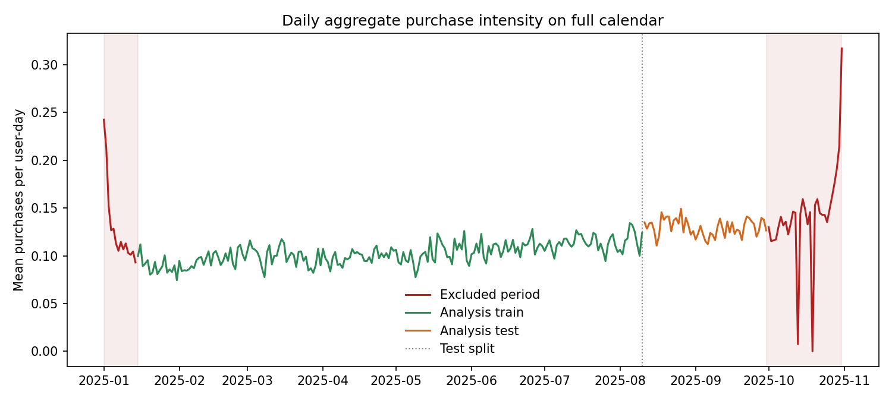
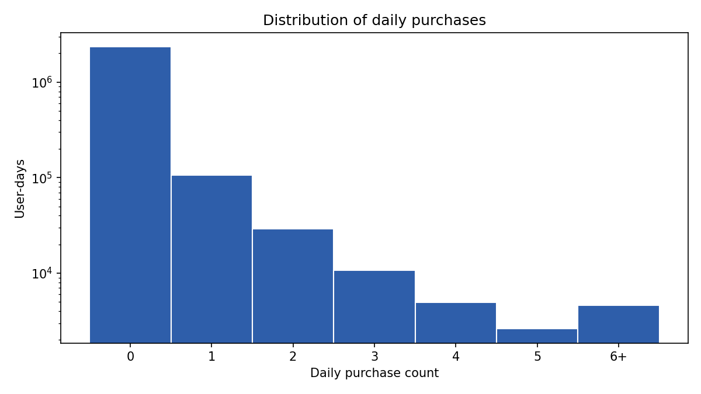
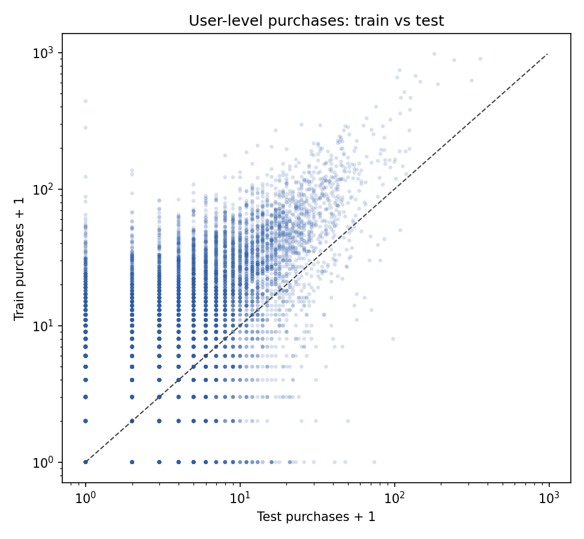
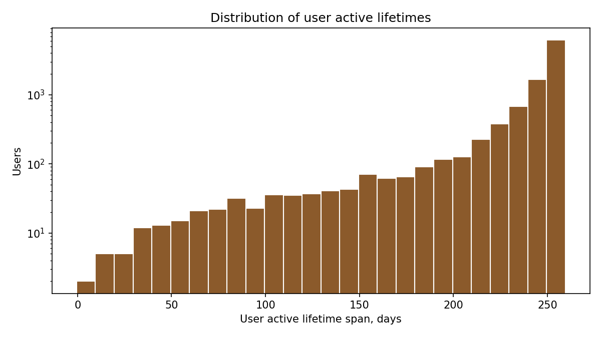
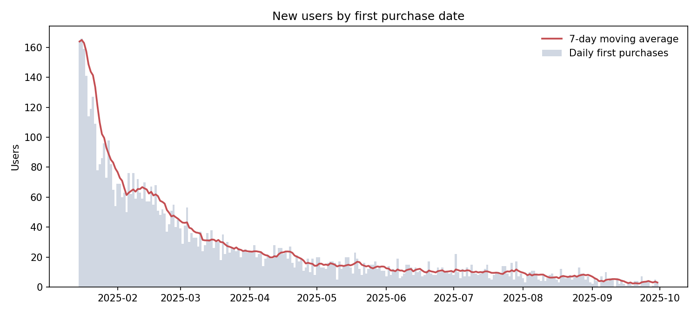
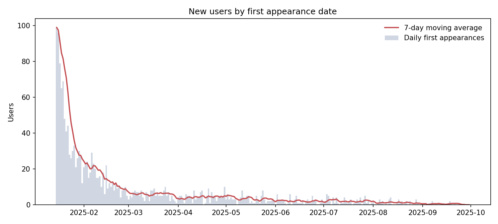
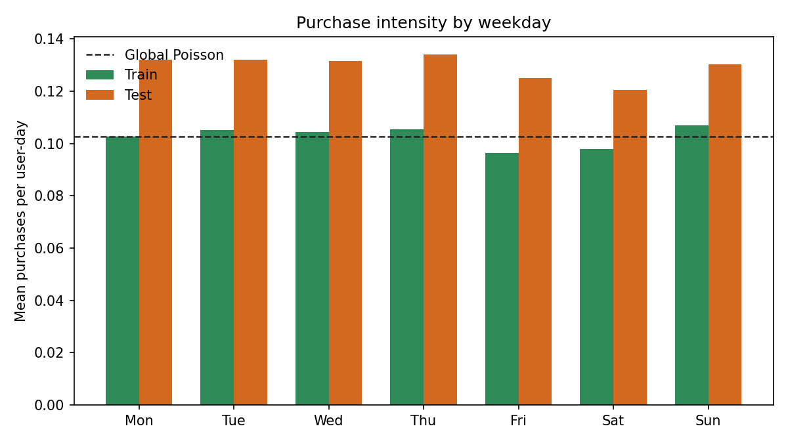
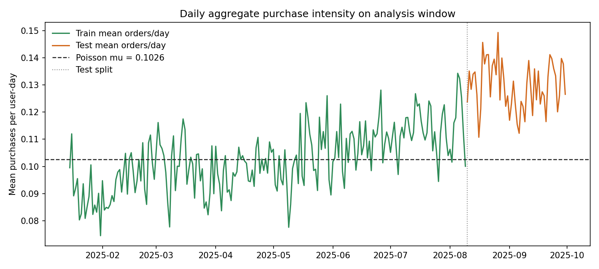

# Глава 1. Базовая модель Poisson для дневной интенсивности покупок

## 1.1. Постановка задачи

Пусть для пользователя $u$ в день $t$ наблюдается целевая переменная $y_{u,t}$, равная числу покупок за день. В первом блоке диплома рассматривается самая простая вероятностная модель:

$$
y_{u,t} \sim \mathrm{Poisson}(\mu),
$$

где $\mu > 0$ является общей константой для всех пользователей и всех дней.

Такая модель заведомо груба, но она нужна по трем причинам:

1. дает нижнюю точку отсчета для всей лестницы моделей;
2. задает базовую вероятностную постановку через интенсивность;
3. позволяет увидеть, какие систематические ошибки возникают еще до введения сезонности и персонализации.

В этой главе прогнозом модели является ожидаемое число покупок на один `user-day`:

$$
\hat{\lambda}_{u,t} = \mu.
$$

## 1.2. Данные и анализируемое окно

Для эксперимента используется датасет:

`data/processed/orbitals/dayuses_cohort_10000_seed42_daily_grid.csv`

Каждая строка соответствует одному пользователю в один календарный день. В датасете присутствуют не только покупки, но и просмотры, переходы в корзину, конверсии и другие поведенческие признаки. Однако в этой главе используется только таргет

$$
y_{u,t} = \texttt{to\_ord},
$$

то есть число заказов пользователя в день.

Полный файл покрывает период с `2025-01-01` по `2025-10-31`. После первичного анализа было решено исключить не только ранний январь, но и октябрь, поскольку на полном календарном ряде в этих частях наблюдается режим, который заметно отличается от основной части временного ряда. Поэтому в этой главе анализ проводится на окне

$$
2025\text{-}01\text{-}15 \le t \le 2025\text{-}09\text{-}30.
$$

Именно на этом окне считаются все метрики и почти все описательные графики.

Характеристики анализируемой панели:

1. число строк: `2,500,231`;
2. число пользователей: `10,000`;
3. среднее число покупок на `user-day`: `0.1082`;
4. доля дней с покупкой: `6.32%`;
5. доля нулевых дней: `93.68%`.

Для train попали дни до `2025-08-09`, для test дни с `2025-08-10` по `2025-09-30`.

## 1.3. Выбор окна анализа и исключенные периоды

На полном календарном ряде видно, что данные естественным образом распадаются на три режима:

1. первые две недели января;
2. основное рабочее окно с середины января до конца сентября;
3. октябрь.

Поэтому для первой главы разумно взять для baseline-моделей именно центральное окно `2025-01-15` -> `2025-09-30`, а крайние участки считать отдельными режимами.

На полном ряде получаются следующие средние дневные интенсивности:

1. `2025-01-01` -> `2025-01-14`: `0.1298`;
2. `2025-01-15` -> `2025-09-30`: `0.1079`;
3. `2025-10-01` -> `2025-10-31`: `0.1416`.

Отсюда:

1. ранний январь выше основного окна примерно в `1.20` раза;
2. октябрь выше основного окна примерно в `1.31` раза;
3. значение на `2025-01-01` равно `0.2426`, что примерно в `2.25` раза выше среднего уровня основного окна.

Это и есть причина, по которой в первой главе метрики считаются не на полном ряде, а на более стабильном центральном окне.

## 1.4. Оценивание параметра

При предположении независимости наблюдений логарифм функции правдоподобия равен

$$
\log L(\mu)
= \sum_{u,t} \left( y_{u,t}\log \mu - \mu - \log(y_{u,t}!) \right).
$$

Первые условия оптимальности дают

$$
\frac{\partial \log L(\mu)}{\partial \mu}
= \sum_{u,t} \left(\frac{y_{u,t}}{\mu} - 1\right) = 0.
$$

Отсюда максимизатор правдоподобия имеет закрытую форму:

$$
\hat{\mu}
= \frac{1}{N}\sum_{u,t} y_{u,t}.
$$

То есть MLE для простого Poisson совпадает со средним числом покупок на train.

В текущем эксперименте получено:

$$
\hat{\mu}_{\text{train}} = 0.1026.
$$

Это значение используется как постоянный прогноз для всех объектов тестовой выборки.

## 1.5. Метрики

Для count-прогноза в этой работе используются следующие основные метрики.

Для краткости далее вводятся обозначения:

1. $i = 1,\dots,N$ - индекс наблюдения на evaluation-выборке, то есть конкретного `user-day`;
2. $y_i$ - фактическое число покупок в этом наблюдении;
3. $\hat{\lambda}_i > 0$ - предсказанное моделью ожидаемое число покупок;
4. $N$ - число наблюдений, по которым считается метрика.

Иными словами, запись через индекс $i$ здесь просто сворачивает двойной индекс $(u,t)$ в один.

### Poisson log-likelihood

Если модель предсказывает интенсивность $\hat{\lambda}_i > 0$, то для одного наблюдения вероятность увидеть ровно $k$ событий задается формулой

$$
\mathbb{P}(Y_i = k \mid \hat{\lambda}_i)
=
\frac{e^{-\hat{\lambda}_i}\hat{\lambda}_i^k}{k!},
\qquad k = 0,1,2,\dots
$$

В нашей задаче после наблюдения фактического значения $y_i$ log-likelihood одного объекта равен

$$
\log p(y_i \mid \hat{\lambda}_i)
=
y_i \log \hat{\lambda}_i - \hat{\lambda}_i - \log(y_i!).
$$

Если считать наблюдения условно независимыми, то log-likelihood всей evaluation-выборки равен сумме этих слагаемых:

$$
\log L = \sum_i \left( y_i \log \hat{\lambda}_i - \hat{\lambda}_i - \log(y_i!) \right).
$$

В частном случае главы 1 модель предсказывает одну и ту же константу для всех наблюдений:

$$
\hat{\lambda}_i \equiv \mu.
$$

Тогда формула принимает вид

$$
\log L(\mu) = \sum_i \left( y_i \log \mu - \mu - \log(y_i!) \right).
$$

Эта метрика напрямую согласована с модельным предположением и является основной для сравнения вероятностных count-моделей.

### Mean Poisson NLL

$$
\mathrm{Mean\ NLL} = -\frac{1}{N}\log L.
$$

Это средний отрицательный log-likelihood на одно наблюдение. Чем меньше значение, тем лучше.

### Mean Poisson deviance

$$
\mathrm{Dev} = \frac{2}{N}\sum_i \left(
y_i \log \frac{y_i}{\hat{\lambda}_i} - (y_i - \hat{\lambda}_i)
\right).
$$

Здесь используется стандартная договоренность: если $y_i = 0$, то слагаемое $y_i \log(y_i / \hat{\lambda}_i)$ считается равным `0`. По сути это та же likelihood-based метрика, что и `Poisson log-likelihood`: на фиксированном test-наборе минимизация deviance эквивалентна максимизации log-likelihood. Разница только в интерпретации: deviance удобно читать как расстояние до насыщенной, то есть идеально подогнанной Poisson-модели.

### MAE и RMSE

$$
\mathrm{MAE} = \frac{1}{N}\sum_i |y_i - \hat{\lambda}_i|,
$$

$$
\mathrm{RMSE} = \sqrt{\frac{1}{N}\sum_i (y_i - \hat{\lambda}_i)^2}.
$$

Они менее согласованы с Poisson-постановкой, но хорошо интерпретируются.

### Aggregate bias

$$
\mathrm{Bias} = \frac{1}{N}\sum_i \hat{\lambda}_i - \frac{1}{N}\sum_i y_i.
$$

Эта диагностика важна для диплома, поскольку показывает, переоценивает или недооценивает модель суммарную интенсивность покупок.

## 1.6. Описательные графики

### Распределение числа покупок

По оси `Oy` используется логарифмический масштаб. Это позволяет одновременно увидеть доминирование нулей и более редкие дни с несколькими покупками.

### Покупки пользователя на train и test

На графике по оси `Ox` отложено число покупок пользователя на test, по оси `Oy` число покупок на train. Обе оси логарифмические, а сами величины сдвинуты на единицу, чтобы корректно отображать нулевые значения. Такой график показывает сильную неоднородность пользователей: рядом существуют как почти не покупающие пользователи, так и пользователи с большой суммарной активностью.

Если смотреть на пользователей по наличию хотя бы одной покупки, то на текущем окне:

1. `79.6%` имеют покупку и в train, и в test;
2. `17.1%` имеют покупку только в train;
3. `2.8%` имеют покупку только в test;
4. оставшиеся `0.5%` не имеют покупок ни в train, ни в test.

### Время жизни пользователя

Под временем жизни в этой главе понимается разность в днях между последним и первым активным днем пользователя на анализируемом окне. Здесь активным считается день, в котором наблюдается хотя бы одно ненулевое действие среди доступных поведенческих колонок.

Распределение также показано в логарифмическом масштабе по `Oy`. На анализируемом окне среднее время жизни равно `241.0` дням, медиана равна `253` дням.

### Появление новых пользователей по дате первой покупки

Этот график показывает, сколько пользователей в конкретный день совершили первую покупку. На анализируемом окне среднее значение равно `24.6` пользователя в день, а максимум достигает `166` на `2025-01-16`.

### Появление новых пользователей по первой дате в панели

Этот график показывает уже не первую покупку, а первую дату появления пользователя в датасете. Он полезен как дополнительная диагностика состава панели: здесь можно отделить вход пользователя в наблюдаемую историю от момента его первой конверсии. На анализируемом окне среднее значение равно `6.7` пользователя в день, а максимум достигает `99` на `2025-01-15`.

При этом `9.65%` пользователей впервые появляются в панели не в январе, то есть состав наблюдаемой когорты действительно пополняется и после начала календарного года.

### Профиль по дням недели

Этот график важен как мост к следующей модели. Если средняя интенсивность меняется по дням недели, то одна глобальная константа оказывается слишком жестким предположением, и естественным следующим шагом становится сезонный Poisson.

## 1.7. Реализация первого baseline

Для этой главы был написан отдельный минимальный стек:

1. загрузка и split панели: `src/diploma_baselines/data.py`;
2. count-метрики: `src/diploma_baselines/metrics.py`;
3. базовая модель Poisson: `src/diploma_baselines/models/poisson.py`;
4. графики и пайплайн эксперимента: `src/diploma_baselines/pipeline.py`, `src/diploma_baselines/plots.py`;
5. точка запуска: `scripts/compute/run_poisson_baseline.py`.

Такой раздельный код нужен, чтобы дипломный baseline не зависел от текущего исследовательского Hawkes-пайплайна и оставался простым для чтения.

На этом же этапе удобно еще раз посмотреть на динамику внутри выбранного окна и на то, как на ней выглядит константный Poisson-прогноз:

На этом графике хорошо видно, что даже после исключения января и октября одна глобальная константа все равно остается слишком жестким приближением: фактическая дневная интенсивность колеблется вокруг более медленно меняющегося уровня.

## 1.8. Результаты

### Train

1. `mean_poisson_nll = 0.3851`;
2. `mean_poisson_deviance = 0.6315`;
3. `MAE = 0.1929`;
4. `RMSE = 0.5813`;
5. `aggregate_bias = 0.0000`.

Нулевой bias на train ожидаем, потому что MLE для глобального Poisson в точности подгоняет средний уровень таргета.

### Test

1. `mean_poisson_nll = 0.4608`;
2. `mean_poisson_deviance = 0.7493`;
3. `MAE = 0.2169`;
4. `RMSE = 0.6550`;
5. `aggregate_bias = -0.0269`;
6. `relative_aggregate_bias = -20.7%`.

Главный результат этой главы состоит не в том, что глобальный Poisson дает хорошие метрики, а в том, что он дает понятный и интерпретируемый baseline. На тестовом периоде модель систематически недооценивает интенсивность покупок.

## 1.9. Выводы

Из первого baseline следуют три важных вывода.

1. Count-постановка через интенсивность корректна и технически проста уже на самом базовом уровне.
2. Константный Poisson слишком груб для реальных e-commerce данных: он не отражает ни календарную динамику, ни различия между пользователями.
3. Следующее естественное усложнение модели состоит не в переходе к полностью history-based моделям, а в том, чтобы разрешить базовому уровню интенсивности медленно меняться во времени.

Именно поэтому следующая ступень лестницы моделей будет иметь вид

$$
y_{u,t} \sim \mathrm{Poisson}(\lambda_t),
$$

где $\lambda_t$ оценивается по недавней истории и отражает текущий глобальный уровень активности.
