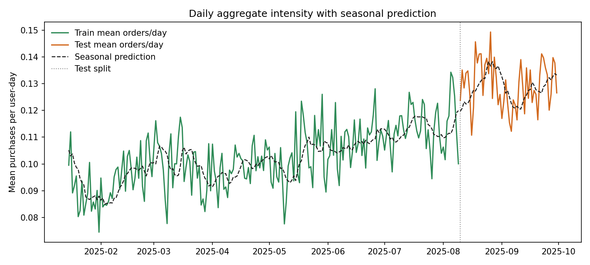
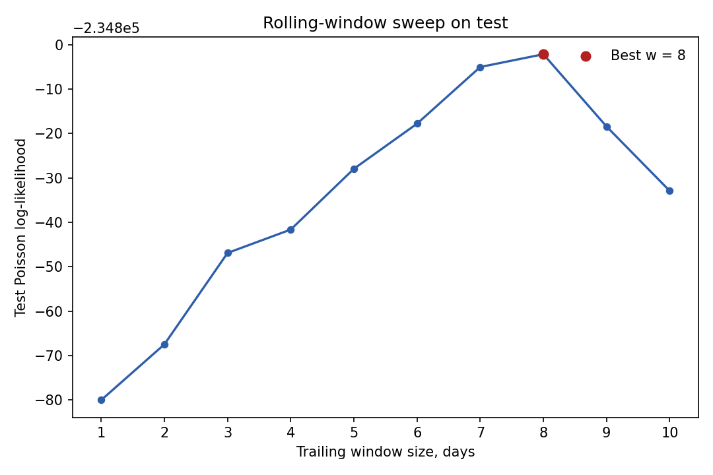

# Глава 2. Rolling Mean Poisson Model

## 2.1. Мотивация

После главы про глобальный Poisson и экспериментов с `day-of-week` сезонностью стало видно, что в данных остается еще один важный тип структуры: средний уровень интенсивности сам заметно меняется во времени.

Иными словами, помимо внутринедельных колебаний существует более медленный drift базового уровня покупок. Если моделировать только одну глобальную константу $\mu$, либо только фиксированный профиль по дням недели, то этот drift не будет пойман.

Поэтому перед переходом к более сложным моделям имеет смысл рассмотреть промежуточный baseline:

1. без персонализации;
2. без сезонности внутри недели;
3. но с медленно меняющейся во времени глобальной интенсивностью.

## 2.2. Постановка модели

Пусть

$$
\bar{y}_t = \frac{1}{N_t}\sum_u y_{u,t}
$$

обозначает среднее число покупок на один `user-day` в календарный день $t$.

Тогда rolling baseline задается как

$$
y_{u,t} \sim \mathrm{Poisson}(\lambda_t),
$$

где интенсивность в день $t$ определяется через среднее за предшествующие 7 дней:

$$
\lambda_t = \frac{1}{7}\sum_{j=1}^{7}\bar{y}_{t-j}.
$$

В общем виде при окне длины $w$:

$$
\lambda_t = \frac{1}{w}\sum_{j=1}^{w}\bar{y}_{t-j}.
$$

В текущей главе используется именно недельное окно:

$$
w = 7.
$$

Это принципиально простая модель. Она не разделяет пользователей и не различает дни недели, а только разрешает глобальному уровню интенсивности плавно меняться во времени.

## 2.3. Важная оговорка о протоколе

Эта модель является online one-step-ahead baseline.

Для дня $t$ она использует только прошлые наблюдения, то есть значения $\bar{y}_{t-1}, \bar{y}_{t-2}, \dots$. Поэтому утечки из будущего здесь нет. Однако на test-периоде модель имеет доступ к фактически реализованной истории предыдущих test-дней.

Это означает следующее:

1. сравнение с глобальным Poisson из главы 1 остается полезным;
2. но rolling baseline использует более богатый информационный набор, чем статическая модель с одной константой;
3. поэтому его нужно интерпретировать как промежуточный temporal baseline, а не как полностью симметричную замену статическим моделям.

Именно в этом и состоит его смысл: проверить, насколько важен сам по себе медленный drift уровня даже без внутринедельной сезонности.

## 2.4. Данные и окно анализа

Используется то же окно анализа, что и в предыдущих главах:

$$
2025\text{-}01\text{-}15 \le t \le 2025\text{-}09\text{-}30.
$$

Train/test split также не меняется:

1. train: до `2025-08-09`;
2. test: с `2025-08-10` по `2025-09-30`.

Для первых дней анализируемого окна rolling baseline использует warm start из предшествующей истории, то есть из календарных дней до `2025-01-15`. Эти дни не входят в метрики главы, но используются как доступная историческая информация.

## 2.5. Реализация

Для этой главы добавлен отдельный baseline:

1. модель: `src/diploma_baselines/models/rolling_poisson.py`;
2. пайплайн: `src/diploma_baselines/pipeline.py`;
3. раннер: `scripts/compute/run_rolling_poisson_baseline.py`.

Текущий baseline не оценивает параметры через MLE в привычном смысле. Вместо этого он использует фиксированное правило построения прогноза на основе trailing mean.

## 2.6. График динамики

Главный график этой главы показывает фактическую среднюю дневную интенсивность и rolling prediction:

На этом графике хорошо видно, что weekly rolling baseline довольно точно отслеживает медленный подъем уровня интенсивности. Именно поэтому по вероятностным метрикам он оказывается заметно сильнее глобального Poisson.

## 2.7. Результаты

Ниже global Poisson из главы 1 рассматривается как baseline, а rolling model как новая модель. В столбце `Delta` везде стоит разность

$$
\text{rolling} - \text{global Poisson}.
$$

Для `poisson_loglik` большее значение лучше. Для остальных метрик лучше меньшие значения.

### Train

| Metric | Global Poisson | Rolling Poisson | Delta |
| --- | ---: | ---: | ---: |
| `poisson_loglik` | `-765151.63` | `-764675.09` | `+476.54` |
| `mean_poisson_nll` | `0.38506` | `0.38482` | `-0.00024` |
| `mean_poisson_deviance` | `0.63152` | `0.63104` | `-0.00048` |
| `MAE` | `0.19291` | `0.19256` | `-0.00035` |
| `RMSE` | `0.58129` | `0.58125` | `-0.00004` |
| `aggregate_bias` | `0.00000` | `-0.00032` | `-0.00032` |

На train rolling baseline действительно слегка лучше почти по всем метрикам, но этот результат не является главным: гораздо важнее поведение на test.

### Test

| Metric | Global Poisson | Rolling Poisson | Delta |
| --- | ---: | ---: | ---: |
| `poisson_loglik` | `-236458.00` | `-234805.05` | `+1652.95` |
| `mean_poisson_nll` | `0.46083` | `0.45760` | `-0.00322` |
| `mean_poisson_deviance` | `0.74931` | `0.74287` | `-0.00644` |
| `MAE` | `0.21685` | `0.23878` | `+0.02192` |
| `RMSE` | `0.65496` | `0.65441` | `-0.00055` |
| `aggregate_bias` | `-0.02687` | `-0.00109` | `+0.02578` |
| `relative_aggregate_bias` | `-20.75%` | `-0.84%` | `+19.91 pp` |

Картина получается смешанной:

1. по вероятностным метрикам rolling baseline существенно лучше;
2. по aggregate bias он почти полностью устраняет систематическую недооценку test-периода;
3. но по `MAE` он оказывается заметно хуже.

## 2.8. Почему модель улучшает log-likelihood, но ухудшает MAE

Этот результат содержательно важен.

Глобальный Poisson сильно недооценивает общий уровень test-периода:

$$
\hat{\lambda}_{\text{global}} \approx 0.1026,
$$

в то время как средний test-уровень равен

$$
\bar{y}_{\text{test}} \approx 0.1295.
$$

Rolling baseline поднимает средний прогноз почти до этого уровня:

$$
\overline{\hat{\lambda}}_{\text{rolling,test}} \approx 0.1284.
$$

Именно поэтому log-likelihood резко улучшается: модель лучше калибрует интенсивность как параметр Poisson-распределения.

Однако по `MAE` ситуация другая. Когда модель поднимает интенсивность почти для всех user-day, она начинает сильнее ошибаться на многочисленных нулевых наблюдениях. Поэтому `MAE` может ухудшаться даже при существенном улучшении вероятностных метрик.

Это хороший пример того, что для count-моделей “лучшая intensity model” и “лучшая модель по абсолютной ошибке” не обязательно совпадают.

## 2.10. Почему выбрано окно в 7 дней

До сих пор в этой главе использовалось недельное окно `w = 7`. Это естественный первый выбор, потому что оно совпадает с длиной календарной недели. Однако полезно проверить, насколько это решение поддерживается самими данными.

Для этого был проведен простой sweep:

1. для каждого `w` от `1` до `10` строится rolling Poisson;
2. все остальные условия эксперимента остаются прежними;
3. на test считается `poisson_loglik`.

Полученная картина выглядит так:

1. при малых окнах `w = 1, 2, 3` качество хуже;
2. при увеличении окна до `6-8` дней `test log-likelihood` монотонно улучшается;
3. лучший результат на сетке `1..10` достигается при `w = 8`;
4. однако `w = 7` уступает ему совсем немного.

Численно:

1. `w = 7`: `test_poisson_loglik = -234805.05`;
2. `w = 8`: `test_poisson_loglik = -234802.18`;
3. разница составляет всего `+2.87` по `poisson_loglik`, или около `5.6e-06` по `mean_poisson_nll`.

Следовательно, выбор `w = 7` нельзя назвать строго оптимальным на этой сетке. Но его все еще разумно оставить как основной рабочий вариант:

1. он лежит практически на плато лучших решений;
2. проигрыш относительно лучшего окна очень мал;
3. недельное окно имеет естественную календарную интерпретацию, что удобно для дальнейшего объединения с внутринедельной сезонностью в следующей главе.

## 2.11. Выводы

Из этой промежуточной главы следуют четыре вывода.

1. В данных действительно есть медленно меняющийся глобальный уровень интенсивности.
2. Даже очень простой rolling baseline улавливает этот drift и резко улучшает Poisson log-likelihood.
3. При этом он не является универсально лучшим baseline, потому что по `MAE` его поведение хуже.
4. Окно `7` дней не является строгим оптимумом, но находится очень близко к лучшим значениям на сетке `1..10` и потому остается удобным базовым выбором.
5. Следующее естественное усложнение состоит в том, чтобы проверить, остается ли в данных дополнительная структура на уровне дней недели.

Следующая глава будет посвящена модели вида

$$
y_{u,t} \sim \mathrm{Poisson}(\lambda_t \cdot s_{d(t)}),
$$

где $\lambda_t$ задает rolling baseline уровня, а $s_{d(t)}$ описывает возможную внутринедельную сезонность.
