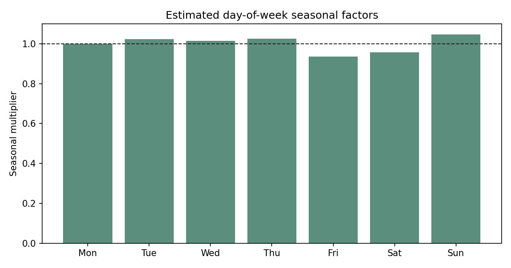
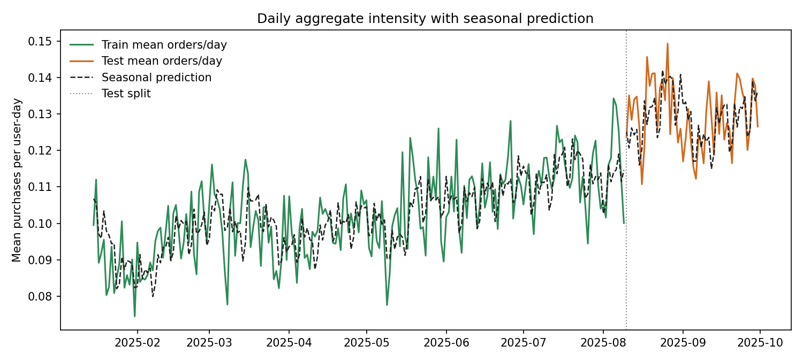

# Глава 3. Rolling Seasonal Poisson Model

## 3.1. Мотивация

После второй главы стало ясно, что главная проблема простого глобального Poisson состоит в нестационарности среднего уровня интенсивности. Weekly rolling baseline почти полностью устранил aggregate bias и резко улучшил Poisson log-likelihood.

Однако это еще не означает, что внутринедельная структура исчезла. Поэтому следующий естественный шаг состоит в том, чтобы объединить два эффекта:

1. медленно меняющийся во времени глобальный уровень;
2. фиксированную сезонность внутри недели.

Именно такую модель и рассматривает эта глава.

## 3.2. Модель

Пусть $d(t)$ обозначает день недели, а $\lambda_t$ медленно меняющийся базовый уровень интенсивности. Тогда модель имеет вид

$$
y_{u,t} \sim \mathrm{Poisson}(\lambda_t \cdot s_{d(t)}),
$$

где:

1. $\lambda_t > 0$ отвечает за общий уровень покупательской активности в день $t$;
2. $s_{d(t)} > 0$ задает внутринедельный сезонный множитель.

В этой главе сначала строится rolling baseline уровня, а затем по train оцениваются weekday-поправки как средние отклонения фактической интенсивности от этого baseline.

## 3.3. Оценивание weekday-correction поверх rolling baseline

Пусть $\hat{\lambda}^{\mathrm{roll}}_t$ обозначает rolling baseline, построенный только по прошлым дням. Тогда для каждого train-дня можно рассчитать относительное отклонение фактической интенсивности от rolling-прогноза:

$$
r_t = \frac{\bar{y}_t}{\hat{\lambda}^{\mathrm{roll}}_t}.
$$

После этого для каждого дня недели усредняется этот train-residual:

$$
\tilde{s}_k = \frac{1}{|\mathcal{T}_k|}\sum_{t \in \mathcal{T}_k} r_t,
$$

где $\mathcal{T}_k$ это множество train-дней, пришедшихся на день недели $k$.

После этого коэффициенты нормируются так, чтобы их среднее по train-экспозиции было равно единице:

$$
\hat{s}_k = \frac{\tilde{s}_k}{\sum_j w_j \tilde{s}_j},
$$

где $w_j$ это доля train-дней недели $j$.

Именно эти $\hat{s}_k$ затем используются как фиксированная weekday-поправка в test.

Для текущего train-периода получены следующие множители:

| Day | Multiplier |
| --- | ---: |
| Mon | `0.9992` |
| Tue | `1.0237` |
| Wed | `1.0152` |
| Thu | `1.0255` |
| Fri | `0.9357` |
| Sat | `0.9558` |
| Sun | `1.0472` |

График сезонных факторов:

## 3.4. Оценивание rolling level

Сначала по полному календарному ряду строится rolling baseline уровня:

$$
\hat{\lambda}^{\mathrm{roll}}_t = \frac{1}{7}\sum_{j=1}^{7}\bar{y}_{t-j}.
$$

Далее итоговый прогноз имеет вид:

$$
\widehat{\mathrm{E}}[y_{u,t}] = \hat{\lambda}^{\mathrm{roll}}_t \cdot \hat{s}_{d(t)}.
$$

Таким образом, weekday-correction здесь интерпретируется не как самостоятельный глобальный профиль, а как поправка к уже построенному rolling baseline.

## 3.5. Оговорка о протоколе

Как и во второй главе, это online one-step-ahead baseline.

Для прогнозирования дня $t$ используются только наблюдения до дня $t-1$, поэтому утечки из будущего нет. Однако на test модель имеет доступ к истории уже прошедших test-дней. Следовательно, это корректный sequential forecast, но не “frozen train-only” predictor.

Именно в таком качестве эту модель и нужно интерпретировать.

## 3.6. Данные и реализация

Используется тот же интервал:

$$
2025\text{-}01\text{-}15 \le t \le 2025\text{-}09\text{-}30.
$$

Split тот же:

1. train: до `2025-08-09`;
2. test: с `2025-08-10` по `2025-09-30`.

Реализация:

1. модель: `src/diploma_baselines/models/rolling_seasonal_poisson.py`;
2. пайплайн: `src/diploma_baselines/pipeline.py`;
3. раннер: `scripts/compute/run_rolling_seasonal_poisson_baseline.py`.

## 3.7. Графики

### Дневная динамика

По этому графику видно, что модель одновременно удерживает общий уровень рядом с фактической интенсивностью и учитывает более мелкий внутринедельный ритм.

## 3.8. Результаты

Ниже `rolling Poisson` из главы 2 рассматривается как основной baseline, а `rolling seasonal Poisson` как новая модель. В столбце `Delta vs rolling` стоит разность

$$
\text{rolling seasonal} - \text{rolling}.
$$

Для `poisson_loglik` большее значение лучше. Для остальных метрик лучше меньшие значения.

### Train

| Metric | Rolling Poisson | Rolling Seasonal | Delta vs rolling |
| --- | ---: | ---: | ---: |
| `poisson_loglik` | `-764675.09` | `-764524.08` | `+151.01` |
| `mean_poisson_nll` | `0.38482` | `0.38474` | `-0.00008` |
| `mean_poisson_deviance` | `0.63104` | `0.63089` | `-0.00015` |
| `MAE` | `0.19256` | `0.19254` | `-0.00002` |
| `RMSE` | `0.58125` | `0.58124` | `-0.00001` |
| `aggregate_bias` | `-0.00032` | `-0.00032` | `-0.00001` |

На train новая модель чуть лучше rolling-only baseline, но разница мала.

### Test

| Metric | Rolling Poisson | Rolling Seasonal | Delta vs rolling |
| --- | ---: | ---: | ---: |
| `poisson_loglik` | `-234805.05` | `-234781.61` | `+23.44` |
| `mean_poisson_nll` | `0.45760` | `0.45756` | `-0.00005` |
| `mean_poisson_deviance` | `0.74287` | `0.74278` | `-0.00009` |
| `MAE` | `0.23878` | `0.23894` | `+0.00016` |
| `RMSE` | `0.65441` | `0.65440` | `-0.00001` |
| `aggregate_bias` | `-0.00109` | `-0.00088` | `+0.00021` |
| `relative_aggregate_bias` | `-0.84%` | `-0.68%` | `+0.16 pp` |

На test добавление weekday seasonality поверх rolling mean дает положительный, но очень маленький выигрыш по вероятностным метрикам. По `MAE` модель остается немного хуже.

## 3.9. Интерпретация

Эта глава дает очень полезный для диплома вывод.

1. Эффект weekly seasonality в данных есть.
2. Но после учета slow drift уровня он почти полностью теряет самостоятельную силу.
3. Основной вклад в улучшение вероятностных метрик дает именно time-varying level.

Иначе говоря, чистый глобальный `seasonal Poisson` проигрывал не потому, что сама идея сезонности неверна, а потому что он боролся со второстепенным эффектом, пока главный эффект drift уровня оставался неучтенным.

## 3.10. Выводы

Из этой главы следуют три вывода.

1. Комбинация rolling level и weekday seasonality является более полной моделью, чем каждый из компонентов по отдельности.
2. Однако ее выигрыш над rolling-only baseline очень мал.
3. Это означает, что для текущего датасета fixed global weekday seasonality не является главным источником качества.

Практически это важный ориентир для следующих шагов: если хочется еще улучшать качество, следующий прирост, скорее всего, нужно искать не в более тонкой глобальной сезонности, а в персонализации или в более богатом использовании пользовательской истории.
