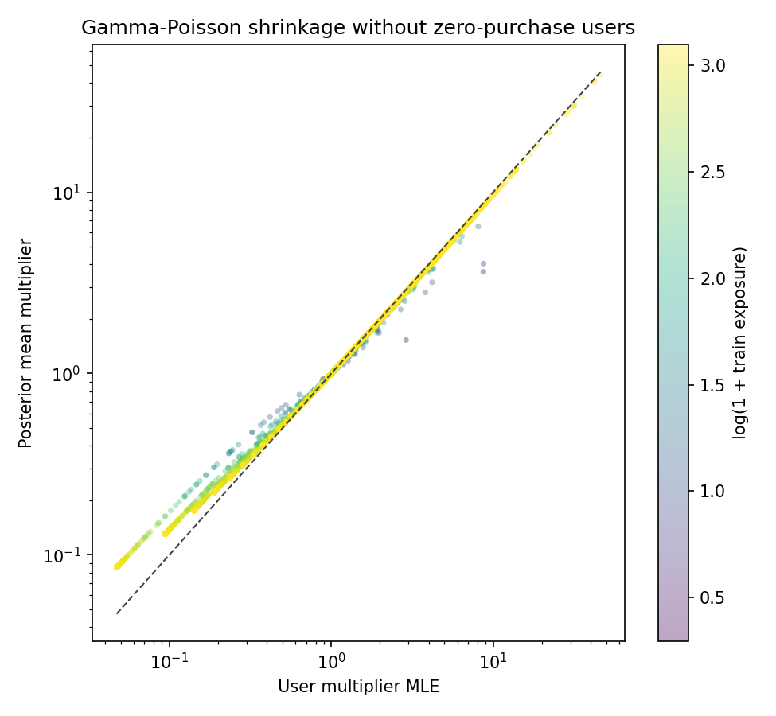
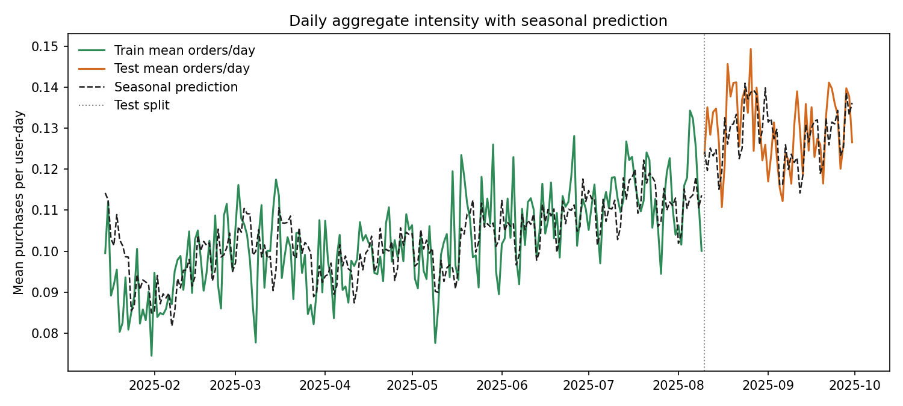

# Глава 4. Personalized Rolling Seasonal Poisson Model

## 4.1. Мотивация

После главы 3 уже видно, что общий временной тренд и слабая внутринедельная сезонность объясняют часть структуры данных. Однако даже после их учета остается очевидная неоднородность пользователей: одни систематически покупают больше, другие меньше.

Поэтому следующий шаг состоит в том, чтобы сохранить общий глобальный тренд из главы 3, но добавить пользовательский множитель интенсивности.

Интуитивно модель говорит следующее:

1. все пользователи живут примерно в одном и том же общем календарном тренде;
2. но у каждого пользователя есть собственный уровень активности;
3. этот уровень нужно оценивать аккуратно, с shrinkage, чтобы не переобучаться на редких пользователях.

## 4.2. Модель

Пусть $b_t$ обозначает общий baseline из главы 3:

$$
b_t = \lambda_t^{\mathrm{roll}} \cdot s_{d(t)}.
$$

Тогда для пользователя $u$ в день $t$ вводится персональный множитель $\mu_u$:

$$
y_{u,t} \mid \mu_u \sim \mathrm{Poisson}(\mu_u \cdot b_t).
$$

Здесь:

1. $b_t$ задает общий временной фон;
2. $\mu_u$ отражает устойчивую персональную активность пользователя относительно общего тренда.

Если $\mu_u > 1$, пользователь покупает активнее среднего; если $\mu_u < 1$, пассивнее среднего.

## 4.3. Gamma prior

Чтобы оценивать пользовательские множители аккуратно, вводится априорное распределение:

$$
\mu_u \sim \mathrm{Gamma}(\alpha, \beta),
$$

где используется параметризация `shape-rate`, то есть

$$
p(\mu_u)
= \frac{\beta^{\alpha}}{\Gamma(\alpha)} \mu_u^{\alpha - 1} e^{-\beta \mu_u},
\qquad \mu_u > 0.
$$

Для этого распределения:

$$
\mathbb{E}[\mu_u] = \frac{\alpha}{\beta},
\qquad
\mathrm{Var}(\mu_u) = \frac{\alpha}{\beta^2}.
$$

## 4.4. Сопряженность и posterior

Для конкретного пользователя достаточно двух sufficient statistics на train:

$$
Y_u = \sum_{t \in \mathcal{T}_{\mathrm{train}}} y_{u,t},
$$

$$
E_u = \sum_{t \in \mathcal{T}_{\mathrm{train}}} b_t.
$$

Здесь $Y_u$ это суммарное число покупок пользователя на train, а $E_u$ это суммарная train-экспозиция относительно общего baseline.

Тогда условное правдоподобие пользователя равно

$$
p(Y_u \mid \mu_u, E_u)
\propto
\mu_u^{Y_u} e^{-\mu_u E_u}.
$$

Благодаря сопряженности получаем posterior:

$$
\mu_u \mid Y_u, E_u \sim \mathrm{Gamma}(\alpha + Y_u, \beta + E_u).
$$

Отсюда posterior mean имеет вид

$$
\mathbb{E}[\mu_u \mid Y_u, E_u]
= \frac{\alpha + Y_u}{\beta + E_u}.
$$

Именно это значение и используется как оценка пользовательского множителя в прогнозе.

Тогда итоговый прогноз на test:

$$
\widehat{\mathbb{E}}[y_{u,t}]
= b_t \cdot \frac{\alpha + Y_u}{\beta + E_u}.
$$

Для пользователей, не наблюдавшихся на train, используется prior mean:

$$
\widehat{\mu}_u = \frac{\alpha}{\beta}.
$$

## 4.5. Empirical Bayes для гиперпараметров

Параметры $\alpha$ и $\beta$ не фиксируются вручную, а оцениваются по train-данным эмпирико-байесовским способом.

Интегрируя $\mu_u$, получаем маргинальное распределение для пользовательской статистики:

$$
p(Y_u \mid E_u, \alpha, \beta)
=
\frac{\Gamma(Y_u + \alpha)}{\Gamma(\alpha)\Gamma(Y_u + 1)}
\cdot
\frac{\beta^{\alpha} E_u^{Y_u}}{(\beta + E_u)^{Y_u + \alpha}}.
$$

Соответственно, гиперпараметры выбираются из задачи

$$
(\hat{\alpha}, \hat{\beta})
=
\arg\max_{\alpha > 0, \beta > 0}
\sum_u \log p(Y_u \mid E_u, \alpha, \beta).
$$

В текущем эксперименте получены:

$$
\hat{\alpha} = 0.8774,
\qquad
\hat{\beta} = 0.8808.
$$

Отсюда:

$$
\mathbb{E}[\mu_u] \approx 0.9961,
\qquad
\mathrm{Var}(\mu_u) \approx 1.1309.
$$

То есть prior mean практически равен единице, что хорошо согласуется с интерпретацией общего baseline как среднего уровня активности.

## 4.6. Почему нужен shrinkage

Если не использовать prior, то естественной оценкой был бы raw MLE:

$$
\hat{\mu}_u^{\mathrm{MLE}} = \frac{Y_u}{E_u}.
$$

Но для редких пользователей эта оценка оказывается очень шумной и легко переобучается.

Posterior mean автоматически осуществляет shrinkage:

$$
\hat{\mu}_u^{\mathrm{post}} = \frac{\alpha + Y_u}{\beta + E_u},
$$

то есть тянет редких пользователей к prior mean, а для пользователей с большой экспозицией становится близкой к raw MLE.

График shrinkage:

Отдельно полезно посмотреть на тот же график без пользователей с нулем покупок на train:

На первом графике хорошо видна вертикальная полоса слева: это пользователи с `Y_u = 0`, для которых raw MLE равен нулю. Таких пользователей в train `3.01%`. На втором графике эта группа убрана, и поэтому лучше видна основная интересующая структура: для большинства пользователей с ненулевой покупательской историей posterior mean лежит близко к диагонали, а заметный shrinkage происходит прежде всего у пользователей с малой train-экспозицией и экстремальным raw MLE.

Диагональ на этих графиках соответствует случаю `posterior = MLE`. Если точка лежит выше диагонали, то posterior mean больше raw MLE, то есть модель поднимает пользовательский коэффициент относительно сырой оценки. Если точка лежит ниже диагонали, то posterior mean меньше raw MLE, то есть происходит shrinkage вниз.

Интуитивно это означает следующее: байесовская модель не доверяет экстремальным пользовательским оценкам, если они опираются на слабую статистику. Поэтому слишком маленькие raw MLE она подтягивает вверх к общему уровню, а слишком большие, наоборот, опускает вниз.

## 4.7. Данные и реализация

Используется тот же интервал:

$$
2025\text{-}01\text{-}15 \le t \le 2025\text{-}09\text{-}30.
$$

Split тот же:

1. train: до `2025-08-09`;
2. test: с `2025-08-10` по `2025-09-30`.

Реализация:

1. модель: `src/diploma_baselines/models/personalized_gamma_poisson.py`;
2. общий baseline: `src/diploma_baselines/models/rolling_seasonal_poisson.py`;
3. пайплайн: `src/diploma_baselines/pipeline.py`;
4. раннер: `scripts/compute/run_personalized_rolling_seasonal_poisson_baseline.py`.

## 4.8. Дневная динамика

Следующий график показывает среднюю дневную интенсивность и предсказание personalized model:

Здесь видно, что модель удерживает общий уровень прогноза рядом с фактической интенсивностью и одновременно перераспределяет массу между пользователями через $\mu_u$.

## 4.9. Результаты

Ниже `rolling seasonal Poisson` из главы 3 рассматривается как предыдущая модель, а `posterior personalized Poisson` как новая модель. В столбце `Delta vs baseline` стоит разность

$$
\text{posterior personalized} - \text{rolling seasonal}.
$$

Для `poisson_loglik` большее значение лучше. Для остальных метрик лучше меньшие значения.

### Train

| Metric | Rolling Seasonal | Posterior Personalized | Delta vs baseline |
| --- | ---: | ---: | ---: |
| `poisson_loglik` | `-764524.08` | `-628387.14` | `+136136.94` |
| `mean_poisson_nll` | `0.38474` | `0.31623` | `-0.06851` |
| `mean_poisson_deviance` | `0.63089` | `0.49387` | `-0.13702` |
| `MAE` | `0.19254` | `0.17606` | `-0.01648` |
| `RMSE` | `0.58124` | `0.55269` | `-0.02855` |
| `aggregate_bias` | `-0.00032` | `0.00000` | `+0.00032` |

### Test

| Metric | Rolling Seasonal | Posterior Personalized | Delta vs baseline |
| --- | ---: | ---: | ---: |
| `poisson_loglik` | `-234781.61` | `-210167.01` | `+24614.60` |
| `mean_poisson_nll` | `0.45756` | `0.40959` | `-0.04797` |
| `mean_poisson_deviance` | `0.74278` | `0.64683` | `-0.09594` |
| `MAE` | `0.23894` | `0.21870` | `-0.02024` |
| `RMSE` | `0.65440` | `0.63140` | `-0.02300` |
| `aggregate_bias` | `-0.00088` | `-0.00169` | `-0.00081` |
| `relative_aggregate_bias` | `-0.68%` | `-1.30%` | `-0.62 pp` |

Это уже очень сильное улучшение: персонализация дает заметный прирост не только по likelihood-метрикам, но и по `MAE` и `RMSE`.

### Raw personalized MLE

Если вместо posterior mean использовать пользовательский raw MLE без shrinkage, то получаем:

1. train `mean_poisson_nll = 0.31594`;
2. test `mean_poisson_nll = 0.46503`.

То есть in-sample такая модель выглядит очень сильной, но на test переобучается и становится даже хуже, чем baseline без персонализации.

## 4.10. Сравнение моделей

### Posterior personalized vs raw MLE

На test:

1. `delta_poisson_loglik = +28449.68`;
2. `delta_mean_poisson_nll = -0.05544`;
3. `delta_mean_poisson_deviance = -0.11089`;
4. `delta_MAE = +0.00073`;
5. `delta_RMSE = -0.00079`.

Это важный результат главы:

1. raw MLE почти идеально подгоняет train;
2. но в probabilistic sense очень плохо переносится на test;
3. Gamma-posterior shrinkage радикально улучшает out-of-sample likelihood.

## 4.11. Интерпретация

Эта глава дает несколько важных выводов.

1. Пользовательская неоднородность в данных действительно очень сильна.
2. После того как общий тренд и слабая weekday seasonality уже учтены, добавление персонального множителя дает крупный прирост качества.
3. Наивная персонализация через raw MLE опасна: она переобучается.
4. Байесовский подход с Gamma prior дает ровно тот механизм shrinkage, который здесь нужен.

Именно поэтому эта глава является качественно более сильной, чем предыдущие baseline-шаги: здесь улучшение уже не косметическое, а существенное и устойчивое.

## 4.12. Выводы

Из главы 4 следуют три главных вывода.

1. Общий rolling seasonal baseline хорошо описывает временную структуру, но без персонализации остается слишком грубым.
2. Gamma-Poisson user-scaling дает математически аккуратный и интерпретируемый способ добавить персональную активность пользователя.
3. Empirical-Bayes shrinkage оказывается принципиально важным: без него персонализация переобучается, а с ним дает крупный выигрыш на test.

Это делает personalized multiplicative scaling естественным кандидатом на базовую вероятностную модель для дальнейших сравнений с более сложными подходами.
