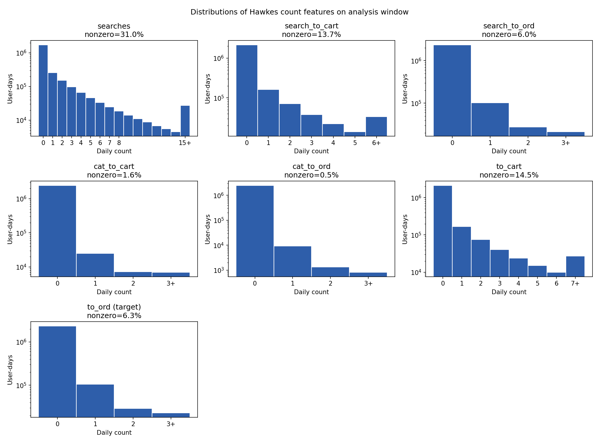
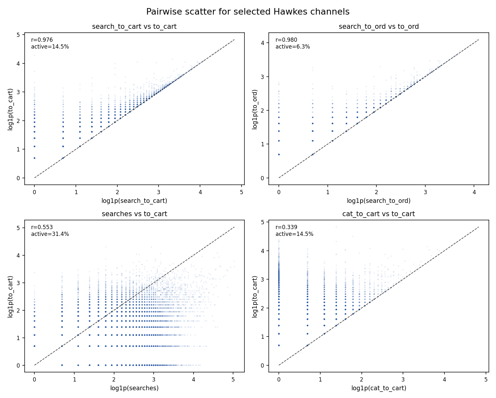

# 05. Исследование признаков для Hawkes-модели

До этого момента основная линия диплома работала в основном только с целевой переменной `to_ord`. Начиная с Hawkes-блока, для моделирования активности пользователя начинают активно использоваться и другие дневные count-признаки. Поэтому перед переходом к многоканальной intensity-модели полезно отдельно посмотреть на свойства этих признаков.

Сразу зафиксируем практический вывод этой главы: часть каналов дальше не используется в основном Hawkes-пайплайне, потому что они почти полностью дублируют уже оставшиеся признаки, размывают интерпретацию коэффициентов и практически не дают прироста в качестве.

## 5.1. Что исследуется

В этом разделе рассматриваются семь count-каналов, которые используются в Hawkes-модели:

1. `searches`;
2. `search_to_cart`;
3. `search_to_ord`;
4. `cat_to_cart`;
5. `cat_to_ord`;
6. `to_cart`;
7. `to_ord`.

Важно: основной target всей задачи тоже равен `to_ord`.

То есть:

1. как target `to_ord_{u,t}` означает число покупок пользователя в текущий день;
2. как Hawkes-channel `to_ord` та же колонка используется уже в лагированном виде, то есть как часть пользовательской истории.

Поэтому в этой главе `to_ord` явно трактуется как target-канал.

## 5.2. Протокол

Статистики считались на том же основном окне анализа:

1. `2025-01-15` -> `2025-09-30`;
2. всего `2,500,231` наблюдений `user-day`.

Код и артефакты:

1. модуль: `src/diploma_baselines/feature_research.py`;
2. раннер: `scripts/compute/run_experimental_hawkes_feature_research.py`;
3. summary: `diploma/reports/feature_research/summary.json`;
4. таблицы:
   - `diploma/reports/feature_research/feature_summary.csv`;
   - `diploma/reports/feature_research/feature_correlation.csv`;
   - `diploma/reports/feature_research/top_correlations.csv`.

## 5.3. Базовые статистики

Ниже приведены самые важные summary-статистики по семи каналам.

| Channel | Role | Mean | Nonzero share | P99 | Max |
| --- | --- | ---: | ---: | ---: | ---: |
| `searches` | `feature` | `1.238` | `30.98%` | `15` | `305` |
| `search_to_cart` | `feature` | `0.360` | `13.65%` | `6` | `157` |
| `search_to_ord` | `feature` | `0.102` | `6.02%` | `2` | `57` |
| `cat_to_cart` | `feature` | `0.029` | `1.57%` | `1` | `71` |
| `cat_to_ord` | `feature` | `0.006` | `0.45%` | `0` | `34` |
| `to_cart` | `feature` | `0.390` | `14.48%` | `7` | `157` |
| `to_ord` | `target` | `0.108` | `6.32%` | `2` | `59` |

Из таблицы сразу видно:

1. все признаки очень разреженные;
2. search-based каналы значительно плотнее category-based;
3. `cat_to_ord` особенно редок;
4. при этом у всех признаков есть длинный тяжелый хвост.

## 5.4. Распределения

Гистограммы подтверждают ту же картину:

1. у всех семи счетчиков доминирует ноль;
2. основная масса положительных значений сосредоточена на очень малых count;
3. при этом для search- и order-related каналов существуют редкие, но очень крупные всплески.

Это важный момент для Hawkes-постановки: модель работает не с “гладкими” числовыми признаками, а с очень sparse и heavy-tailed потоками.

## 5.5. Корреляции

Самые сильные парные корреляции:

1. `search_to_ord` vs `to_ord`: `0.980`;
2. `search_to_cart` vs `to_cart`: `0.976`;
3. `search_to_cart` vs `search_to_ord`: `0.575`;
4. `to_cart` vs `to_ord`: `0.573`;
5. `searches` vs `search_to_cart`: `0.559`;
6. `searches` vs `to_cart`: `0.553`.

То есть в данных есть две очень сильные почти вложенные пары:

1. `search_to_cart` и `to_cart`;
2. `search_to_ord` и `to_ord`.

Это уже само по себе создает сильную коллинеарность для Hawkes-базиса.

## 5.6. Pairwise scatter

Ниже показаны несколько наиболее показательных пар. Для читаемости графики строятся:

1. только по строкам, где хотя бы один из двух признаков ненулевой;
2. в координатах `log1p`, чтобы не потерять длинный хвост.

Компактный grid показывает четыре разных типа связи:

1. `search_to_cart` vs `to_cart`: почти линейная зависимость, потому что `search_to_cart` является атрибутированным подмножеством общего `to_cart`;
2. `search_to_ord` vs `to_ord`: еще более сильная вложенность между order-каналом из поиска и общим target-каналом;
3. `searches` vs `to_cart`: уже не почти тождественная, а более содержательная upstream-связь;
4. `cat_to_cart` vs `to_cart`: category-based сигнал заметно более редкий и связан с общим `to_cart` слабее.

Для дальнейшего Hawkes-блока здесь важен практический вывод: корреляция пар

1. `search_to_cart` vs `to_cart`;
2. `search_to_ord` vs `to_ord`

настолько сильна, что `search_to_cart` и `search_to_ord` удобно трактовать как вторичные признаки. Поэтому в основном Hawkes-базисе они временно удаляются, а их роль берут на себя уже оставшиеся `to_cart` и `to_ord`.

## 5.7. Вывод

Из этого исследования признаков следуют три важных вывода.

1. Входные Hawkes-признаки очень sparse и heavy-tailed.
2. Между несколькими ключевыми каналами есть очень сильная корреляция, особенно:
   - `search_to_cart` vs `to_cart`;
   - `search_to_ord` vs `to_ord`.
3. Поэтому при интерпретации Hawkes-коэффициентов нужно быть осторожным: часть нестабильности `alpha` может объясняться не изменением самого сигнала, а перераспределением весов между сильно коррелированными каналами.

Практически это хорошо согласуется с предыдущими экспериментами по excitation stability: итоговый Hawkes-сигнал может оставаться устойчивым даже тогда, когда отдельные коэффициенты двигаются.
