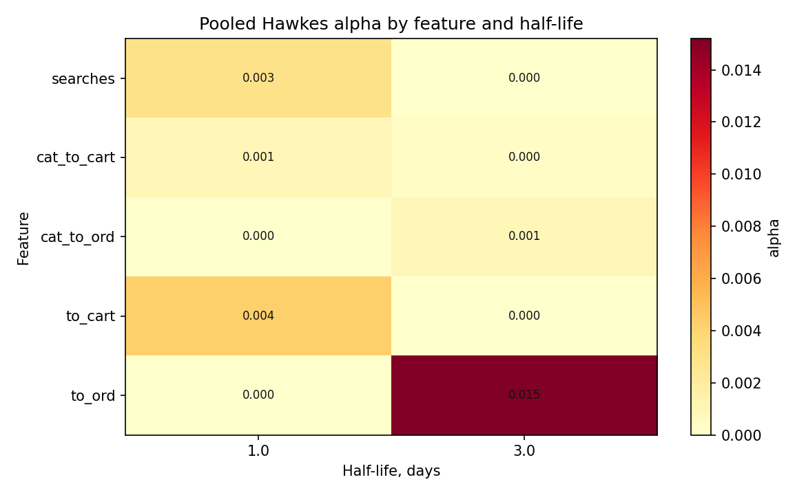
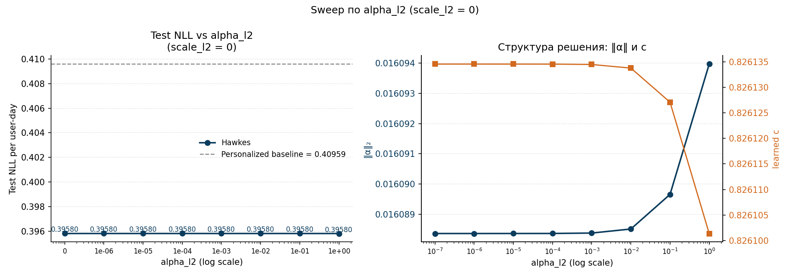
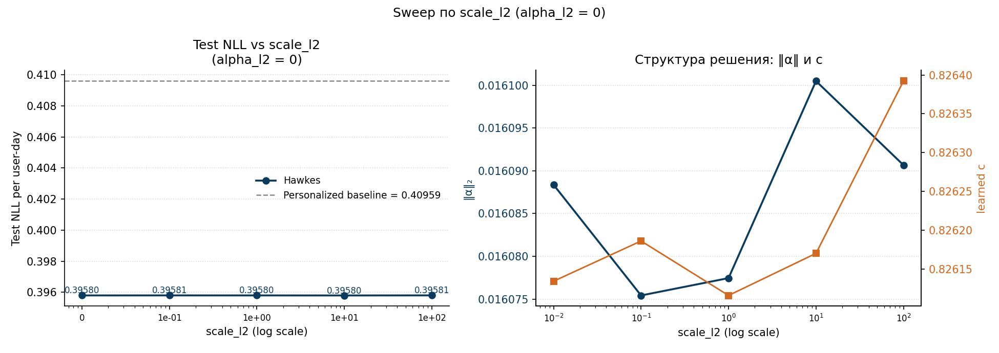

# 06. Hawkes-модель с обучаемым scale поверх baseline

## 6.1. Предварительная additive-постановка и мотивация

Перед текущей моделью была проверена более простая pooled additive Hawkes-постановка:

$$
\lambda_{\mathrm{hawkes}}(u,t)
=
\lambda_{\mathrm{base}}(u,t)
+
\sum_{j=1}^{J}\sum_{m=1}^{M} \alpha_{j,m} z_{u,j,m,t},
$$

где все коэффициенты $\alpha_{j,m}$ ограничивались снизу нулем. Эта версия оказалась полезной как быстрый sanity check: она действительно улучшала likelihood поверх сильного personalized Poisson, но делала это не слишком аккуратно. Структурно модель могла только повышать baseline, а не перекалибровывать его вниз, поэтому:

1. likelihood рос;
2. средняя предсказанная интенсивность систематически завышалась;
3. aggregate bias становился положительным;
4. user-level выигрыш концентрировался только в более активных сегментах;
5. по `MAE` модель проигрывала personalized Poisson.

Поэтому отдельной главой эта ранняя additive-версия не оставляется. В этой главе рассматривается уже более естественная постановка: Hawkes должен иметь возможность сначала перекалибровать baseline, а затем добавить краткосрочную history-based надстройку.

## 6.2. Модель

В качестве основной Hawkes-модели выбирается scaled-baseline Hawkes с двумя короткими half-life `1` и `3` дня:

$$
\lambda_{\mathrm{hawkes}}(u,t)
=
c \cdot \lambda_{\mathrm{base}}(u,t)
+
\sum_{j=1}^{J}\sum_{m \in \{1,3\}} \alpha_{j,m} z_{u,j,m,t},
$$

где:

1. $\lambda_{\mathrm{base}}(u,t)$ — сильный personalized rolling seasonal Poisson из главы 4;
2. $c > 0$ — обучаемый глобальный scale baseline;
3. $\alpha_{j,m} \ge 0$ — pooled Hawkes-коэффициенты;
4. $z_{u,j,m,t}$ — экспоненциально затухающие состояния, построенные по прошлой пользовательской активности.

Здесь параметр обозначен через $c$, а не через $\mu$, чтобы не конфликтовать с пользовательскими множителями $\mu_u$ из главы 4.

Интерпретация модели:

1. $c \cdot \lambda_{\mathrm{base}}(u,t)$ отвечает за глобальную перекалибровку базовой интенсивности;
2. Hawkes-слагаемое отвечает уже не за общий сдвиг уровня, а за краткосрочные history-effects поверх перекалиброванного baseline.

На текущем этапе Hawkes-часть строится не по всем семи исходным count-каналам, а по сокращенному набору:

1. `searches`;
2. `cat_to_cart`;
3. `cat_to_ord`;
4. `to_cart`;
5. `to_ord`.

Каналы `search_to_cart` и `search_to_ord` временно убраны из основной Hawkes-модели, потому что в главе 05 и отдельном pre-check они почти полностью дублировали уже оставшиеся `to_cart` и `to_ord`, но почти не меняли итоговые метрики.

Ниже в разделе `6.9` отдельно показано, что именно компактный базис `(1,3)` выбирается как основной по итогам сравнения нескольких наборов half-life.

## 6.3. Обучение

На train минимизируется регуляризованный пуассоновский negative log-likelihood:

$$
\mathcal{L}(c,\alpha)
=
-\log p\!\left(y \mid c \lambda_{\mathrm{base}} + X\alpha\right)
+
\lambda_{\alpha}\|\alpha\|_2^2
+
\lambda_c (c-1)^2.
$$

Здесь:

1. штраф на $\alpha$ контролирует величину Hawkes-надстройки;
2. штраф на $(c-1)^2$ не позволяет scale слишком далеко уходить от уже сильного baseline из главы 4.

В текущем запуске использовались:

1. `alpha_l2 = 1e-4`;
2. `scale_l2 = 10.0`;
3. `max_iter = 300`.

Обученный параметр scale получился равным

$$
\hat{c} = 0.8261.
$$

То есть модель сначала немного уменьшает baseline, а затем добавляет Hawkes-excitation за счет короткой памяти на горизонте `1-3` дней.

## 6.4. Протокол и реализация

Протокол полностью совпадает с предыдущими главами:

1. анализируемое окно: `2025-01-15` -> `2025-09-30`;
2. train: до `2025-08-09`;
3. test: с `2025-08-10` по `2025-09-30`;
4. evaluation: тот же sequential one-step-ahead protocol.

Код:

1. модель: `src/diploma_baselines/models/hawkes.py`;
2. pipeline: `src/diploma_baselines/pipeline.py`;
3. раннер: `scripts/run_experimental_1_hawkes.py`.

Артефакты:

1. `diploma/reports/experimental_1_hawkes/summary.json`;
2. `diploma/reports/experimental_1_hawkes/alpha_heatmap.png`;
3. `diploma/reports/experimental_1_hawkes/delta_ll_vs_test_purchases_personalized_to_hawkes.png`;
4. `diploma/reports/experimental_1_hawkes/user_ll_gain_hist.png`;
5. `diploma/reports/experimental_1_hawkes/alpha_table.csv`.

## 6.5. Что получилось на данных

Ниже `personalized rolling seasonal Poisson` из главы 4 рассматривается как предыдущая модель, а `scaled-baseline Hawkes` как новая модель.

Для `poisson_loglik` большее значение лучше. Для остальных метрик лучше меньшие значения.

### Train

| Metric | Personalized Poisson | Scaled-baseline Hawkes | Delta vs baseline |
| --- | ---: | ---: | ---: |
| `poisson_loglik` | `-628387.14` | `-624221.17` | `+4165.97` |
| `mean_poisson_nll` | `0.31623` | `0.31413` | `-0.00210` |
| `mean_poisson_deviance` | `0.49387` | `0.48967` | `-0.00419` |
| `MAE` | `0.17606` | `0.17572` | `-0.00034` |
| `RMSE` | `0.55269` | `0.55175` | `-0.00094` |
| `aggregate_bias` | `0.00000` | `0.00001` | `+0.00001` |

### Test

| Metric | Personalized Poisson | Scaled-baseline Hawkes | Delta vs baseline |
| --- | ---: | ---: | ---: |
| `poisson_loglik` | `-210167.01` | `-203093.06` | `+7073.95` |
| `mean_poisson_nll` | `0.40959` | `0.39580` | `-0.01379` |
| `mean_poisson_deviance` | `0.64683` | `0.61926` | `-0.02757` |
| `MAE` | `0.21870` | `0.21691` | `-0.00179` |
| `RMSE` | `0.63140` | `0.62719` | `-0.00421` |
| `aggregate_bias` | `-0.00169` | `-0.00259` | `-0.00091` |
| `relative_aggregate_bias` | `-1.30%` | `-2.00%` | `-0.70 pp` |

Картина получается следующая:

1. likelihood-метрики заметно улучшаются;
2. `MAE` и `RMSE` тоже улучшаются;
3. положительный bias исчезает.

## 6.6. Какие сигналы реально использовались

Оцененные Hawkes-коэффициенты:

В выбранной модели остаются только два коротких масштаба памяти, и структура становится существенно проще для интерпретации:

1. `searches` и `to_cart` живут почти полностью на half-life `1` день;
2. `to_ord` несет основной order-memory на half-life `3` дня;
3. category-based каналы остаются заметно слабее, но не исчезают полностью;
4. явной необходимости в более длинных ядрах при такой постановке уже не видно.

## 6.7. User-level картина

Ниже показано, как user-level `delta LL` зависит от числа покупок в test:

Сводка по сравнению с personalized Poisson:

1. `share(new > prev) = 63.4%`;
2. `mean_delta_ll = +0.7127`;
3. `median_delta_ll = +0.1614`.

По бакетам `test purchases` новая модель выглядит так:

1. `0` покупок: `80.4%` пользователей выигрывают;
2. `1` покупка: `55.1%`;
3. `2` покупки: `54.2%`;
4. `3-5` покупок: `59.0%`;
5. `6-10` покупок: `62.1%`;
6. `11+` покупок: `66.2%`.

То есть выбранная версия Hawkes дает уже не локальный, а массовый user-level gain.

## 6.8. Вывод

Этот эксперимент фиксирует основной Hawkes-baseline для дальнейшей research-ветки.

1. Добавление обучаемого scale делает Hawkes-модель методологически более корректной.
2. Компактный базис half-life `(1,3)` почти полностью сохраняет выигрыш более широкого набора ядер.
3. На текущем split выбранная версия выигрывает у personalized Poisson по всем основным метрикам, включая `MAE`.
4. Поэтому дальше именно эта постановка используется как основной Hawkes-кандидат, а выбор числа half-life фиксируется внутри раздела `6.9`.

## 6.9. Нужны ли более длинные half-life

Чтобы этот вывод был наглядным, ниже собраны test-метрики для трех прогонов одной и той же Hawkes-модели:

1. только `half-life = (1)`;
2. выбранный основной базис `half-life = (1,3)`;
3. расширенный базис `half-life = (1,3,7,21)`.

Для `poisson_loglik` большее значение лучше. Для остальных метрик лучше меньшие значения.

| Half-lives | `poisson_loglik` | `mean_poisson_nll` | `mean_poisson_deviance` | `MAE` | `RMSE` | `delta_poisson_loglik` vs personalized | `delta_poisson_loglik` vs `(1,3)` |
| --- | ---: | ---: | ---: | ---: | ---: | ---: | ---: |
| `(1)` | `-204037.35` | `0.39764` | `0.62294` | `0.21710` | `0.62786` | `+6129.67` | `-944.29` |
| `(1,3)` | `-203093.06` | `0.39580` | `0.61926` | `0.21691` | `0.62719` | `+7073.95` | `0.00` |
| `(1,3,7,21)` | `-202909.79` | `0.39544` | `0.61855` | `0.21682` | `0.62706` | `+7257.22` | `+183.27` |

Картина получается очень четкой:

1. переход от `(1)` к `(1,3)` дает заметный прирост по всем test-метрикам;
2. переход от `(1,3)` к `(1,3,7,21)` дает уже очень маленькое улучшение;
3. по `poisson_loglik` полный базис лучше `(1,3)` всего на `183.27`;
4. по `MAE` и `RMSE` различие между `(1,3)` и полным базисом практически исчезает.

Следовательно, более длинные half-life в текущей постановке почти не нужны. Основной полезный Hawkes-сигнал уже захватывается базисом `(1,3)`, поэтому именно он и выбирается как основная модель.

## 6.10. Чувствительность к регуляризации

В loss'e модели присутствуют два регуляризационных штрафа:

1. `alpha_l2` — `L2`-штраф на `‖α‖²`;
2. `scale_l2` — `L2`-штраф на `(c − 1)²`.

Несмотря на то что данных у нас много (`~2 \cdot 10^6` user-day на train), и в этом режиме переобучения по 11 параметрам быть не должно, имеет смысл явно проверить, что выбор регуляризации не меняет результат. Поэтому ниже — две независимых сетки.

**Sweep A.** `alpha_l2 ∈ {0, 10⁻⁶, 10⁻⁵, 10⁻⁴, 10⁻³, 10⁻², 10⁻¹, 1}`, `scale_l2 = 0`.

| `alpha_l2` | Test NLL | learned `c` | `‖α‖₂` |
| ---: | ---: | ---: | ---: |
| `0` | `0.39580` | `0.8261` | `0.0161` |
| `1e-6` ... `1` | `0.39580` | `0.8261` | `0.0161` |

Полное отсутствие чувствительности на всём диапазоне — тестовая NLL, обученный `c` и `‖α‖` совпадают вплоть до 4-го знака после запятой.

**Sweep B.** `scale_l2 ∈ {0, 10⁻¹, 1, 10, 100}`, `alpha_l2 = 0`.

| `scale_l2` | Test NLL | learned `c` | `‖α‖₂` |
| ---: | ---: | ---: | ---: |
| `0` | `0.39580` | `0.8261` | `0.0161` |
| `1e-1` | `0.39581` | `0.8262` | `0.0161` |
| `1` | `0.39580` | `0.8261` | `0.0161` |
| `10` | `0.39580` | `0.8262` | `0.0161` |
| `100` | `0.39581` | `0.8264` | `0.0161` |

Та же картина — никакого влияния на решение.

**Вывод.** На основном split-е выбор `(alpha_l2, scale_l2)` практически не влияет на результат: data-likelihood-выигрыш от Hawkes-надстройки на `~2 \cdot 10^6` user-day сильно превышает регуляризационный штраф во всех значениях этих сеток. Поэтому в работе эти параметры зафиксированы в стандартных значениях `alpha_l2 = 1e-4`, `scale_l2 = 10`, без дальнейшего тюнинга.

Скрипт: [`scripts/compute/run_hawkes_reg_sweeps.py`](../scripts/compute/run_hawkes_reg_sweeps.py); CSV — `diploma/reports/hawkes_reg_sweeps/sweep_alpha_l2.csv`, `sweep_scale_l2.csv`.
