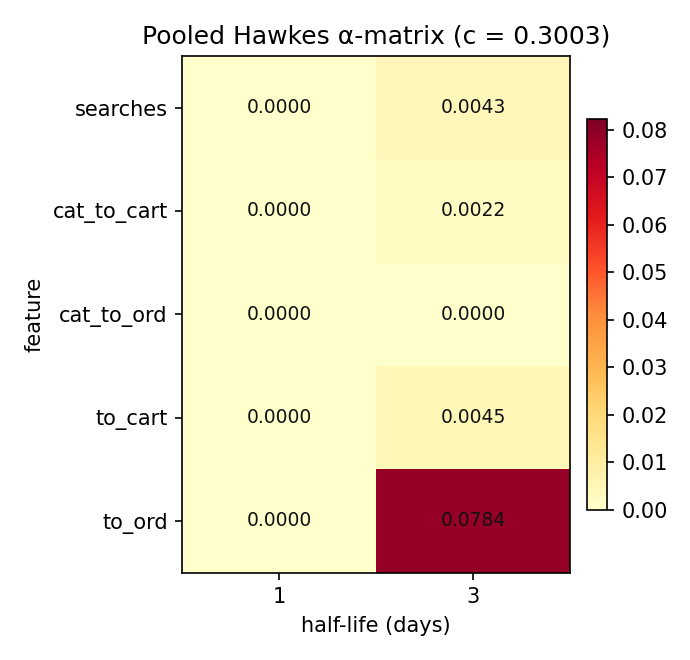
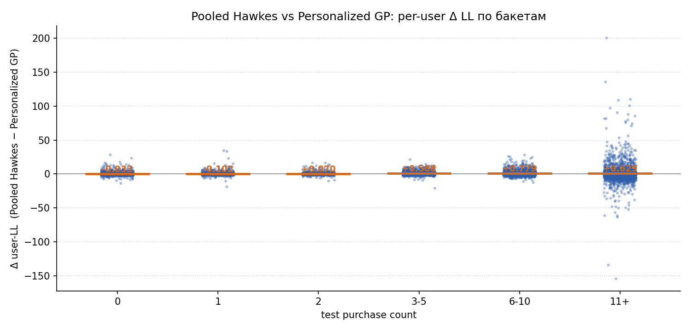
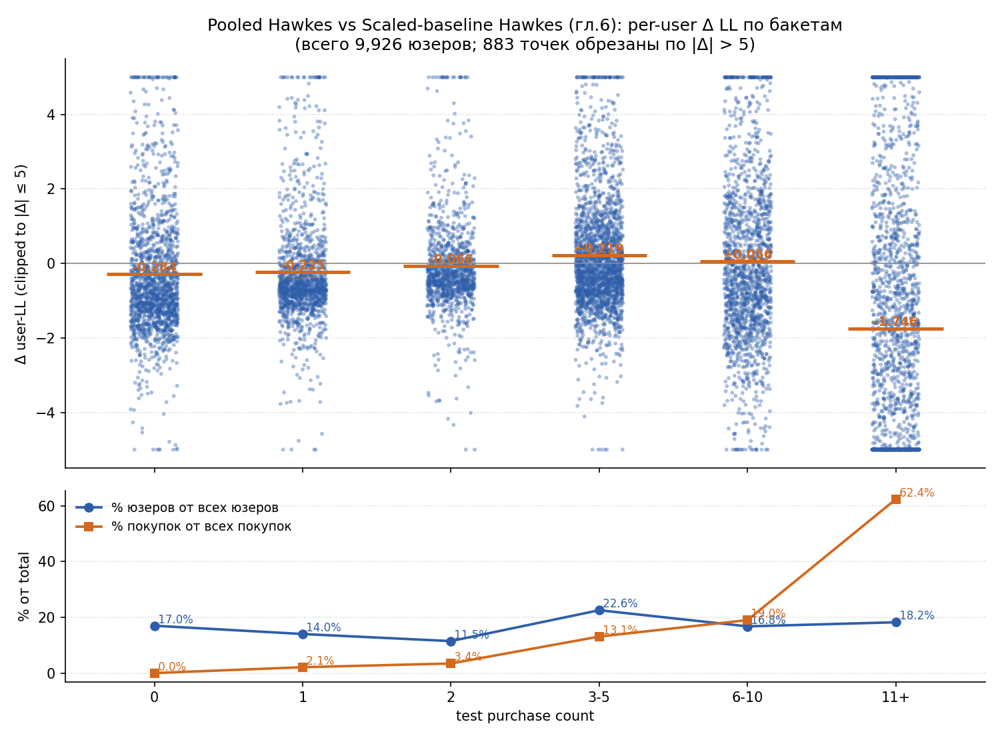

# 07. Pooled Hawkes без per-user multiplier

## 7.1. Мотивация

В главе 4 индивидуальная активность пользователя моделируется через статический per-user multiplier $\mu_u$ перед общим baseline $b_t$. В главе 6 поверх этой модели добавляется Hawkes-надстройка, которая ловит уже не уровень активности, а её краткосрочные history-effects.

Однако сама по себе постановка "статический множитель $\mu_u$ × baseline + dynamic Hawkes" — не единственный способ ввести персонализацию в эту модель. Hawkes-состояния $z_{u,j,m,t}$ по построению per-user (это exp-decay-сглаженная история фичей конкретного пользователя). А значит, в принципе можно полностью переложить персонализацию на Hawkes-часть и не вводить отдельный статический множитель.

В этой главе исследуется именно такая постановка: один глобальный масштаб baseline для всех пользователей и pooled Hawkes-надстройка с per-user states.

## 7.2. Модель

Используется модель вида

$$
\lambda_{u,t}
=
c \cdot b_t
+
\sum_{j=1}^{J}\sum_{m \in \{1,3\}} \alpha_{j,m} z_{u,j,m,t},
$$

где:

1. $b_t$ — общий rolling-seasonal baseline (зависит только от дня $t$, не от юзера);
2. $c > 0$ — единственный глобальный скаляр, общий для всех пользователей;
3. $\alpha_{j,m} \ge 0$ — pooled Hawkes-коэффициенты, общие для всей панели;
4. $z_{u,j,m,t}$ — per-user Hawkes-состояния в день $t$.

Существенно: **per-user multiplier $\mu_u$ исчез из модели**. Вся персонализация теперь приходит через $z_{u,j,m,t}$, который у каждого пользователя свой по построению.

Итого `1 + 5 \cdot 2 = 11` обучаемых параметров на всю панель из ~10K пользователей.

Hawkes-часть строится по тому же сокращённому набору каналов, что и в главе 6:

1. `searches`;
2. `cat_to_cart`;
3. `cat_to_ord`;
4. `to_cart`;
5. `to_ord`.

Half-lives те же — `(1, 3)` дня.

## 7.3. Обучение

На train минимизируется регуляризованный пуассоновский negative log-likelihood:

$$
\mathcal{L}(c, \alpha)
=
-\log p\!\left(y \mid c \cdot b_t + X\alpha\right)
+
\lambda_{\alpha} \|\alpha\|_2^2
+
\lambda_c (c - 1)^2.
$$

Регуляризация — те же дефолтные значения, что и в главе 6: `alpha_l2 = 1e-4`, `scale_l2 = 10.0`, `max_iter = 500`. Поскольку обучаемых параметров всего `11`, переобучения по ним на `~2 \cdot 10^6` user-day быть не может; отдельная sensitivity-проверка тут не проводится.

Обученные параметры:

$$
\hat{c} = 0.3003, \qquad \|\hat\alpha\|_2 = 0.0786.
$$

Видно сразу, что глобальный масштаб baseline сильно занижается (`c \approx 0.30`, против `0.83` в главе 6) — Hawkes-надстройка теперь несёт основную долю интенсивности, а не работает как поправка.

## 7.4. Протокол и реализация

Протокол совпадает с предыдущими главами:

1. анализируемое окно: `2025-01-15` → `2025-09-30`;
2. train: до `2025-08-09`;
3. test: с `2025-08-10` по `2025-09-30`;
4. evaluation: тот же sequential one-step-ahead protocol.

Код:

1. раннер: [`scripts/run_pooled_hawkes_ch7.py`](../scripts/run_pooled_hawkes_ch7.py);
2. фит и predict — внутри раннера (loss и L-BFGS-B напрямую, без отдельной библиотеки);
3. построение Hawkes-states — `src/diploma_baselines/models/hawkes.py` (`build_basis_states`).

Артефакты:

1. `diploma/reports/07_pooled_hawkes/summary.json`;
2. `diploma/reports/07_pooled_hawkes/alpha_heatmap.png`;
3. `diploma/reports/07_pooled_hawkes/alpha_table.csv`;
4. `diploma/reports/07_pooled_hawkes/delta_ll_vs_test_purchases.png`;
5. `diploma/reports/07_pooled_hawkes/user_ll_scores.csv`.

## 7.5. Что получилось на данных

Ниже `personalized rolling seasonal Poisson` из главы 4 рассматривается как предыдущая модель, а `Pooled Hawkes` — как новая.

Для `poisson_loglik` большее значение лучше. Для остальных метрик лучше меньшие значения.

### Train

| Metric | Personalized Poisson | Pooled Hawkes | Delta vs baseline |
| --- | ---: | ---: | ---: |
| `poisson_loglik` | `-628387.14` | `-671642.48` | `-43255.34` |
| `mean_poisson_nll` | `0.31623` | `0.33800` | `+0.02177` |
| `mean_poisson_deviance` | `0.49387` | `0.53741` | `+0.04354` |

### Test

| Metric | Personalized Poisson | Pooled Hawkes | Delta vs baseline |
| --- | ---: | ---: | ---: |
| `poisson_loglik` | `-210167.01` | `-206534.60` | `+3632.41` |
| `mean_poisson_nll` | `0.40959` | `0.40251` | `-0.00708` |
| `mean_poisson_deviance` | `0.64683` | `0.63268` | `-0.01416` |
| `MAE` | `0.21870` | `0.21866` | `-0.00004` |
| `RMSE` | `0.63140` | `0.63181` | `+0.00040` |
| `aggregate_bias` | `-0.00169` | `-0.00427` | `-0.00258` |
| `relative_aggregate_bias` | `-1.30%` | `-3.30%` | `-2.00 pp` |

Картина любопытная:

1. На train модель **хуже** Personalized Poisson — это и ожидаемо: 11 параметров против ~10K в EB-модели, in-sample fit беднее.
2. На test модель **лучше** по likelihood-метрикам — `+3632` нат / `−0.0071` нат/n. То есть простая 11-параметрическая модель обобщается лучше, чем 10K-параметрическая EB.
3. По `MAE` и `RMSE` модели практически совпадают.
4. `relative aggregate bias` хуже — модель более консервативная в общей массе.

Сравнение с моделью из главы 6 (Scaled-baseline Hawkes, тоже на half_lives `(1, 3)`): на test Pooled Hawkes даёт `-206535`, Scaled-baseline даёт `-203093`. То есть в этой постановке **Pooled Hawkes уступает Scaled-baseline Hawkes** на `~3442` нат / `+0.0067` нат/n.

## 7.6. Какие сигналы реально использовались

Оцененные Hawkes-коэффициенты:



Картина:

1. основной вес — на `to_ord` с half-life `3` дня (`α = 0.0784`);
2. вторичные вклады: `searches` и `to_cart` на half-life `3` дня;
3. `to_ord (hl=1)`, `cat_to_cart (hl=1)`, `cat_to_ord` на любом half-life — обнуляются оптимизатором (упираются в `α = 0`).

Контраст с главой 6: в Scaled-baseline Hawkes основной сигнал был на `to_ord (hl=3) ≈ 0.015`, а здесь — `0.078` (в `5×` раз больше). Это ожидаемо: в Pooled Hawkes Hawkes-надстройка в одиночку отвечает за всё personalized-ядро, поэтому веса у неё крупнее.

## 7.7. User-level картина



Сводка по сравнению с Personalized Poisson:

1. `share(pooled > pers) = 41.5%`;
2. `mean_delta_ll = +0.366` (per user);
3. `median_delta_ll = −0.380`.

То есть **на медианном пользователе Pooled Hawkes проигрывает**, но на среднем — выигрывает (за счёт того, что выигрыш на активных пользователях намного больше потери на неактивных).

По бакетам `test purchases`:

| Бакет | n | mean Δ LL | share(pooled > pers) |
| --- | ---: | ---: | ---: |
| `0` | `1686` | `−0.033` | `35.8%` |
| `1` | `1391` | `−0.102` | `28.1%` |
| `2` | `1138` | `+0.070` | `38.0%` |
| `3-5` | `2239` | `+0.588` | `51.5%` |
| `6-10` | `1663` | `+0.779` | `48.2%` |
| `11+` | `1809` | `+0.629` | `41.1%` |

Это важно для интерпретации: Pooled Hawkes **выигрывает на активных пользователях** (где dynamic Hawkes-сигнал содержательно работает) и **проигрывает на 0-1 buyers**, для которых статический $\mu_u^{EB}$ из главы 4 даёт более стабильную и корректно сжатую к нулю оценку.

## 7.8. User-level картина: vs Scaled-baseline Hawkes из главы 6

Пер-юзерное сравнение с моделью из главы 6 (Scaled-baseline Hawkes на тех же `(1, 3)`):



Сводка:

1. `share(pooled > ch.6) = 36.1%`;
2. `mean_delta_ll = −0.347` (per user);
3. `median_delta_ll = −0.486`.

По бакетам:

| Бакет | n | mean Δ LL | share(pooled > ch.6) |
| --- | ---: | ---: | ---: |
| `0` | `1686` | `−0.284` | `29.8%` |
| `1` | `1391` | `−0.225` | `24.8%` |
| `2` | `1138` | `−0.066` | `32.2%` |
| `3-5` | `2239` | `+0.219` | `45.9%` |
| `6-10` | `1663` | `+0.056` | `42.9%` |
| `11+` | `1809` | `−1.746` | `34.8%` |

Картина показательная и **зеркальна** разделу 7.7:

1. Pooled Hawkes систематически проигрывает Scaled-baseline Hawkes на 0–2 buyers (у Scaled $\mu_u^{EB}$ корректно сжимает их вниз).
2. Pooled слегка выигрывает на 3–10 buyers (там dynamic Hawkes-сигнал сильнее статического `μ_u`).
3. На 11+ buyers Pooled **сильно проигрывает** (mean `−1.75` нат/юзер) — у этих пользователей больше всего покупок (`62%` от всех в test), и `μ_u^{EB}` оценивается особенно надёжно.

Именно бакет `11+` объясняет основную долю общего отставания Pooled Hawkes: `1809 \cdot (-1.75) \approx -3170` нат, что почти полностью покрывает суммарный недостаток `−3442` нат относительно Scaled-baseline Hawkes на test.

## 7.9. Вывод

1. Pooled Hawkes без per-user multiplier — корректная альтернативная параметризация: всё personalization-усилие ложится на Hawkes-states.
2. На тех же half-lives `(1, 3)`, что и в главе 6, эта модель **лучше Personalized GP на test**, но **хуже Scaled-baseline Hawkes**: статический $\mu_u^{EB}$ всё ещё несёт полезный сигнал на длинной выборке.
3. На in-sample train эта модель уступает обеим — у неё всего 11 параметров против ~10K у EB-моделей; но это ровно то, что объясняет лучшую generalization относительно Personalized GP.
4. По user-level breakdown'у видно конкретное место, где Pooled Hawkes выигрывает (активные пользователи) и проигрывает (неактивные). Если задача требует и того и другого — обе модели можно сочетать; но в рамках этой главы фиксируется именно "чистый" Pooled-вариант.

## 7.10. Воспроизведение

```bash
python scripts/run_pooled_hawkes_ch7.py    # ~60 секунд
```
