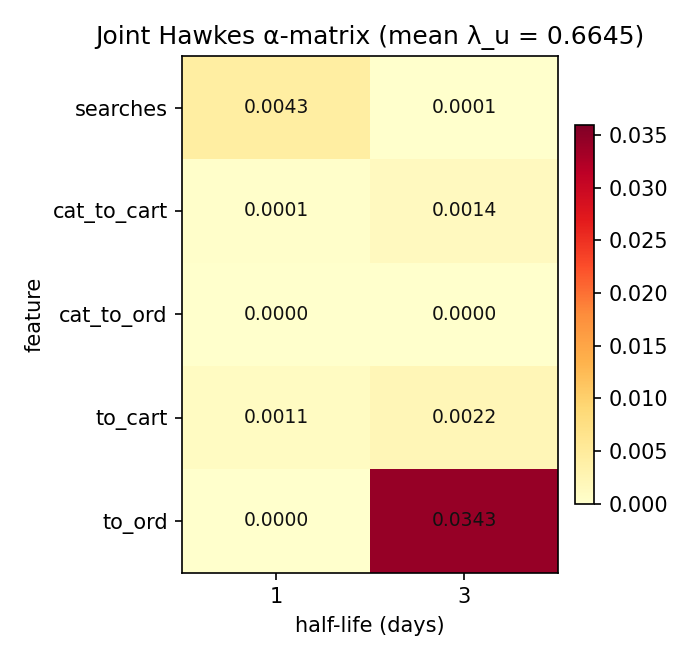
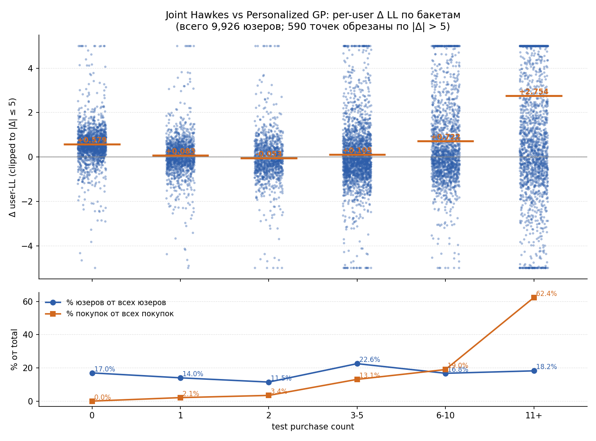
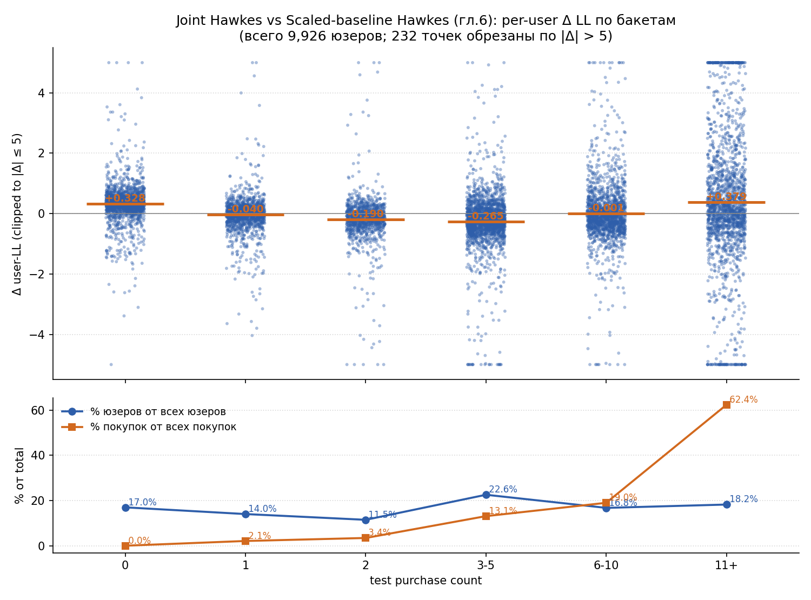

# 08. Joint Hawkes: совместный fit `λ_u` и `α`

## 8.1. Мотивация

В главе 6 модель строится поэтапно:

1. сначала фитится сильный personalized baseline `μ_u^{EB} \cdot b_t` (глава 4 через Empirical Bayes);
2. поверх него отдельно фитится Hawkes-надстройка `c, α` при **зафиксированном** $\mu_u^{EB}$.

Эта поэтапность удобна и быстро сходится, но она не гарантирует, что итоговая декомпозиция `(m_u, α)` оптимальна по joint-loss'у. В частности, на этапе 1 EB подбирает $\mu_u^{EB}$ под чистый Poisson **без учёта Hawkes-надстройки**, а на этапе 2 Hawkes уже не может подвинуть $\mu_u^{EB}$, чтобы освободить место для своего сигнала.

В этой главе исследуется альтернатива: **отказаться от двухступенчатой процедуры** и обучать per-user multiplier $\lambda_u$ и Hawkes-коэффициенты $\alpha$ **одновременно** через единственную задачу Poisson-MLE. Никакого Bayes-prior'a — только Gaussian L2-shrinkage `(\lambda_u - 1)^2`.

## 8.2. Модель

Модель имеет тот же функциональный вид, что и в главе 6:

$$
\lambda_{u,t} = \lambda_u \cdot b_t + \sum_{j=1}^{J}\sum_{m \in \{1,3\}} \alpha_{j,m}\, z_{u,j,m,t},
$$

где:

1. $b_t$ — общий rolling-seasonal baseline (тот же, что и в главах 4 и 6);
2. $\lambda_u > 0$ — **per-user multiplier**, обучаемый напрямую (не через Bayesian posterior, а как параметр в loss'e);
3. $\alpha_{j,m} \ge 0$ — pooled Hawkes-коэффициенты;
4. $z_{u,j,m,t}$ — те же exp-decay-сглаженные per-user states из главы 6.

Half-lives — `(1, 3)` дня, фичи — `searches, cat_to_cart, cat_to_ord, to_cart, to_ord`. Параметризация совпадает с главой 6 ровно во всём, кроме того, как фитится множитель перед `b_t`:

| Параметр | Глава 6 (Scaled-baseline) | Глава 8 (Joint) |
| --- | --- | --- |
| Per-user multiplier | $c \cdot \mu_u^{EB}$ (staged: EB → fix) | $\lambda_u$ (joint MLE) |
| Глобальный scale | $c$ | — (нет) |
| Hawkes коэффициенты | $\alpha$, обучаются на этапе 2 | $\alpha$, обучаются вместе с $\lambda_u$ |

Итого `~10K + 10` обучаемых параметров против `1 + 10` в Pooled Hawkes (глава 7) и `~10K (через α₀,β₀) + 1 + 10` в Scaled-baseline (глава 6).

## 8.3. Обучение

На train минимизируется регуляризованный пуассоновский negative log-likelihood:

$$
\mathcal{L}(\lambda, \alpha) = -\log p\!\left(y \mid \lambda_u \cdot b_t + X\alpha\right) + \gamma \sum_u (\lambda_u - 1)^2 + \lambda_\alpha \|\alpha\|_2^2.
$$

В отличие от EB-prior'a главы 4, здесь `\lambda_u` тянется не к зависящему от данных `α/β`, а к **единице** через простой L2-штраф. Это:

1. эквивалентно Gaussian-prior'у с центром в `1` и обратной дисперсией, равной `2γ`;
2. не даёт длинного правого хвоста, как Gamma-prior;
3. одинаково мягко shrinkает активных и неактивных пользователей.

В текущем запуске использовались:

1. $\gamma = 1.0$ (`lambda_l2 = 1.0`);
2. $\lambda_\alpha = 10^{-4}$ (`alpha_l2 = 1e-4`);
3. `max_iter = 400`.

Обученные параметры:

$$
\overline{\lambda}_u = 0.6494, \qquad \|\hat\alpha\|_2 = 0.0324.
$$

То есть joint-фит занижает per-user multiplier сильнее, чем staged-вариант из главы 6 (там $c \cdot \mu_u^{EB} \approx 0.823$), и компенсирует это **примерно в `2×` большим** `‖α‖_2` (в главе 6 — `0.0161`). Подробное per-user сравнение `m_u` для двух моделей — на scatter в разделе 9.6.

## 8.4. Протокол и реализация

Протокол совпадает с предыдущими главами:

1. анализируемое окно: `2025-01-15` → `2025-09-30`;
2. train: до `2025-08-09`;
3. test: с `2025-08-10` по `2025-09-30`;
4. evaluation: тот же sequential one-step-ahead protocol.

Код:

1. фит-функция `fit_joint`: [`scripts/compute/run_joint_lambda_alpha_fit.py`](../scripts/compute/run_joint_lambda_alpha_fit.py);
2. раннер главы: [`scripts/run_joint_hawkes_ch8.py`](../scripts/run_joint_hawkes_ch8.py);
3. построение Hawkes-states — `src/diploma_baselines/models/hawkes.py` (`build_basis_states`).

Артефакты:

1. `diploma/reports/08_joint_hawkes/summary.json`;
2. `diploma/reports/08_joint_hawkes/alpha_heatmap.png`;
3. `diploma/reports/08_joint_hawkes/alpha_table.csv`;
4. `diploma/reports/08_joint_hawkes/delta_ll_vs_test_purchases.png`;
5. `diploma/reports/08_joint_hawkes/delta_ll_vs_test_purchases_vs_ch6.png`;
6. `diploma/reports/08_joint_hawkes/user_ll_scores.csv`, `user_ll_scores_vs_ch6.csv`.

## 8.5. Что получилось на данных

Ниже `personalized rolling seasonal Poisson` из главы 4 рассматривается как предыдущая модель, а `Joint Hawkes` — как новая.

Для `poisson_loglik` большее значение лучше. Для остальных метрик лучше меньшие значения.

### Train

| Metric | Personalized Poisson | Joint Hawkes | Delta vs baseline |
| --- | ---: | ---: | ---: |
| `poisson_loglik` | `-628387.14` | `-628766.21` | `-379.07` |
| `mean_poisson_nll` | `0.31623` | `0.31642` | `+0.00019` |
| `mean_poisson_deviance` | `0.49387` | `0.49426` | `+0.00038` |

### Test

| Metric | Personalized Poisson | Joint Hawkes | Delta vs baseline |
| --- | ---: | ---: | ---: |
| `poisson_loglik` | `-210167.01` | `-202721.12` | `+7445.90` |
| `mean_poisson_nll` | `0.40959` | `0.39508` | `-0.01451` |
| `mean_poisson_deviance` | `0.64683` | `0.61781` | `-0.02902` |
| `MAE` | `0.21870` | `0.21562` | `-0.00308` |
| `RMSE` | `0.63140` | `0.62910` | `-0.00230` |
| `aggregate_bias` | `-0.00169` | `-0.00653` | `-0.00485` |
| `relative_aggregate_bias` | `-1.30%` | `-5.04%` | `-3.74 pp` |

Картина:

1. На train Joint Hawkes практически совпадает с Personalized Poisson (`Δ ≈ −0.0002` нат/n) — это ожидаемо: joint MLE с L2-shrinkage даёт почти такую же in-sample подгонку, как EB-Poisson. `α`-надстройка добавляет немного flexibility, но L2 не даёт ей переобучаться.
2. На test модель **намного лучше** Personalized Poisson по likelihood-метрикам — `+7446` нат / `−0.0145` нат/n. Это самое большое улучшение из всех Hawkes-вариантов в работе.
3. По `MAE` и `RMSE` тоже выигрыш.
4. `relative aggregate bias` ухудшается до `−5%` — модель более консервативная в общей массе. На длинной выборке это не мешает likelihood-победе.

Сравнение с моделью из главы 6 (Scaled-baseline Hawkes): test `poisson_loglik = -203093.06` (NLL `0.39580`). Joint Hawkes даёт `-202721.12` (NLL `0.39508`), то есть **на `+372` нат / `−0.00072` нат/n лучше**. Разница в пределах численного шума на длинном split-е (это и есть тот самый `c-α` trade-off из главы 9), но joint всё равно чуть впереди.

## 8.6. Какие сигналы реально использовались

Оцененные Hawkes-коэффициенты:



Структура совпадает с главой 6 по форме: основная масса сидит в `to_ord (hl=3)`, вторичные вклады — `searches`, `to_cart`. Но **значения почти в `2×` больше**, чем в Scaled-baseline (норма `‖α‖ = 0.0324` vs `0.0161` в главе 6). Это — другой край того же `c-α` trade-off'a: занизив per-user multiplier, joint оставил место для более сильной Hawkes-надстройки.

## 8.7. User-level картина



Сводка по сравнению с Personalized Poisson:

1. `share(joint > pers) = 57.3%`;
2. `mean_delta_ll = +0.750` (per user);
3. `median_delta_ll = +0.166`.

По бакетам `test purchases`:

| Бакет | n | mean Δ LL | share(joint > pers) |
| --- | ---: | ---: | ---: |
| `0` | `1686` | `+0.579` | `85.2%` |
| `1` | `1391` | `+0.083` | `54.1%` |
| `2` | `1138` | `−0.053` | `42.8%` |
| `3-5` | `2239` | `+0.105` | `45.6%` |
| `6-10` | `1663` | `+0.722` | `54.4%` |
| `11+` | `1809` | `+2.754` | `60.3%` |

Особенности:

1. **0-buyers**: `85%` юзеров выигрывают, mean `+0.58` нат — здесь joint занижает $\lambda_u$ ниже, чем `μ_u^{EB}` сжимается (см. scatter в разделе 9.6), и для нулевых юзеров это полезно.
2. **2 и 3-5 buyers**: тонкая зона, где модели работают примерно одинаково (mean около нуля, share около `45%`).
3. **11+ buyers**: огромный выигрыш `+2.75` нат/юзер — для тяжёлых пользователей Hawkes-надстройка хорошо ловит short-term паттерны, которые недоступны статическому $\mu_u^{EB}$.

## 8.8. User-level картина: vs Scaled-baseline Hawkes из главы 6

Пер-юзерное сравнение с моделью из главы 6 (Scaled-baseline Hawkes, тот же `(1, 3)` базис):



Сводка:

1. `share(joint > ch.6) = 48.9%`;
2. `mean_delta_ll = +0.037` (per user);
3. `median_delta_ll = −0.013`.

По бакетам:

| Бакет | n | mean Δ LL | share(joint > ch.6) |
| --- | ---: | ---: | ---: |
| `0` | `1686` | `+0.328` | `84.5%` |
| `1` | `1391` | `−0.040` | `47.7%` |
| `2` | `1138` | `−0.190` | `32.5%` |
| `3-5` | `2239` | `−0.265` | `29.1%` |
| `6-10` | `1663` | `−0.001` | `43.0%` |
| `11+` | `1809` | `+0.379` | `57.1%` |

Картина куда более симметричная, чем в гл.7:

1. **0-buyers**: joint **сильно лучше** Scaled-baseline (mean `+0.33`, share `85%`) — без EB-prior'a joint отпускает их $\lambda_u$ почти в ноль, и для пользователей с `y_test = 0` это даёт большое улучшение по log-likelihood.
2. **2–5 buyers**: **проигрыш** — на этих юзерах EB-shrinkage из главы 6 откалиброван точнее.
3. **11+ buyers**: лёгкий выигрыш `+0.38` (как и vs Personalized GP).

В сумме mean Δ почти ноль (`+0.04` нат/юзер), и общий test-LL разница — `+372` нат на `9926` юзеров. То есть joint и staged действительно **очень близки** на 207d, но **по-разному распределяют ошибку по сегментам**: joint делает упор на 0-buyers, staged — на средне-активных.

## 8.9. Вывод

1. Joint-фит `λ_u` и `α` через единственную Poisson-MLE задачу даёт лучшую вероятностную метрику среди Hawkes-вариантов на test (NLL `0.39508`, `+7446` нат vs Personalized GP, `+372` нат vs Scaled-baseline Hawkes).
2. На in-sample train модель практически совпадает с Personalized Poisson — L2-shrinkage сдерживает per-user multiplier'ы.
3. По per-user breakdown'у видно, что **joint и staged — две разные декомпозиции одной и той же общей интенсивности**: joint выигрывает на 0-buyers (за счёт более сильного занижения `λ_u`), staged — на средне-активных. Соответствующие `(m_u, α)` отличаются (см. scatter в разделе 9.6), но итоговый общий test-LL у обоих моделей очень близок.
4. На длинной выборке `(207d)` `c-α` trade-off практически не виден в агрегированных метриках; на коротких выборках преимущество joint-обучения становится более заметным (см. главу 10).

## 8.10. Воспроизведение

```bash
python scripts/run_joint_hawkes_ch8.py    # ~30 секунд
```
