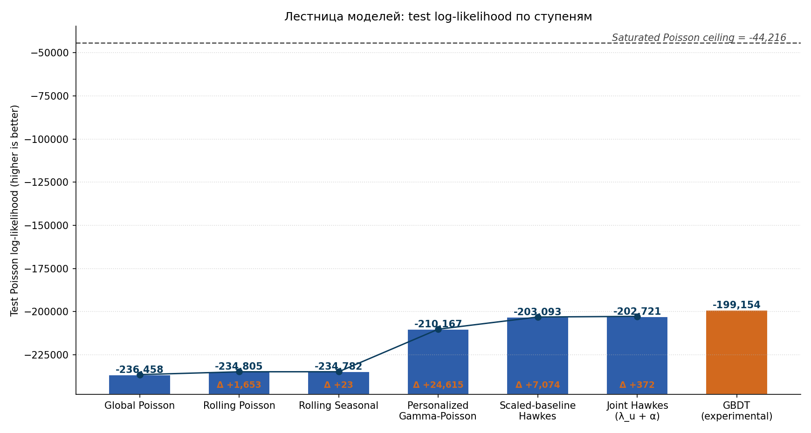
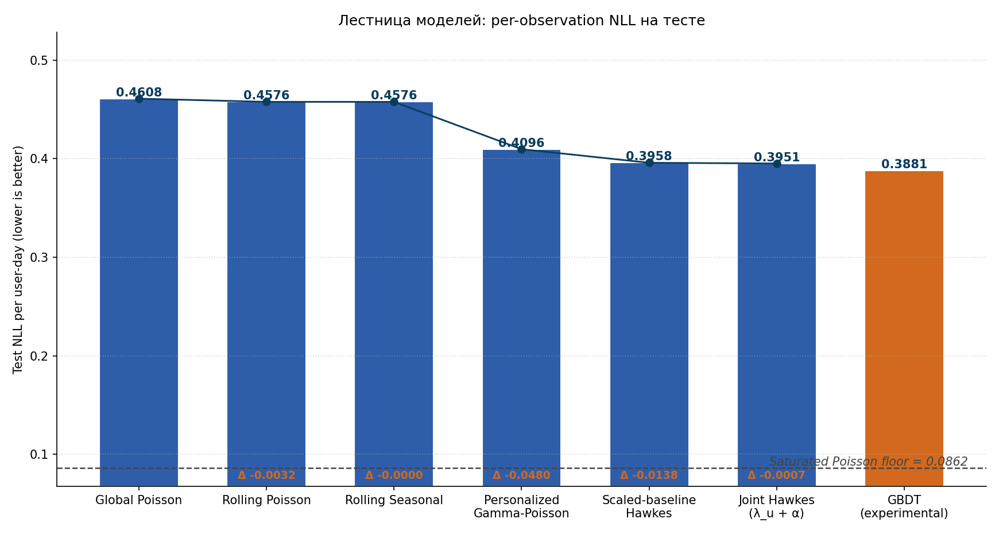
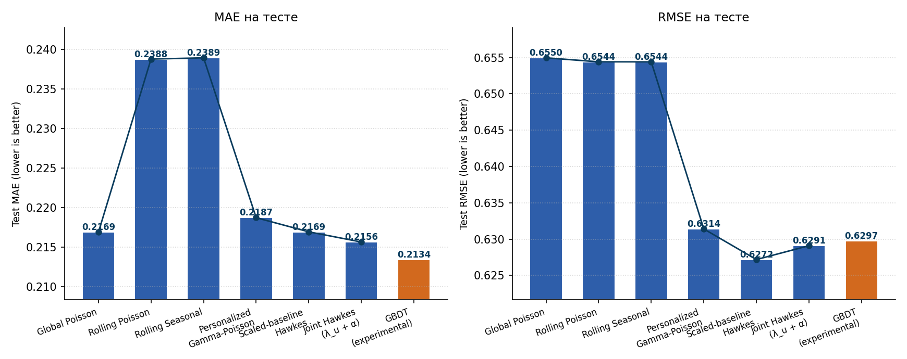
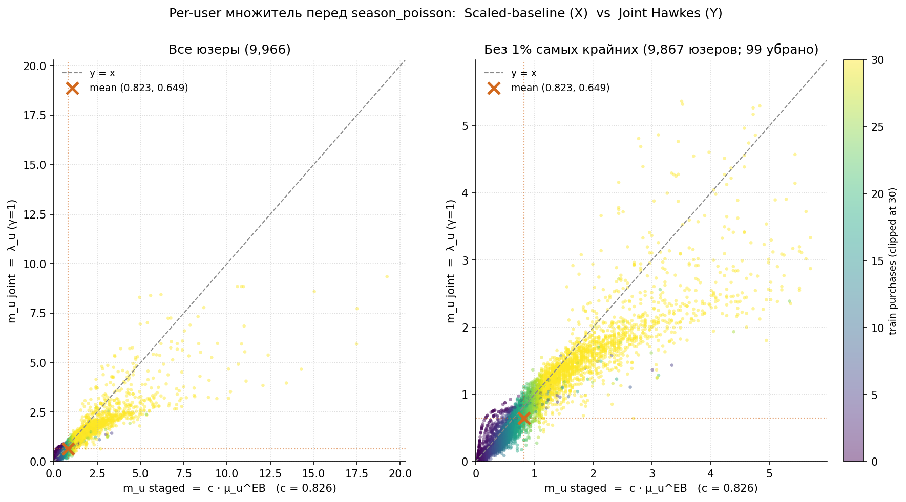

# 09. Сводка: лестница моделей по test log-likelihood

В этой главе собирается вся основная лестница моделей и показывается, как ключевая вероятностная метрика — Poisson log-likelihood на test — улучшается с каждой ступенью. Дополнительно обсуждается NLL/n как нормированный аналог LL для последующего сравнения на разных подвыборках, и приводится теоретический потолок (saturated Poisson ceiling).

## 9.1. Что входит в график

На графике рассматриваются:

1. Global Poisson (глава 1);
2. Rolling Poisson (глава 2);
3. Rolling Seasonal Poisson (глава 3);
4. Personalized Gamma-Poisson — Empirical-Bayes Gamma-prior на per-user `μ_u` (глава 4);
5. Scaled-baseline Hawkes — staged: Personalized → Hawkes (глава 6);
6. Joint Hawkes — `λ_u` и `α` обучаются совместно через Poisson MLE;
7. Experimental GBDT (показан отдельным цветом, вне основной лестницы).

## 9.2. Saturated Poisson ceiling / floor

Прежде чем смотреть графики, полезно понять, какое значение log-likelihood в принципе достижимо.

Даже идеальная Poisson-модель не даст $\mathrm{LL} = 0$. Это связано с тем, что Poisson — распределение, а не дельта-функция: для одного наблюдения

$$
\log p(y \mid \lambda) = y \log \lambda - \lambda - \log(y!).
$$

Для каждого наблюдения функция $\lambda \mapsto \log p(y \mid \lambda)$ максимизируется при $\lambda = y$. Если для каждого наблюдения подставить $\lambda_i = y_i$ — это **saturated Poisson model** — то получится верхняя граница для любого Poisson-предсказания на этих данных:

$$
\mathrm{LL}_{\mathrm{sat}} = \sum_{i} \left( y_i \log y_i - y_i - \log(y_i!) \right),
$$

с договорённостью $0 \log 0 := 0$. Эту величину удобно вычислить из любого уже обученного Poisson-эксперимента, потому что она связана с deviance:

$$
\mathrm{Deviance}_i = 2 \cdot \left( \mathrm{LL}_{\mathrm{sat}, i} - \mathrm{LL}_{\mathrm{model}, i} \right),
\qquad
\mathrm{LL}_{\mathrm{sat}} = \mathrm{LL}_{\mathrm{model}} + \frac{N \cdot \overline{\mathrm{Deviance}}}{2}.
$$

На текущем test-окне (`2025-08-10` -> `2025-09-30`, $N \approx 513{,}138$ наблюдений `user-day`):

$$
\mathrm{LL}_{\mathrm{sat}} \approx -44{,}216,
\qquad
\mathrm{NLL}_{\mathrm{sat}} = -\frac{\mathrm{LL}_{\mathrm{sat}}}{N} \approx 0.0862.
$$

Любая модель, которая по NLL подходит к `0.0862` (или по LL — к `-44 216`), фактически достигает теоретического предела на этом распределении target.

## 9.3. Log-likelihood graph

По оси `Ox` отложены модели, по оси `Oy` — суммарный Poisson log-likelihood на test. Большее значение лучше. Над столбцами подписано само значение, внутри столбца — приращение относительно предыдущей ступени основной лестницы. Сверху пунктиром обозначен теоретический потолок.

## 9.4. Per-observation NLL: нормированная метрика

Суммарный log-likelihood прямо пропорционален числу наблюдений:

$$
\mathrm{LL}_{\mathrm{model}} = \sum_{i=1}^{N} \log p\!\left(y_i \mid \hat{\lambda}_i\right).
$$

Это значит, что сравнивать суммарный log-likelihood между разными test-окнами или подвыборками панели нельзя: одно и то же качество прогноза на более длинном окне даёт численно больший по модулю LL только из-за длины окна. Для будущих сравнений на разных подвыборках (например, для cross-validation в главе 10) удобнее использовать per-observation негативный log-likelihood:

$$
\mathrm{NLL}_{\mathrm{model}} = -\frac{1}{N}\,\mathrm{LL}_{\mathrm{model}} = -\frac{1}{N}\sum_{i=1}^{N}\log p\!\left(y_i \mid \hat{\lambda}_i\right).
$$

Это среднее значение «сюрприза» модели на одно наблюдение `user-day`. Меньше — лучше. Метрика измеряется в натах. Поскольку она нормирована на размер выборки, её значения сопоставимы между окнами разной длины и разными размерами панели.

В дальнейшем основной метрикой качества для сравнения моделей считается именно NLL/n, а не суммарный LL.

## 9.5. MAE и RMSE на тесте

NLL согласован с Poisson-предположением модели, но удобно посмотреть и на «точечные» метрики на самой величине target — `MAE = N^{-1} Σ |y - λ̂|` и `RMSE = √(N^{-1} Σ (y - λ̂)²)`. Считаются на том же test-окне (`N ≈ 513K`).

Несколько наблюдений:

1. **MAE у Global Poisson уже близок к лучшим моделям** (`0.2169`). Это особенность высокой sparsity (`93.7%` нулей): константный прогноз `λ̄ ≈ 0.10` ближе к нулям, чем большинство пер-юзерных оценок. Rolling и Rolling Seasonal даже **проигрывают** по MAE (`0.239`), потому что подняли уровень прогноза и получили больший вклад от нулевых ячеек.
2. **RMSE** даёт более согласованную с NLL картину: основной шаг даёт персонализация (`0.6544 → 0.6314`), Hawkes-надстройка ещё немного снижает (`→ 0.6272`). Дальше различия между Hawkes-вариантами и GBDT — в третьем-четвёртом знаке.
3. **Best MAE — у GBDT** (`0.2134`), best RMSE — у Scaled-baseline Hawkes (`0.6272`). По обеим метрикам это **меньшие** различия, чем по NLL, потому что MAE/RMSE взвешивают ошибки на нулевых ячейках одинаково с ошибками на ненулевых, а NLL — нет.

Основной метрикой для сравнения остаётся NLL: только она согласована с likelihood'ом, на котором оптимизируются все probabilistic-модели. MAE и RMSE приведены для полноты и для сопоставимости с regression-моделями.

## 9.6. Численная таблица

| Ступень | Модель | Test `LL` | Test NLL/n | Δ vs предыдущая (LL) | Зазор до ceiling |
| ---: | --- | ---: | ---: | ---: | ---: |
| 1 | Global Poisson | `-236458.00` | `0.4608` | — | `192242` |
| 2 | Rolling Poisson | `-234805.05` | `0.4576` | `+1652.95` | `190589` |
| 3 | Rolling Seasonal | `-234781.61` | `0.4576` | `+23.44` | `190566` |
| 4 | Personalized Gamma-Poisson | `-210167.01` | `0.4096` | `+24614.60` | `165951` |
| 5 | Scaled-baseline Hawkes | `-203093.06` | `0.3958` | `+7073.95` | `158877` |
| 6 | Joint Hawkes (`λ_u + α`) | `-202721.12` | `0.3951` | `+371.94` | `158505` |
| — | GBDT (experimental) | `-199154.34` | `0.3881` | — | `154938` |
| — | Saturated Poisson ceiling / floor | `-44216` | `0.0862` | — | `0` |

## 9.7. Множитель перед `season_poisson` в Hawkes-моделях

Обе Hawkes-модели имеют вид `λ_t = m_u · b_t + states · α`, где `b_t` — это `season_poisson`. Но «множитель» `m_u` в них устроен по-разному:

- **Scaled-baseline Hawkes (staged)**: `m_u = c · μ_u^{EB}`, где `c` — один глобальный множитель, `μ_u^{EB}` — per-user EB-posterior из главы 4.
- **Joint Hawkes**: `m_u = λ_u` напрямую, без отдельного `c`, обучается совместно с `α`.

Каждая точка ниже — один из `~10K` train-юзеров: `oX` — `m_u` от Scaled-baseline Hawkes, `oY` — `m_u` от Joint Hawkes. Цвет — суммарное число покупок юзера на train (clipped at 30).

На графике хорошо видны несколько структурных эффектов:

1. **Mean'ы** (красный крест): `m_staged ≈ 0.823`, `m_joint ≈ 0.649`. Joint в среднем занижает множитель сильнее, и компенсирует это **примерно в 2 раза большим** `‖α‖_2` (`0.0324` vs `0.0161`).
2. **Корреляция** `corr(m_staged, m_joint) = 0.85` — высокая, но **не единица**: модели договариваются о том, кто более активный, но конкретные значения отличаются.
3. **Левый хвост** (юзеры с малым числом покупок) лежит **ниже диагонали**: для них Joint выдаёт `λ_u` сильно меньше `c · μ_u^{EB}` — оптимизатор без байесовского prior'а отпускает их в зону `λ_u ≈ 0`, в то время как EB shrinkает к `α/β ≈ 1` и потом умножается на `c ≈ 0.83`.
4. **Активные юзеры** (правый хвост, светлый цвет) тоже зачастую ниже диагонали — joint-фит снижает их per-user multiplier, чтобы оставить место большой `α^⊤ s_{u,t}` Hawkes-надстройке.

Несмотря на эти разные декомпозиции, итоговый test NLL обоих моделей практически совпадает (`0.3958` vs `0.3951`) — это и есть тот самый `c-α` trade-off из ladder'a: разные оценки `(m_u, α)` дают почти одинаковую общую интенсивность.

## 9.8. Что видно из графиков

1. Самый крупный единичный шаг лестницы — это переход к **персонализации через Gamma-Poisson**. Его вклад больше всех остальных шагов лестницы вместе взятых.
2. Учёт медленно меняющегося уровня (rolling) даёт заметный, но относительно скромный сдвиг.
3. Внутринедельная сезонность поверх rolling добавляет очень мало — основной эффект уровня уже захвачен на ступени 2.
4. Hawkes-надстройка поверх Personalized baseline даёт устойчивое улучшение `+7K` нат / `−0.014` нат/n.
5. Joint Hawkes (`λ_u + α` обучаются совместно) на длинной истории **практически совпадает** со staged-вариантом: `Δ = +372` ната, или `−0.0007` нат/n — разница в пределах численного шума. Дополнительное преимущество joint-обучения проявляется только на коротких окнах (см. главу 10).
6. Experimental GBDT идёт чуть выше обоих Hawkes-вариантов, но всё ещё в той же области графика — итоговый разрыв между Hawkes и GBDT гораздо меньше, чем разрыв между Hawkes и потолком.

Главный вывод из сравнения с потолком:

1. От начальной модели до GBDT мы закрываем только около `19%` зазора между Global Poisson и saturated ceiling.
2. Остаётся `~155 000` нат разрыва, который не может быть закрыт никаким Poisson-предсказанием, опирающимся только на текущие фичи.
3. Это согласуется с природой данных: даже зная всю историю пользователя, нельзя точно предсказать, купит ли он завтра один товар или ни одного — целевая переменная по построению содержит aleatoric uncertainty.

Иными словами, разница между нашей лучшей моделью и потолком — это в основном **внутренний шум данных**, а не оставшаяся структура, которую модели не уловили.

## 9.9. Воспроизведение

Графики и таблица собираются из уже сохранённых `summary.json` каждого эксперимента:

1. скрипт: `scripts/plots/run_ladder_summary.py`;
2. артефакты:
   - `diploma/reports/ladder_summary/test_loglik_ladder.png`;
   - `diploma/reports/ladder_summary/test_nll_per_obs_ladder.png`;
   - `diploma/reports/ladder_summary/test_mae_rmse_ladder.png`;
   - `diploma/reports/ladder_summary/ladder_summary.json`.

Если какая-то из моделей будет перезапущена, достаточно повторно запустить этот скрипт — он подтянет свежие числа из соответствующих `summary.json`.
