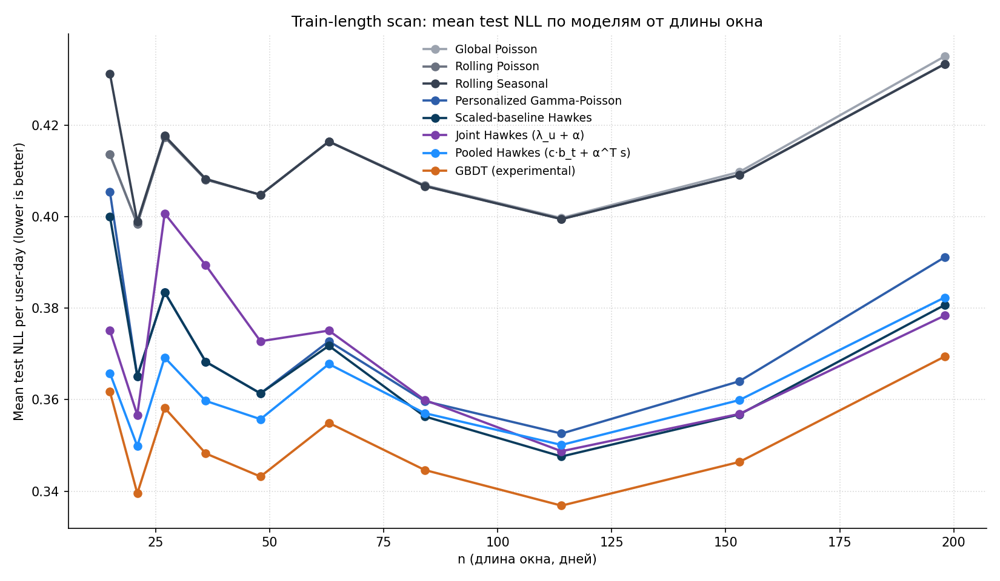
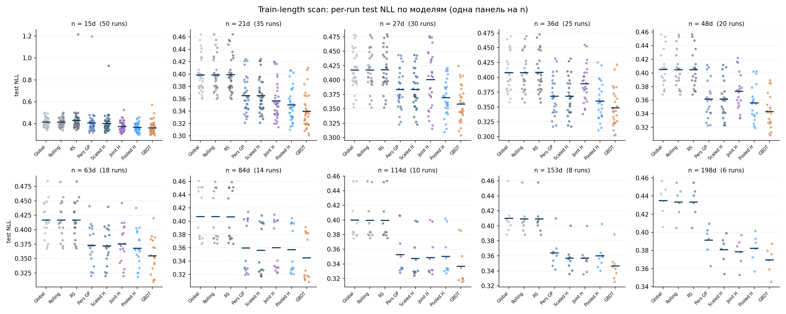
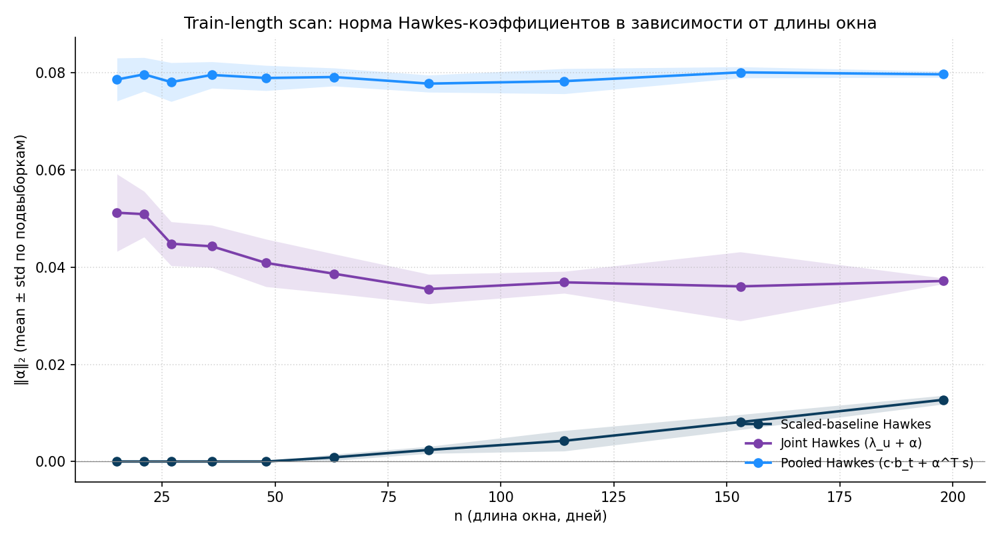
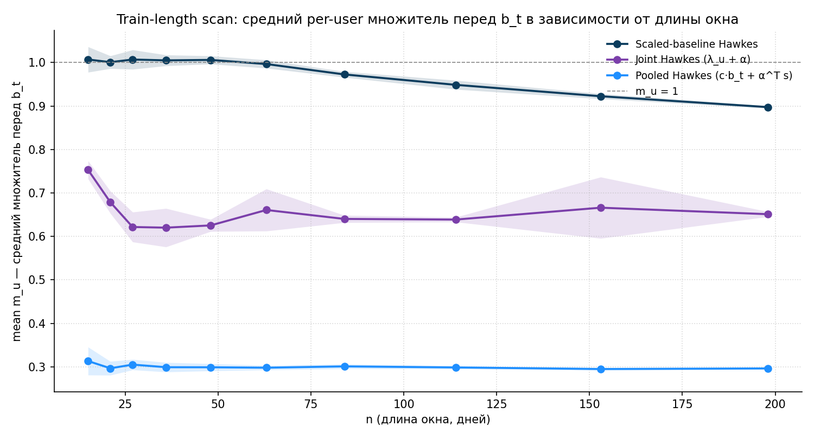

# 11. Train-length scan: качество моделей в зависимости от длины окна

## 11.1. Постановка

Главы 9 и 10 фиксируют два крайних варианта train-test протокола:

1. главное `207d / 52d` разбиение — большое train-окно, одна точка оценки на модель;
2. блочный CV из главы 10 — `13` непересекающихся `21d`-блоков `(14d train + 7d test)`.

В этой главе строится более общий движок. Для произвольной длины окна `n` дней мы случайно выбираем `m` стартовых дат внутри периода `[2025-01-15, 2025-10-31]`, для каждой подвыборки используем первые `2n/3` дней как train и последние `n/3` как test, и обучаем все модели заново. Утечки нет, потому что каждая модель обучается с нуля на своём train; интервалы могут пересекаться, и при больших `n` они действительно сильно пересекаются, при маленьких — почти нет.

`n` пробегает 10 значений, кратных трём (чтобы 2/3 и 1/3 делились ровно), на лог-сетке от `15` до `198`:

| `n` (дней) | `m` (число подвыборок) | train-длина (дней) | test-длина (дней) |
| ---: | ---: | ---: | ---: |
| 15 | 50 | 10 | 5 |
| 21 | 35 | 14 | 7 |
| 27 | 30 | 18 | 9 |
| 36 | 25 | 24 | 12 |
| 48 | 20 | 32 | 16 |
| 63 | 18 | 42 | 21 |
| 84 | 14 | 56 | 28 |
| 114 | 10 | 76 | 38 |
| 153 | 8 | 102 | 51 |
| 198 | 6 | 132 | 66 |

Итого 216 прогонов. `m` падает с ростом `n` грубо log-линейно (`m=50` при `n=14`, `m=10` при `n=100`) — при больших `n` множества возможных стартовых дат меньше, и брать много почти-идентичных подвыборок смысла нет.

Гонятся 8 моделей из глав 1–8:

1. Global Poisson;
2. Rolling Poisson;
3. Rolling Seasonal;
4. Personalized Gamma-Poisson;
5. Scaled-baseline Hawkes (staged, гл.6);
6. Joint Hawkes (`λ_u + α`, гл.8);
7. Pooled Hawkes (`c·b_t + α^⊤ s`, гл.7);
8. GBDT (experimental).

Чтобы добавление GBDT не превратило прогон в шестичасовое мероприятие, feature-engineering для бустинга строится **один раз** на полном окне анализа (`~2.78M` строк, `141` фича за `~8` минут), а внутри `evaluate_interval` остаётся только slice по датам и сам `HistGradientBoostingRegressor.fit`. Без этого приёма прогон стоил бы `~5–6` часов вместо реальных `~23` минут, потому что 96–99% времени GBDT в этой задаче уходит именно на построение фичей, а не на сам fit.

## 11.2. Mean test NLL по моделям от длины окна

Для каждого `n` усреднён test NLL по `m` подвыборкам.



`oX` — длина полного окна `n` (train + test), `oY` — средний test NLL на одной user-day; ниже = лучше. Каждая линия — отдельная модель.

Сводная таблица mean NLL по `n` для четырёх главных «верхних» моделей и GBDT:

| `n` | Personalized GP | Scaled-baseline H | Joint Hawkes | Pooled Hawkes | **GBDT** |
| ---: | ---: | ---: | ---: | ---: | ---: |
| 15  | `0.4054` | `0.4000` | `0.3751` | `0.3658` | **`0.3617`** |
| 21  | `0.3651` | `0.3651` | `0.3567` | `0.3498` | **`0.3395`** |
| 27  | `0.3835` | `0.3835` | `0.4007` | `0.3692` | **`0.3582`** |
| 36  | `0.3683` | `0.3683` | `0.3894` | `0.3597` | **`0.3483`** |
| 48  | `0.3614` | `0.3614` | `0.3728` | `0.3557` | **`0.3432`** |
| 63  | `0.3728` | `0.3718` | `0.3751` | `0.3678` | **`0.3549`** |
| 84  | `0.3597` | `0.3564` | `0.3600` | `0.3571` | **`0.3446`** |
| 114 | `0.3526` | `0.3476` | `0.3487` | `0.3501` | **`0.3368`** |
| 153 | `0.3640` | `0.3568` | `0.3569` | `0.3599` | **`0.3464`** |
| 198 | `0.3911` | `0.3807` | `0.3784` | `0.3824` | **`0.3694`** |

Картина по `n`:

1. **GBDT доминирует на всех `n`**, gap к лучшей вероятностной модели стабильный — `~0.005..0.013` нат/n. Это согласуется с главой 9, где на `207d` бустинг был лучше Joint Hawkes на `~0.007`.
2. **Pooled Hawkes выигрывает на коротких `n`** (`n ≤ 48`) среди вероятностных моделей. На `n = 27..48` отрыв до `~0.011..0.018` нат/n.
3. **Scaled-baseline и Joint Hawkes сходятся** при `n ≥ 84`: разница между ними в пределах `±0.002` нат/n.
4. **Personalized GP и Scaled-baseline Hawkes побайтово совпадают** при `n ≤ 48`: staged-Hawkes на коротких train вырождается в `(c=1, α=0)`. Это уже наблюдалось в главе 10 на `14d`-блоках.
5. На `n = 198` все вероятностные модели заметно ухудшаются по сравнению с `n = 114..153`. Это эффект включения января с высокой NY-активностью в больший процент train+test окон.

## 11.3. Per-run NLL для каждого `n`

Та же информация на уровне отдельных прогонов: одна панель на одно значение `n`, по `oY` — test NLL за прогон, по `oX` — модель. Точки — отдельные подвыборки, синяя горизонталь — среднее по подвыборкам.



## 11.4. Норма Hawkes-коэффициентов

Для каждой Hawkes-модели — `‖α‖_2` усреднённое по подвыборкам в каждой точке `n`. Полоса вокруг линии — `±1` стандартное отклонение по `m` подвыборкам.



`oX` — длина окна `n`, `oY` — среднее `‖α‖_2` по подвыборкам.

## 11.5. Средний per-user множитель перед `b_t`

Все три Hawkes-модели имеют форму `λ_{u,t} = m_u · b_t + α^⊤ s_{u,t}`, но per-user множитель `m_u` оценивается по-разному:

- **Scaled-baseline Hawkes**: `m_u = c · μ_u^{EB}`, где `c` — глобальный масштаб, `μ_u^{EB}` — Bayesian posterior из главы 4. На графике показан `mean(c · μ_u^{EB})` по train-юзерам.
- **Joint Hawkes**: `m_u = λ_u`, обучается напрямую. Показан `mean(λ_u)`.
- **Pooled Hawkes**: `m_u = c` — единый скаляр, общий для всех (per-user multiplier'a нет вовсе). Показан сам `c`.



`oX` — длина окна `n`, `oY` — средний `m_u` по подвыборкам, пунктирная серая — уровень `m_u = 1`.

## 11.6. Артефакты

- `diploma/reports/11_train_length_scan/scan_results.csv` — все 216 прогонов: `(n_days, m_idx, interval_start, train_end, test_start, test_end, test_rows, model_NLL, ...)`.
- `diploma/reports/11_train_length_scan/scan_aggregated.csv` — агрегированные mean/median/std/min/max по `(n, model)`.
- `diploma/reports/11_train_length_scan/scan_metadata.json` — `n_grid`, `m_grid`, seed, общее время прогона.

## 11.7. Воспроизведение

```bash
python scripts/compute/run_train_length_scan.py     # ~23 минуты: ~8 мин feature-build + ~15 мин на 216 прогонов
python scripts/plots/plot_train_length_scan.py    # перерисовать графики из CSV
```

Скрипт `run_train_length_scan.py` строит GBDT-feature-panel один раз через `build_feature_panel` из `src/diploma_experimental/gbdt.py` и затем slice-ит её по `(interval_start, train_end, test_end)` для каждого прогона. Это переиспользует тот же `HistGradientBoostingRegressor(loss="poisson", max_depth=5, max_iter=200)`, что и в основном run'е GBDT (`scripts/run_experimental_2_gbdt.py`).
