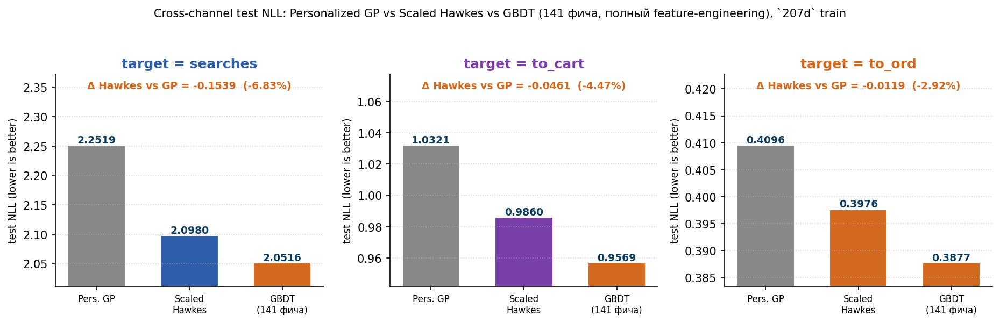
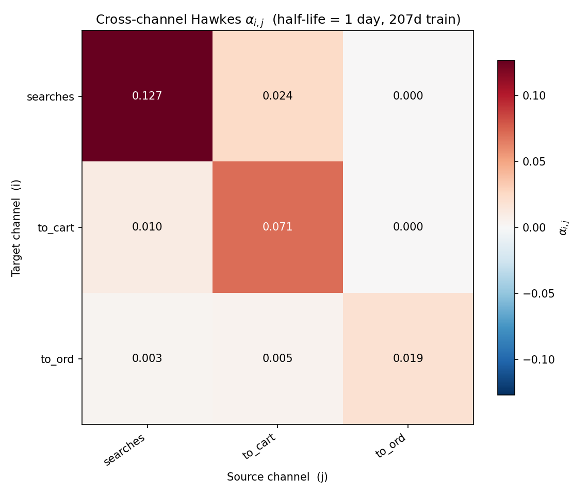
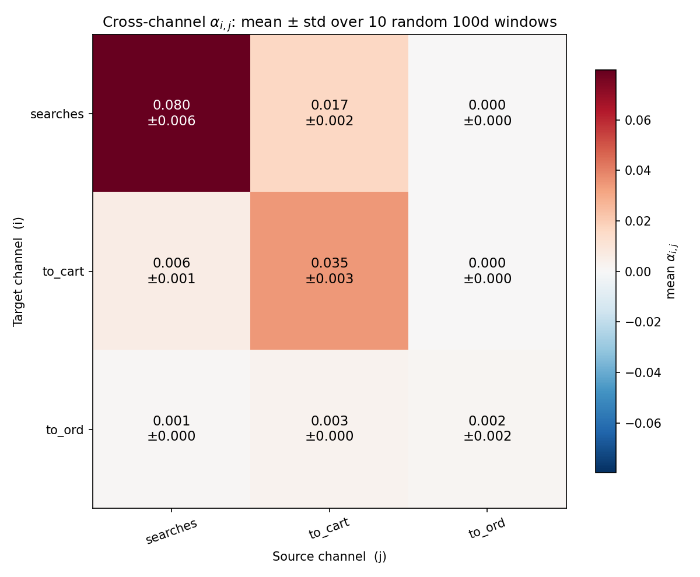
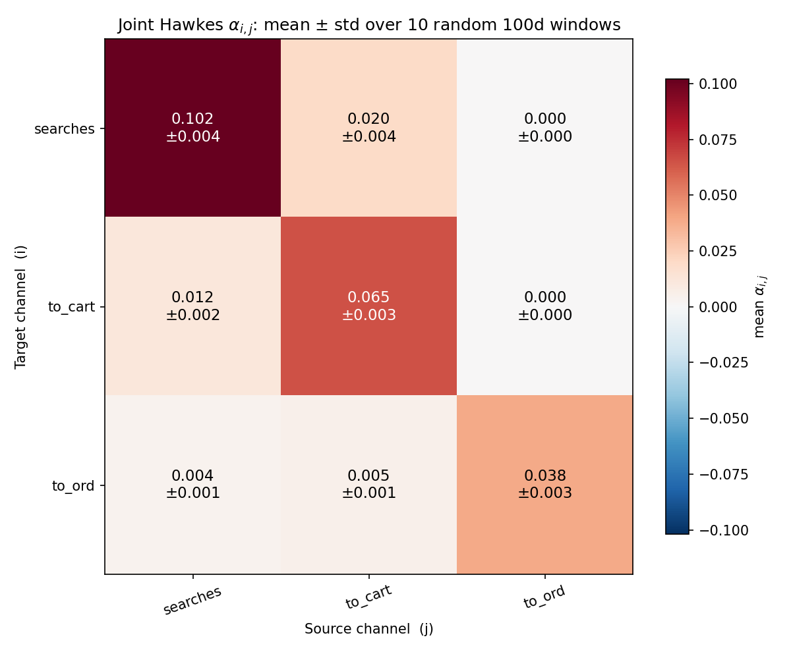
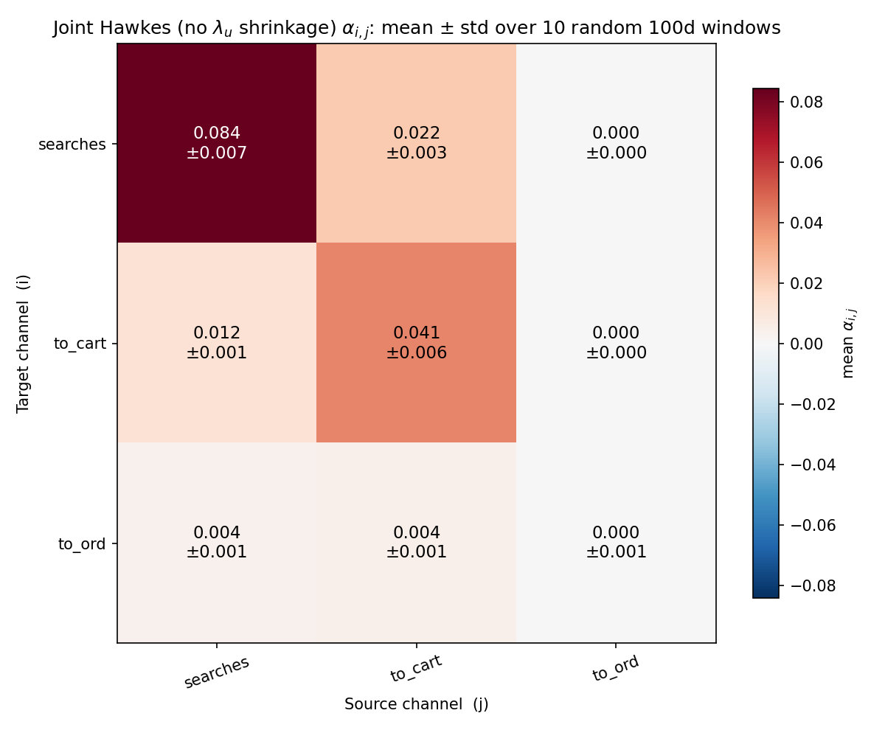
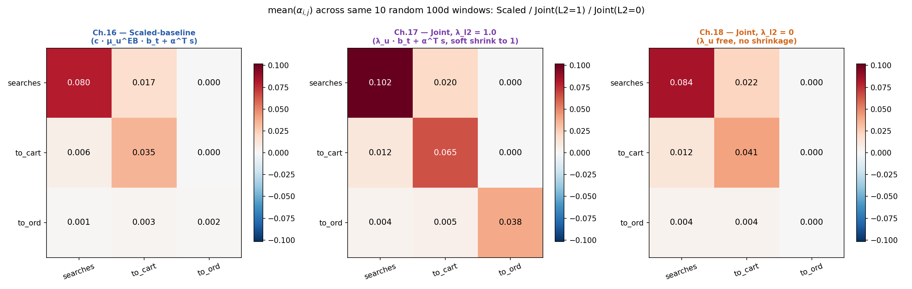

# 12. Cross-channel Hawkes: структура и bootstrap-стабильность

## 12.1. Зачем

Перенести Hawkes-моделирование из главы 6 (один target `to_ord`, pooled `α`) в **cross-channel** постановку: на каждый из 3 каналов воронки (`searches`, `to_cart`, `to_ord`) подгоняется собственная Hawkes-модель, у которой источниками возбуждения служат **все 3 канала** (включая сам себя). Получается интерпретируемая матрица `α[target ← source]`. Глава отвечает на два вопроса:

1. Какие веса видны на главном `207d`-train у базовой **Scaled-baseline** модели (`λ = c · μ_u · b_t + α^⊤ z`, EB-prior на per-user `μ_u`)?
2. Насколько эти веса **устойчивы** к выбору train-окна — bootstrap по 10 случайным `100d`-окнам, и как картина меняется при переходе к **Joint Hawkes** (`λ = λ_u · b_t + α^⊤ z`) с разными уровнями регуляризации `λ_{ℓ_2}` на per-user multiplier.

## 12.2. Протокол

- **Channels**: `searches` (mean ≈ 1.20/row), `to_cart` (≈ 0.37), `to_ord` (≈ 0.10).
- **Half-life**: `1` день, `n_alpha = 3` source-каналов на target.
- **Main train/test** (разделы 12.3-12.4): `2025-01-15..2025-08-09` (207d, ~1.99M строк) / `2025-08-10..2025-09-30` (52d, ~513K).
- **Bootstrap** (разделы 12.4-12.5): 10 случайных `100d` окон из общего диапазона, `66d` train + `34d` test, фиксированный seed.
- **Hyperparameters**: `α_l2 = 1e-4`, `max_iter = 500`. У Joint Hawkes тестируются два уровня регуляризации: `λ_{ℓ_2} = 1.0` (default) и `λ_{ℓ_2} = 0` (без shrinkage'а на `λ_u`).

Скрипты: [`run_cross_channel_hawkes_ch15.py`](../scripts/compute/run_cross_channel_hawkes_ch15.py) (Scaled main train), [`run_cross_channel_hawkes_bootstrap_ch16.py`](../scripts/compute/run_cross_channel_hawkes_bootstrap_ch16.py) (Scaled bootstrap), [`run_cross_channel_joint_hawkes_bootstrap_ch17.py`](../scripts/compute/run_cross_channel_joint_hawkes_bootstrap_ch17.py) (Joint `λ_{ℓ_2}=1` bootstrap), [`run_cross_channel_joint_unregularized_ch18.py`](../scripts/compute/run_cross_channel_joint_unregularized_ch18.py) (Joint `λ_{ℓ_2}=0` bootstrap).

## 12.3. Скоринговая верификация: Hawkes улучшает baseline на всех 3 каналах

До анализа структуры `α` стоит убедиться, что Hawkes-надстройка вообще полезна для каждого из 3 каналов. Для `to_ord` это уже показано в главе 6, но `searches` и `to_cart` — новые target'ы. Сравниваем test NLL Personalized Gamma-Poisson (baseline без Hawkes) и Scaled-baseline Hawkes на главном `207d`-train:

| target | Pers. GP test NLL | Scaled Hawkes test NLL | Δ (Hawkes − GP) | % от baseline |
| --- | ---: | ---: | ---: | ---: |
| `searches` | `2.2519` | `2.0980` | **`−0.1539`** | **`−6.83%`** |
| `to_cart`  | `1.0321` | `0.9860` | **`−0.0461`** | **`−4.47%`** |
| `to_ord`   | `0.4096` | `0.3976` | **`−0.0119`** | **`−2.92%`** |

Hawkes-надстройка улучшает baseline на **всех трёх каналах**. Относительное улучшение монотонно убывает по каналам воронки: самый сильный эффект на `searches` (`−6.83%` от baseline NLL), скромнее на `to_cart` (`−4.47%`), и наименьший на `to_ord` (`−2.92%`) — что согласуется с тем, что `to_ord` самый разреженный канал (mean ≈ `0.10` событий/строка vs `1.20` у `searches`). Дальше имеет смысл смотреть на структуру `α` — мы знаем, что у всех трёх target'ов Hawkes несёт реальный сигнал.

На графике также показан третий bar — `GBDT (141 фича)` — бустинг на полном инженерном наборе фичей. GBDT обгоняет Hawkes на всех 3 каналах ещё на `2.21..2.95%` от baseline, давая верхнюю планку того, что выжимается из данных tree-ensemble'ом. При этом Hawkes закрывает `54..77%` суммарного gap'а от Pers GP до GBDT — большую часть, ценой более простой и интерпретируемой структуры. Детальный разбор — глава 17.

## 12.4. Scaled-baseline: точечная оценка на главном train и bootstrap-стабильность

<table>
<tr>
<td align="center"><b>главный train (<code>207d</code>)</b></td>
<td align="center"><b>bootstrap mean ± std (10 × <code>100d</code>)</b></td>
</tr>
<tr>
<td></td>
<td></td>
</tr>
</table>

Слева — точечная оценка `α[target ← source]` на главном `207d`-train. Справа — mean ± std bootstrap по 10 случайным `100d`-окнам.

| ячейка | главный train | bootstrap mean | std | CV |
| --- | ---: | ---: | ---: | ---: |
| `searches ← searches` | `0.1269` | `0.0798` | `0.0058` | `7.2%` |
| `searches ← to_cart`  | `0.0240` | `0.0168` | `0.0026` | `15.5%` |
| `to_cart ← searches`  | `0.0103` | `0.0060` | `0.0009` | `15.6%` |
| `to_cart ← to_cart`   | `0.0713` | `0.0347` | `0.0034` | `9.7%` |
| `to_ord ← searches`   | `0.0030` | `0.0011` | `0.0005` | `47.4%` |
| `to_ord ← to_cart`    | `0.0046` | `0.0025` | `0.0009` | `36.2%` |
| **`to_ord ← to_ord`** | **`0.0194`** | **`0.0016`** | **`0.0024`** | **`148.3%`** |

Структура воронки видна сразу:

- **Верхне-треугольная часть колонки `to_ord` идентически нулевая** на главном train (`α[searches ← to_ord] = α[to_cart ← to_ord] = 0`): после покупки нет краткосрочного Hawkes-сигнала на поиск или корзину. Структурный нуль, подтверждаемый во всех последующих фитах.
- **Off-diagonal funnel-связи `searches → cart → order`** различимы и положительны на главном train и стабильны в bootstrap (`CV ≤ 16%` для частых пар, до `47%` для редкого `to_ord ← searches`).
- **`α[to_ord ← to_ord]`** на главном train = `0.0194` (ненулевой, но небольшой), а в bootstrap **коллапсирует** практически в ноль (mean `0.0016`, CV `148%`). Это следствие EB-prior'а: per-user multiplier шринкается к нулю для редко-активных юзеров, и у оптимизатора нет signal для self-α редкого target'а на коротких окнах.

Этот коллапс self-`to_ord` и мотивирует переход к Joint Hawkes в 12.5.

Артефакты: [`reports/15_cross_channel_hawkes/`](reports/15_cross_channel_hawkes/), [`reports/16_cross_channel_bootstrap/`](reports/16_cross_channel_bootstrap/).

## 12.5. Параметры Joint Hawkes на bootstrap (10 × 100d)

В Joint Hawkes отказ от EB-prior'а: per-user multiplier `λ_u` обучается напрямую, с L2-штрафом `λ_{ℓ_2} · (λ_u - 1)²` к единице. При `λ_{ℓ_2} = 1` штраф активный (зажимает `λ_u` к prior'у), при `λ_{ℓ_2} = 0` штрафа нет вообще — `λ_u` свободно.

<table>
<tr>
<td align="center"><b><code>λ_{ℓ_2} = 1</code> (default режим)</b></td>
<td align="center"><b><code>λ_{ℓ_2} = 0</code> (без регуляризации)</b></td>
</tr>
<tr>
<td></td>
<td></td>
</tr>
</table>

Mean ± std по 10 окнам для обоих режимов:

| ячейка | mean `α` (`λ=1`) | std (`λ=1`) | CV (`λ=1`) | mean `α` (`λ=0`) | std (`λ=0`) | CV (`λ=0`) |
| --- | ---: | ---: | ---: | ---: | ---: | ---: |
| `searches ← searches` | `0.1020` | `0.0042` | `4.1%`  | `0.0843` | `0.0068` | `8.0%`  |
| `searches ← to_cart`  | `0.0196` | `0.0017` | `8.7%`  | `0.0221` | `0.0029` | `13.0%` |
| `to_cart ← searches`  | `0.0119` | `0.0007` | `5.9%`  | `0.0122` | `0.0013` | `10.3%` |
| `to_cart ← to_cart`   | `0.0651` | `0.0033` | `5.1%`  | `0.0414` | `0.0057` | `13.8%` |
| `to_ord ← searches`   | `0.0039` | `0.0008` | `21.3%` | `0.0035` | `0.0008` | `23.0%` |
| `to_ord ← to_cart`    | `0.0051` | `0.0010` | `20.0%` | `0.0040` | `0.0011` | `26.7%` |
| **`to_ord ← to_ord`** | **`0.0383`** | **`0.0057`** | **`14.7%`** | **`0.0002`** | **`0.0006`** | **`316%`** |

- **`λ_{ℓ_2} = 1`** (активный prior `(λ_u - 1)²`): **стабилизирует все 9 коэффициентов**, включая `α[to_ord ← to_ord]` — CV `14.7%` против `148%` у Scaled.
- **`λ_{ℓ_2} = 0`** (`λ_u` отпущен): **`α[to_ord ← to_ord]` опять коллапсирует** до `0.0002` (mean), CV `316%`. Это та же картина что у Scaled (12.4): без регуляризации на `λ_u`, оптимизатор для редкого target'а зажимает self-α к нулю и компенсирует это другими параметрами. Off-diagonal funnel-связи остаются устойчивыми.

Артефакты: [`reports/17_cross_channel_joint_bootstrap/`](reports/17_cross_channel_joint_bootstrap/), [`reports/18_joint_unregularized/`](reports/18_joint_unregularized/).

(†) Спектральный радиус mean-α матрицы как branching-ratio: `ρ(α_Scaled) ≈ 0.082`, `ρ(α_Joint, λ_l2=1) ≈ 0.107`, `ρ(α_Joint, λ_l2=0) ≈ 0.094`. Все сильно меньше 1 — Hawkes-процессы далеки от explosion-порога.

## 12.6. Сравнение: Joint без регуляризации vs Scaled-baseline

Сравнение mean(α) bootstrap для **Scaled-baseline** (EB-prior зажимает `μ_u` к нулю) и **Joint без рег.** (`λ_u` свободен):

| ячейка | Scaled mean | Joint `λ_l2=0` mean | ratio Joint/Scaled |
| --- | ---: | ---: | ---: |
| `searches ← searches` | `0.0798` | `0.0843` | `×1.06` |
| `searches ← to_cart`  | `0.0168` | `0.0221` | `×1.32` |
| `to_cart ← searches`  | `0.0060` | `0.0122` | `×2.03` |
| `to_cart ← to_cart`   | `0.0347` | `0.0414` | `×1.19` |
| `to_ord ← searches`   | `0.0011` | `0.0035` | `×3.18` |
| `to_ord ← to_cart`    | `0.0025` | `0.0040` | `×1.60` |
| **`to_ord ← to_ord`** | **`0.0016`** | **`0.0002`** | **`×0.13`** |

Структурно картина схожая: off-diagonal funnel-связи различимы и стабильны (ratio в `[1.06, 3.18]`), колонка `to_ord` — нуль, self-`to_ord` коллапсирует. Различие — направление shrinkage'а per-user multiplier'а: Scaled через EB free-shrinks `μ_u` к нулю, Joint без рег. не shrinks вообще, и в обоих случаях у оптимизатора нет structural signal удерживать self-α для редкого target'а.

**Вывод**: Joint Hawkes с **активной** регуляризацией (`λ_{ℓ_2} = 1`) — единственный из 3 рассмотренных режимов, в котором `α[to_ord ← to_ord]` не коллапсирует. Это и мотивирует использовать его как default-режим в следующих главах.

## 12.7. Что унесено в следующие главы

- **Off-diagonal funnel-связи** и **структурный нуль колонки `to_ord`** — фундаментальные структурные результаты, устойчивые ко всем 3 режимам (Scaled, Joint `λ_l2=1`, Joint `λ_l2=0`).
- **`α[to_ord ← to_ord]`** — параметр, удерживаемый только активной регуляризацией. В моделях без неё (Scaled с EB-shrinkage к нулю, Joint `λ_l2=0`) он коллапсирует.
- Joint Hawkes с `λ_{ℓ_2} = 1` берётся как default-режим. Глава 13 разбирает, как сила prior'а `λ_{ℓ_2}` влияет на внутреннюю структуру `(λ_u, α)` и на скоринговое качество модели.
