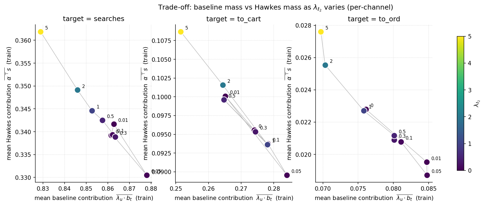
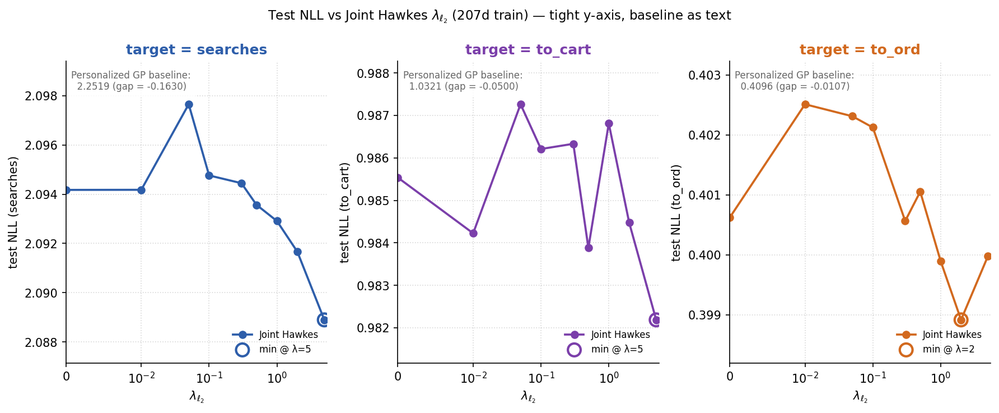
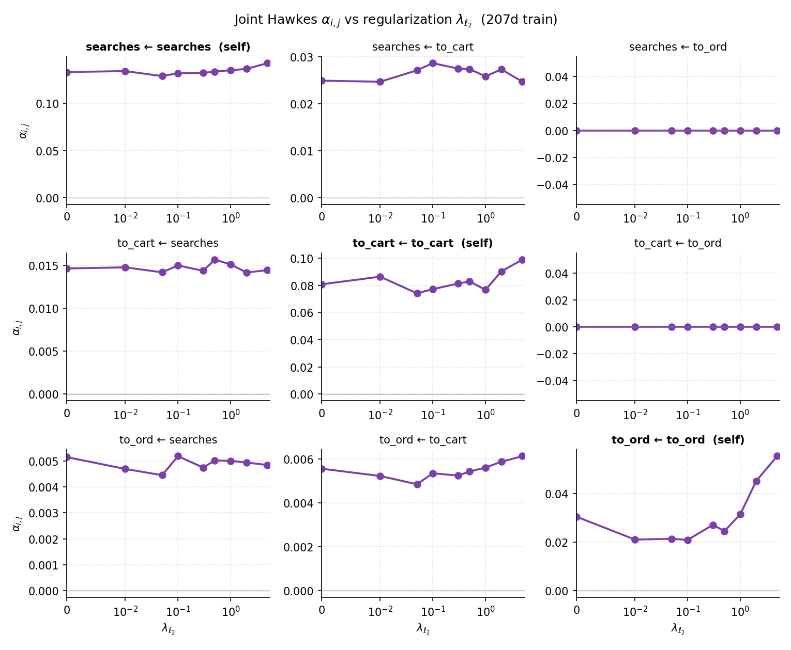

# 13. Чувствительность Joint Hawkes к регуляризации

## 13.1. Зачем

Глава 12 показала, что Joint Hawkes с `λ_{ℓ_2} = 1` стабилизирует `α[to_ord ← to_ord]`, но даёт хуже train NLL, чем Scaled-baseline. Функциональная форма обеих моделей формально совпадает (`λ_u · b_t + α^⊤ z`), но они сходятся в **разные** точки в пространстве `(λ_u, α)` — потому что Scaled использует EB-shrinkage к нулю, а Joint — L2-prior к единице. В этой главе разбирается, насколько внутренняя структура решения Joint меняется в зависимости от силы prior'а `λ_{ℓ_2}`, и как это влияет на test NLL.

## 13.2. Протокол

На главном `207d` train фитим Joint Hawkes для 3 каналов на сетке `λ_{ℓ_2} ∈ {0, 0.01, 0.05, 0.1, 0.3, 0.5, 1.0, 2.0, 5.0}` (9 значений × 3 target = 27 фитов). `α_l2 = 1e-4`, `max_iter = 500`. Параллельно — 6 process worker'ов, wall `~141` секунда.

Скрипт: [`run_joint_reg_sweep_ch19.py`](../scripts/compute/run_joint_reg_sweep_ch19.py). Точка `λ_{ℓ_2} = 0` дополнительно профилируется отдельно с увеличенным `max_iter = 500` ([`run_cross_channel_joint_unregularized_ch18.py`](../scripts/compute/run_cross_channel_joint_unregularized_ch18.py)) для проверки сходимости на границе.

## 13.3. Trade-off baseline ↔ Hawkes

С ростом `λ_{ℓ_2}` оптимизатор зажимает `λ_u` к `1`, и часть общей массы интенсивности **перетекает из baseline-части `λ_u · b_t` в Hawkes-надстройку `α^⊤ z`** — на всех 3 каналах.

| target | mean baseline range | mean Hawkes range |
| --- | --- | --- |
| `searches` | `0.829 .. 0.878` | `0.331 .. 0.362` |
| `to_cart` | `0.251 .. 0.284` | `0.090 .. 0.109` |
| `to_ord` | `0.069 .. 0.085` | `0.019 .. 0.028` |

`α` действует как **компенсаторная переменная** относительно зажатия `λ_u`.

## 13.4. Test NLL почти не зависит от `λ_{ℓ_2}`

| `λ_{ℓ_2}` | `searches` | `to_cart` | `to_ord` |
| ---: | ---: | ---: | ---: |
| `0.00` | `2.0942` | `0.9855` | `0.4006` |
| `0.10` | `2.0948` | `0.9862` | `0.4021` |
| `0.50` | `2.0936` | `0.9839` | `0.4011` |
| `1.00` | `2.0929` | `0.9868` | `0.3999` |
| `5.00` | **`2.0889`** | **`0.9822`** | `0.3999` |

Размах test NLL по всей сетке: `searches` ≈ `0.009`, `to_cart` ≈ `0.005`, `to_ord` ≈ `0.004` нат/n. То есть **разные `λ_{ℓ_2}` приводят к существенно разным разложениям интенсивности на baseline и Hawkes (16.3), но к практически одинаковому predicted intensity на test**. На уровне final `λ_total` эти решения почти эквивалентны.

## 13.5. Разрешение `α` по `λ_{ℓ_2}`

| тип ячейки | поведение | пример range по `λ_{ℓ_2} ∈ [0, 5]` |
| --- | --- | ---: |
| **колонка `to_ord`** | идентический ноль на всём grid'е | `0` |
| **off-diagonal funnel** | устойчивы (`±2..10%`) | `α[to_cart ← searches]: 0.0146 → 0.0144` |
| `searches ← searches` | устойчив (`±4%`) | `0.1333 → 0.1428` |
| `to_cart ← to_cart` | умеренно меняется (`±13%`) | `0.0808 → 0.0989` |
| **`to_ord ← to_ord`** | сильно зависит от prior'а (`+82%`) | `0.0305 → 0.0555` |

Граничная точка `λ_{ℓ_2} = 0` (фит без всякой регуляризации на `λ_u`, с увеличенным `max_iter`) подтверждает картину: `α[to_ord ← to_ord]` на главном train опускается до `~0.020`, а `⟨λ_u⟩` для `to_ord` поднимается до `0.776` (vs `0.726` при `λ_{ℓ_2} = 1`). На редких target'ах оптимизатор перераспределяет массу между `λ_u` и self-`α`.

Артефакты: [`reports/18_joint_unregularized/`](reports/18_joint_unregularized/) (`λ_{ℓ_2}=0` отдельный фит), [`reports/19_joint_reg_sweep/`](reports/19_joint_reg_sweep/) (полный sweep).

## 13.6. Что унесено в следующие главы

- На уровне предсказательного качества (`test NLL`) модель **сверх-параметризована**: широкий range `λ_{ℓ_2}` даёт почти одинаковый скор. На уровне внутренних параметров — разные.
- Off-diagonal `α` и структурный нуль колонки `to_ord` **робастны** к выбору `λ_{ℓ_2}`. Они — реальная структура данных.
- `α[to_ord ← to_ord]` — параметр, определяемый prior'ом, а не данными. Это специальный случай, который изучается в главе 14 через profile likelihood.
- В дальнейших главах `λ_{ℓ_2} = 1` берётся как default-режим Joint Hawkes; влияние снятия регуляризации тестируется как control в 14.6.
