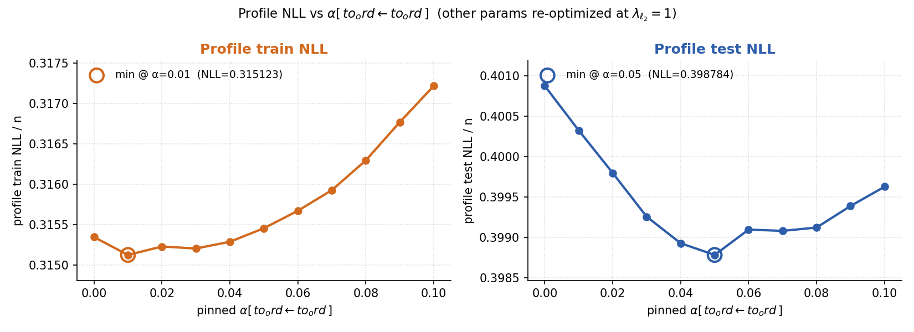
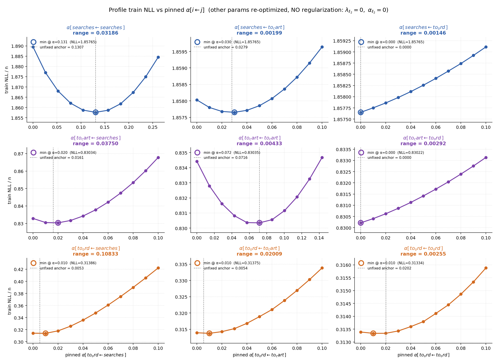

# 14. Profile likelihood по коэффициентам матрицы `α`

## 14.1. Зачем

Глава 13 показала, что test NLL почти не зависит от `λ_{ℓ_2}` в широком диапазоне, при этом разные prior'ы сходятся в разные `(λ_u, α)`. Это значит: **по самому скоринговому критерию модель плохо идентифицирует параметры** — на широких отрезках значений `α[i, j]` ландшафт NLL почти плоский. Эта глава измеряет identifiability **прямо**: фиксируем один коэффициент `α[i, j]` на сетке, ре-оптимизируем остальные параметры, и смотрим, как меняются train NLL и test NLL. Получаем 9 профилей likelihood (по числу коэффициентов).

## 14.2. Протокол

Для каждой пары `(target, source)`:

1. **Cold-fit unfixed Joint Hawkes** для `target` на главном `207d` train → anchor `(λ̂_u, α̂)`.
2. **Pin grid** из 11 точек вокруг unfixed значения: `linspace(0, max(0.10, 2 · α̂_source), 11)`.
3. **Pinned-фит**: `α[target ← source]` фиксируется на каждой точке сетки; ре-оптимизируются `λ_u` и оставшиеся 2 коэффициента `α[target, ·]`. Реализация — подмена переменных в L-BFGS-B (выбрасываем фиксированную координату из оптимизации).
4. **Warm-start sweep**: начало с точки сетки, ближайшей к anchor; sequential warm-start вверх и вниз по сетке; затем **2 polish-pass'а** (re-anchor at current best, re-sweep — обновляем точку, если новый фит даёт меньший loss).
5. Считаем train NLL и test NLL для каждой из 11 точек.

Hyperparameters: `λ_{ℓ_2} = 1` (default режим), `α_l2 = 1e-4`, `cold_max_iter = 3000`, `warm_max_iter = 1200`. Параллельно — `ProcessPoolExecutor` по 6 worker'ов, 9 sweep'ов через `~10` минут wall.

Скрипты: [`run_profile_to_ord_self_ch20.py`](../scripts/compute/run_profile_to_ord_self_ch20.py) (пилотный protocol на одной ячейке), [`run_profile_all_alphas_ch21.py`](../scripts/compute/run_profile_all_alphas_ch21.py) (все 9 коэффициентов, основной запуск), [`run_profile_all_alphas_unreg_ch22.py`](../scripts/compute/run_profile_all_alphas_unreg_ch22.py) (control без регуляризации).

## 14.3. Пилотный case: `α[to_ord ← to_ord]`

На одной ячейке смотрим train и test NLL отдельно (сетка `[0, 0.01, ..., 0.10]`):

| pinned `α[t←t]` | train NLL/n | test NLL/n |
| ---: | ---: | ---: |
| `0.00` | `0.31535` | `0.40087` |
| `0.01` | **`0.31512`** | `0.40032` |
| `0.03` | `0.31520` | `0.39926` |
| `0.05` | `0.31545` | **`0.39878`** |
| `0.10` | `0.31722` | `0.39963` |

- `argmin (train) = 0.01`, размах train: `0.0021` нат/n.
- `argmin (test) = 0.05`, размах test: `0.0021` нат/n.
- **Минимум на test сдвинут вправо от train** — на train оптимизатор тянется к меньшему self-α и большему компенсаторному `α[to_ord ← to_cart]`, на test предпочтение слегка иное.
- Train-профиль плоский в `[0, 0.04]` (диапазон NLL ≈ `0.00033` нат/n — на уровне численного шума).

Companion-параметры демонстрируют компенсацию: `α[to_ord ← to_cart]` падает в 10 раз (`0.0104 → 0.0010`), `⟨λ_u⟩` снижается на 4% по мере роста pin'а.

Артефакты: [`reports/20_profile_to_ord_self/`](reports/20_profile_to_ord_self/).

## 14.4. Полная сетка 3×3: train

Anchors (unfixed `α` при `λ_{ℓ_2} = 1`):

| target | α[t←searches] | α[t←to_cart] | α[t←to_ord] | ⟨λ_u⟩ |
| --- | ---: | ---: | ---: | ---: |
| `searches` | `0.1340` | `0.0272` | `0.0000` | `0.7097` |
| `to_cart`  | `0.0152` | `0.0768` | `0.0000` | `0.7362` |
| `to_ord`   | `0.0052` | `0.0057` | `0.0323` | `0.7261` |

## 14.5. Полная сетка 3×3: test

Сводка по 9 ячейкам — argmin (train/test) и размах NLL по 11 точкам сетки:

| target ← source | anchor | argmin train | argmin test | range train | range test |
| --- | ---: | ---: | ---: | ---: | ---: |
| `searches ← searches` | `0.134` | `0.134` | `0.214` | `0.032` | **`0.096`** |
| `searches ← to_cart`  | `0.027` | `0.030` | `0.030` | `0.002` | `0.002` |
| `searches ← to_ord`   | `0.000` | `0.000` | `0.000` | `0.001` | `0.001` |
| `to_cart ← searches`  | `0.015` | `0.020` | `0.020` | `0.037` | `0.031` |
| `to_cart ← to_cart`   | `0.077` | `0.061` | `0.123` | `0.005` | `0.015` |
| `to_cart ← to_ord`    | `0.000` | `0.000` | `0.000` | `0.003` | `0.003` |
| **`to_ord ← searches`** | `0.005` | `0.010` | `0.010` | **`0.107`** | **`0.103`** |
| `to_ord ← to_cart`    | `0.006` | `0.010` | `0.010` | `0.019` | `0.018` |
| `to_ord ← to_ord`     | `0.032` | `0.030` | `0.060` | `0.002` | `0.002` |

Типичная картина:

- **Жёсткие коэффициенты** (`range ≥ 0.03`): `to_ord ← searches` (range `0.10`), `searches ← searches` (`0.10` test), `to_cart ← searches`, `searches ← searches`, `to_cart ← to_cart` — здесь данные **реально** различают значения.
- **Плоские коэффициенты** (`range ≤ 0.005`): вся колонка `α[* ← to_ord]` плюс `α[searches ← to_cart]` и `α[to_ord ← to_ord]` — данные **не идентифицируют** значение в этом интервале.

Артефакты: [`reports/21_profile_all_alphas/`](reports/21_profile_all_alphas/).

## 14.6. Control: без регуляризации (`λ_{ℓ_2} = 0`, `α_l2 = 0`)

Тот же sweep на 9 коэффициентов, но без любого prior'а. Цель — проверить, что плоскость профилей — это **свойство данных**, а не артефакт регуляризации.

Сравнение anchor'ов и range'й:

| коэффициент | anchor `λ_l2=1` | anchor `λ_l2=0` | range test `λ_l2=1` | range test `λ_l2=0` |
| --- | ---: | ---: | ---: | ---: |
| `α[searches ← searches]` | `0.1340` | `0.1307` | `0.096` | `0.098` |
| `α[searches ← to_cart]`  | `0.0272` | `0.0279` | `0.002` | `0.002` |
| `α[to_cart ← searches]`  | `0.0152` | `0.0161` | `0.031` | `0.030` |
| `α[to_cart ← to_cart]`   | `0.0768` | `0.0716` | `0.015` | `0.016` |
| `α[to_ord ← searches]`   | `0.0052` | `0.0053` | `0.103` | `0.102` |
| `α[to_ord ← to_cart]`    | `0.0057` | `0.0054` | `0.018` | `0.017` |
| **`α[to_ord ← to_ord]`** | `0.0323` | `0.0202` | `0.002` | `0.002` |

**Anchors сдвигаются на 2-37%** (особенно `α[to_ord ← to_ord]`: `−37%` без рег.), но **range NLL по сетке практически идентичны**. То есть **топология profile NLL** — плоские vs жёсткие коэффициенты — **не зависит от prior'а**. Это контрольный аргумент: identifiability отражает геометрию данных, не структуру регуляризации.

Артефакты: [`reports/22_profile_all_alphas_unreg/`](reports/22_profile_all_alphas_unreg/).

## 14.7. Что унесено в главу 15

- Для каждого `α[i, j]` есть **профиль test NLL** на 11 точках; он не зависит от prior'а.
- Анкорные точечные оценки `α̂[i, j]` неинформативны для плоских профилей. Корректнее говорить **интервалом**: "значение находится где-то здесь, и модель не различает точки".
- Это формализуется в главе 15: для каждого `α[i, j]` строится интервал, в котором test NLL остаётся в пределах 10% от выигрыша Hawkes над Personalized GP baseline.
