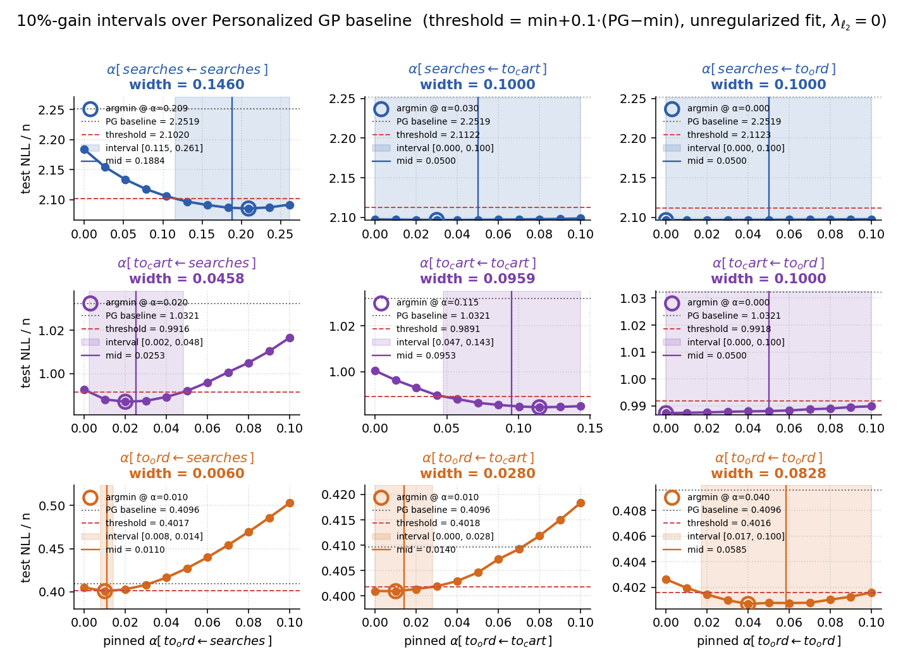
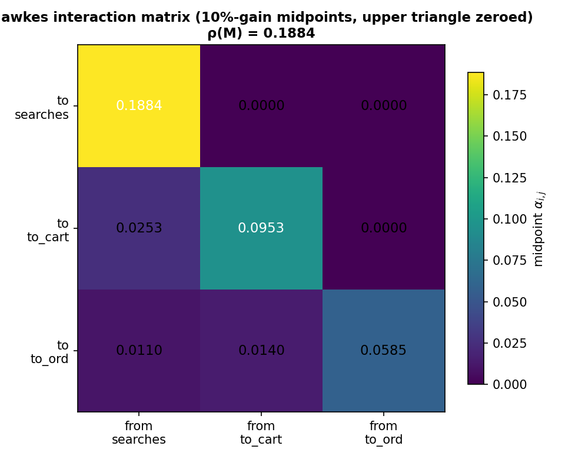

# 15. Финальная Hawkes-матрица: 10%-gain интервалы и midpoint'ы

## 15.1. Зачем

Глава 14 показала, что для каждого `α[target ← source]` имеет смысл говорить не о точечной оценке, а об **интервале значений**, на котором модель сохраняет качество. Эта глава формализует переход «9 профилей likelihood → одна 3×3 матрица», давая каждому коэффициенту один интерпретируемый midpoint.

## 15.2. Метод

### 15.2.1. 10%-gain threshold

Для каждой пары `(target, source)`:

- `PG_NLL(target)` — test NLL Personalized GP scaler'а (baseline без Hawkes);
- `min_NLL` — минимум test NLL Joint Hawkes по 11 точкам сетки из главы 14.6 (фит без регуляризации);
- `gain = PG_NLL − min_NLL` — выигрыш Hawkes над baseline;
- `threshold = min_NLL + 0.10 · gain`.

Допустимы такие `α`, при которых модель сохраняет минимум **90% выигрыша** над baseline.

### 15.2.2. Интервал и midpoint

Из 11 точек профиля test NLL берётся наибольший contiguous диапазон вокруг argmin, где `test_NLL ≤ threshold`. На границах — линейная интерполяция между соседними сеточными точками. `α_lo`, `α_hi` — границы интервала; `α_mid = (α_lo + α_hi) / 2`.

### 15.2.3. Зануление верхнего треугольника

По convention воронки `searches → to_cart → to_ord` (индексы 0 → 1 → 2) верхний треугольник матрицы — это реакции **выше по воронке на события ниже**: `α[searches ← to_cart]`, `α[searches ← to_ord]`, `α[to_cart ← to_ord]`. В главе 14 эти 3 коэффициента имеют **плоские профили** (range test NLL = `0.0011`, `0.0011`, `0.0026` нат/n) — данные на них не реагируют. **Эти 3 ячейки полагаем нулями** в финальной матрице. Остальные 6 (диагональ + нижний треугольник) — берутся как midpoint.

Скрипт: [`run_intervals_midpoint_matrix_ch23.py`](../scripts/compute/run_intervals_midpoint_matrix_ch23.py).

## 15.3. Personalized GP baseline на test

| target | `PG_NLL` |
| --- | ---: |
| `searches` | `2.25192` |
| `to_cart`  | `1.03215` |
| `to_ord`   | `0.40959` |

## 15.4. Интервалы и midpoint'ы

| target ← source | anchor (unfixed) | min test NLL | gain over PG | threshold | α_lo | α_hi | **α_mid** | width |
| --- | ---: | ---: | ---: | ---: | ---: | ---: | ---: | ---: |
| `searches ← searches` | `0.131` | `2.0853` | `+0.167` | `2.1020` | `0.115` | `0.261` | **`0.188`** | `0.146` |
| `to_cart ← searches`  | `0.016` | `0.9871` | `+0.045` | `0.9916` | `0.002` | `0.048` | **`0.025`** | `0.046` |
| `to_cart ← to_cart`   | `0.072` | `0.9843` | `+0.048` | `0.9891` | `0.047` | `0.143` | **`0.095`** | `0.096` |
| `to_ord ← searches`   | `0.005` | `0.4008` | `+0.009` | `0.4017` | `0.008` | `0.014` | **`0.011`** | `0.006` |
| `to_ord ← to_cart`    | `0.005` | `0.4009` | `+0.009` | `0.4018` | `0.000` | `0.028` | **`0.014`** | `0.028` |
| `to_ord ← to_ord`     | `0.020` | `0.4007` | `+0.009` | `0.4016` | `0.017` | `0.100` | **`0.059`** | `0.083` |

(Верхне-треугольные ячейки `searches ← to_cart`, `searches ← to_ord`, `to_cart ← to_ord` — занулены по 15.2.3; интервалы для них формально включали бы всю сетку, midpoint был бы неинформативной серединой grid'а.)

Все 6 учитываемых ячеек имеют положительный `gain` over PG — Hawkes улучшает baseline на test.

На каждой панели: красная пунктирная линия — `PG baseline`, штриховая — `threshold = min + 0.1·gain`, цветная заливка — `[α_lo, α_hi]`, сплошная вертикаль — `α_mid`.

## 15.5. Финальная матрица

| target ↓ \ source → | `searches` | `to_cart` | `to_ord` |
| --- | ---: | ---: | ---: |
| `searches` | **`0.1884`** | `0` | `0` |
| `to_cart`  | `0.0253` | **`0.0953`** | `0` |
| `to_ord`   | `0.0110` | `0.0140` | **`0.0585`** |

Матрица нижнетреугольная по convention funnel, поэтому её собственные значения совпадают с диагональю:

- `|eigvals|` = `[0.0585, 0.0953, 0.1884]`;
- **`ρ(M) = 0.1884`**.

Контекст: `ρ(α_mean Scaled, ch.12)` ≈ `0.082`, `ρ(α_mean Joint, λ_{ℓ_2}=1, ch.12)` ≈ `0.107`. Спектральный радиус по 10%-интервалам выше, потому что он берётся не из mean-α, а из верхней границы диапазона, в котором модель сохраняет 90% выигрыша.

Артефакты: [`reports/23_intervals_midpoint_matrix/`](reports/23_intervals_midpoint_matrix/).

## 15.6. Что показано

- Существует 6-параметрическая нижнетреугольная Hawkes-матрица, в пределах которой модель сохраняет минимум 90% выигрыша над Personalized GP на test.
- Все 6 параметров — это **diagonal** (self-excitation каналов) + **lower triangle** (продвижение вниз по воронке: `searches → cart → order`).
- 3 верхне-треугольных коэффициента (реакции выше по воронке на события ниже) — структурно нулевые: данные на них не реагируют, что согласуется с физическим смыслом воронки.
- Спектральный радиус `ρ(M) = 0.188` — Hawkes-процесс далёк от explosion-порога; финальная матрица описывает stable multivariate Hawkes.
