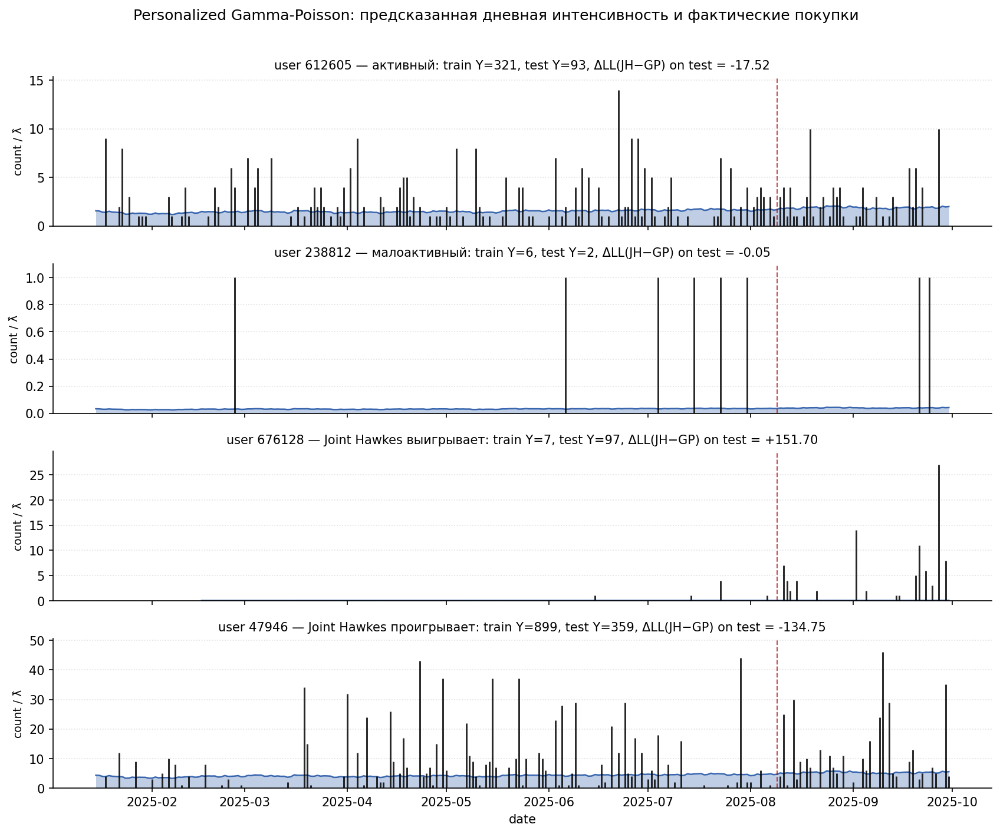
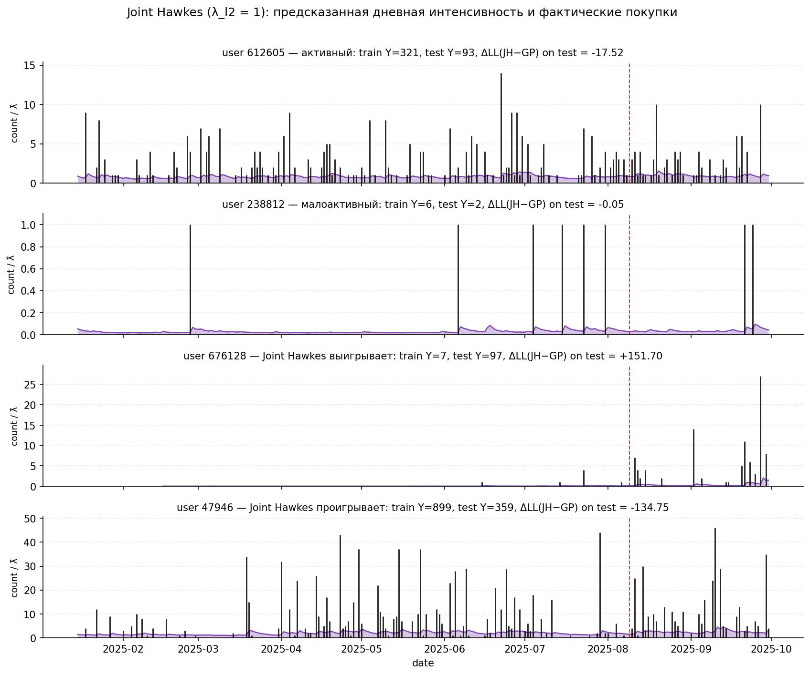

# 16. Per-user интенсивность: визуальное сравнение Pers GP и Joint Hawkes

## 16.1. Зачем

До этого момента модели сравнивались по агрегатным метрикам (NLL, MAE, RMSE — глава 9) и по per-user `ΔLL` гистограммам (глава 9.6 / 6 для Scaled). Здесь смотрим **прямо на траекторию** конкретного пользователя на всём analysis-окне: где модели согласны, где расходятся, и как именно проявляется разница в `λ̂(u, t)`.

## 16.2. Протокол

Протокол совпадает с главой 6: train `2025-01-15..2025-08-09` (~207 дней), test `2025-08-10..2025-09-30` (~52 дня). На train подгоняются обе модели:

- **Personalized Gamma-Poisson** (гл. 4): `λ̂(u, t) = μ_u^{EB} · b_t`. `μ_u^{EB}` — Empirical-Bayes posterior mean по Gamma-Poisson prior'у; `b_t` — Rolling-Seasonal baseline.
- **Joint Hawkes** (гл. 8, `λ_{ℓ_2} = 1`): `λ̂(u, t) = λ_u · b_t + α^{\top} z_{u, t}`, где `λ_u` и `α` обучаются совместно.

После fit'а на train для каждого `(u, t)` всего analysis-окна (включая test) считается `λ̂` обеих моделей.

Выбраны 4 представительных пользователя:

| Тип | user_id | Y_train | Y_test | `ΔLL` (JH − GP) на test |
| --- | ---: | ---: | ---: | ---: |
| активный | `612605` | `321` | `93` | `−17.52` |
| малоактивный | `238812` | `6` | `2` | `−0.05` |
| Joint Hawkes выигрывает | `676128` | `7` | `97` | **`+151.70`** |
| Joint Hawkes проигрывает | `47946` | `899` | `359` | **`−134.75`** |

«Выигрывает» / «проигрывает» — это user с экстремумом `LL_{JH} − LL_{GP}` на test, фильтрованных по `Y_test ≥ 3`.

Скрипт: [`run_user_lifecycle_ch24.py`](../scripts/compute/run_user_lifecycle_ch24.py).

## 16.3. Personalized Gamma-Poisson

На каждой панели по оси X — даты, чёрные вертикальные чёрточки — дни с `to_ord > 0` (высота = число покупок), синяя заливка — `λ̂(u, t) = μ_u^{EB} · b_t`. Красная пунктирная вертикаль — граница train / test.

Видно, что у Personalized GP интенсивность **почти константна** для каждого пользователя. `μ_u^{EB}` фиксируется при fit'е на train, а `b_t` через RS-baseline меняется очень медленно (`±5%` внутри недели). Модель оценивает один числовой уровень «сколько покупок в день в среднем у этого юзера» и его же экстраполирует на test.

## 16.4. Joint Hawkes

Та же визуализация, но фон — `λ̂(u, t)` из Joint Hawkes. Здесь интенсивность **динамическая**: каждое событие пользователя экспоненциально подсвечивает ближайшие 1–3 дня (`α^{\top} z_{u, t}`), и `λ̂` спадает обратно к baseline `λ_u · b_t` между событиями.

Различие проявляется по-разному в зависимости от типа пользователя:

- **`238812` (малоактивный)**: Pers GP даёт `λ̂ ≈ 0.03..0.04` константа; Joint Hawkes держит тот же средний уровень, но с локальными пиками в `0.1..0.4` вокруг покупочных дней. Покупок мало → разница в `LL` пренебрежимая (`ΔLL = −0.05`).
- **`612605` (активный)**: обе модели дают близкий средний уровень (`~1.5..2` в день), но Joint Hawkes пульсирует — взлёты после серий покупок, провалы после тихих периодов. На test проигрывает (`ΔLL = −17.5`): местами overshoots после редких выбросов, и теряет на днях без активности.
- **`676128` (Joint Hawkes выигрывает)**: у пользователя всего `7` покупок на train, поэтому Pers GP сильно shrinkает его `μ_u` к prior'у (`α/β ≈ 1` × `c` → `λ̂` near zero). На test активность взрывается: `97` покупок за `52` дня, концентрированные в августе-сентябре. Joint Hawkes через Hawkes-states **подхватывает** начало роста: `λ̂` поднимается до `5..10` в дни streakов. Pers GP остаётся плоской и платит большим NLL за каждый ненулевой день.
- **`47946` (Joint Hawkes проигрывает)**: мощный регулярный пользователь — `899` train + `359` test. Pers GP оценивает `λ̂ ≈ 4..5` в день. Joint Hawkes пульсирует **слишком сильно**: после крупных дней с `30..40` покупками интенсивность вырастает до `20+`, а на следующий день у юзера часто только `2..3`. Получается systematic overshooting → `ΔLL = −134.75`.

## 16.5. Что показано

1. Personalized GP даёт **один уровень на пользователя** — траектория `λ̂` плоская.
2. Joint Hawkes даёт **динамическую интенсивность** — реагирует на свежие события пользователя через Hawkes-states.
3. Failure-modes этих моделей **дополняют друг друга**:
   - Pers GP проигрывает на пользователях с резким изменением режима (Joint Hawkes ловит начало роста);
   - Joint Hawkes проигрывает на сверхактивных пользователях с большой дневной дисперсией — overreacts на крупные одиночные дни.
4. На уровне population-NLL разница между моделями скромная (`0.3958` vs `0.3951`, см. гл. 9), но per-user `ΔLL` распределена сильно неоднородно: `±150 нат` для отдельных пользователей при mean'е `≈ 0`.

Артефакты: [`reports/24_user_lifecycle/`](reports/24_user_lifecycle/).
