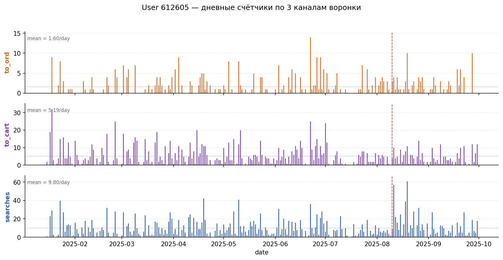
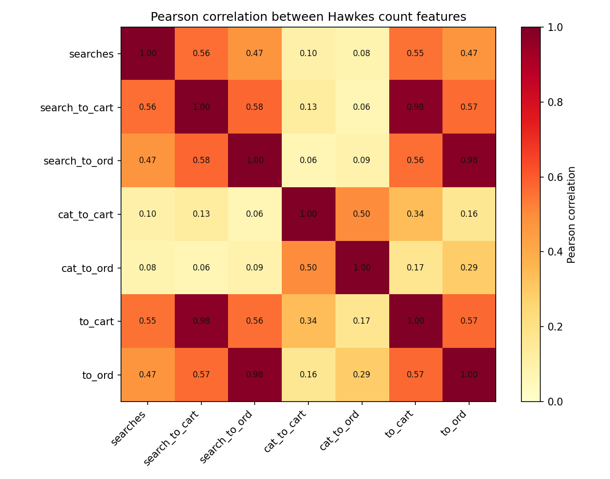
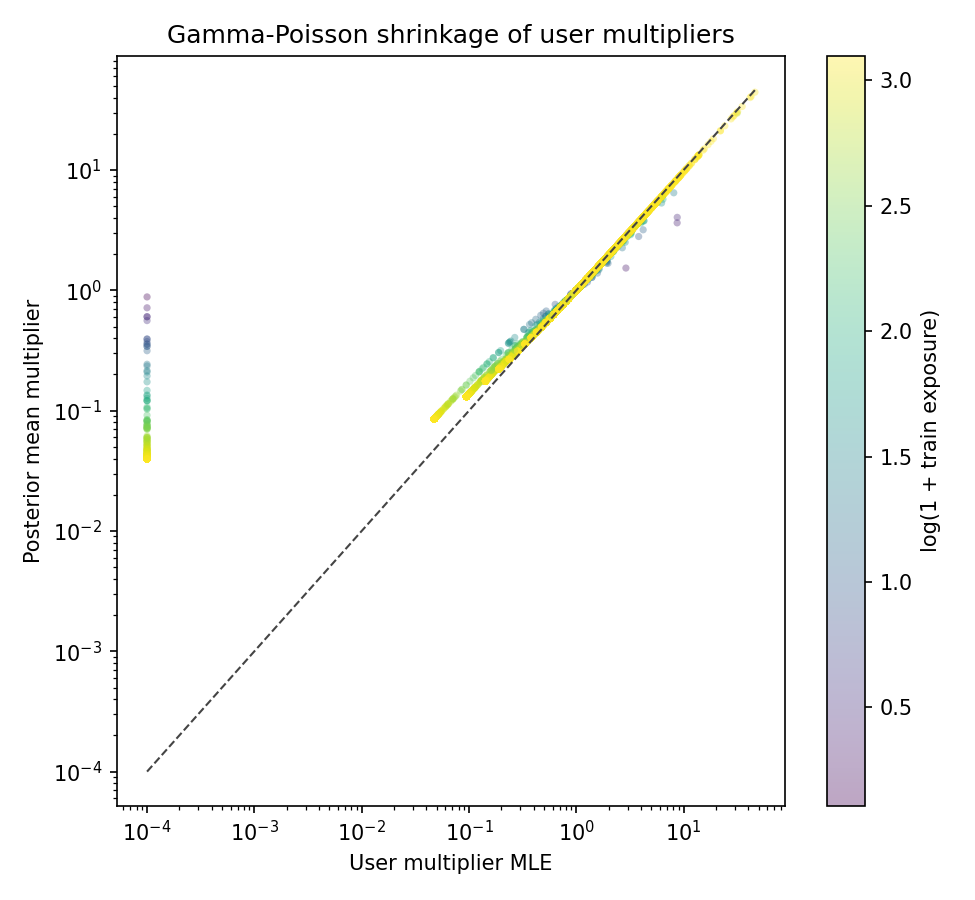
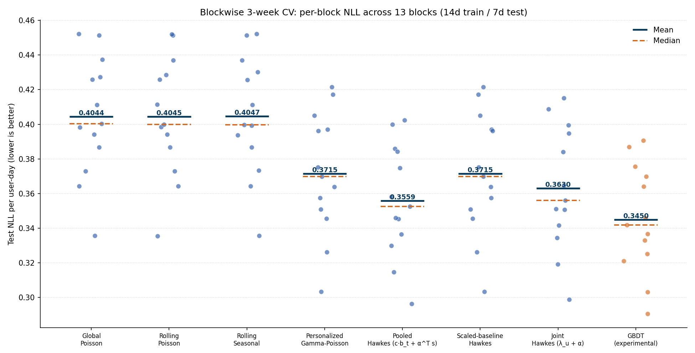
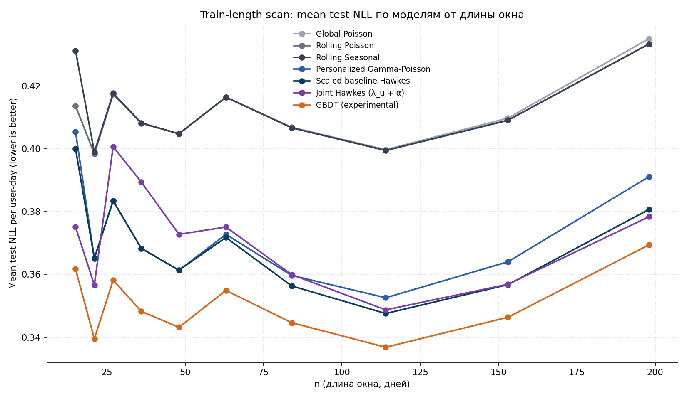
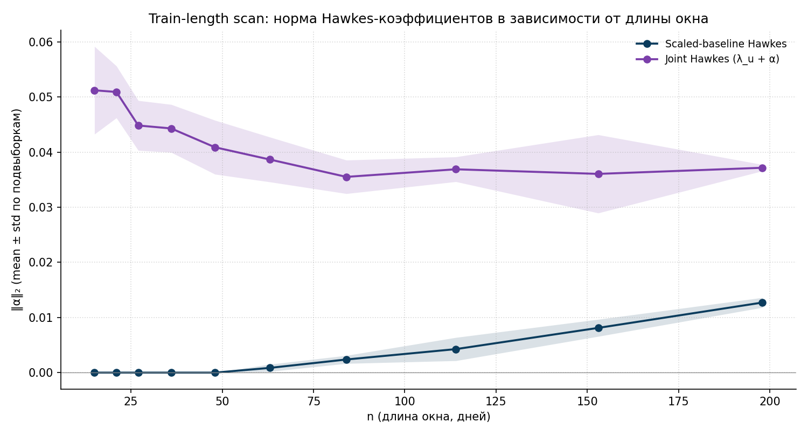
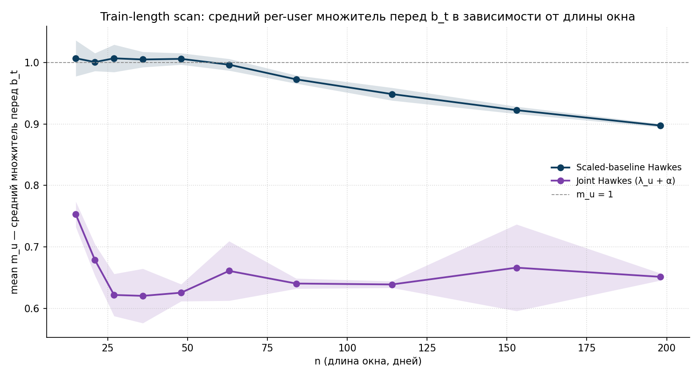
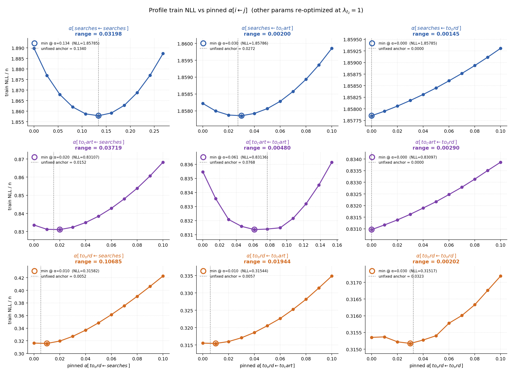
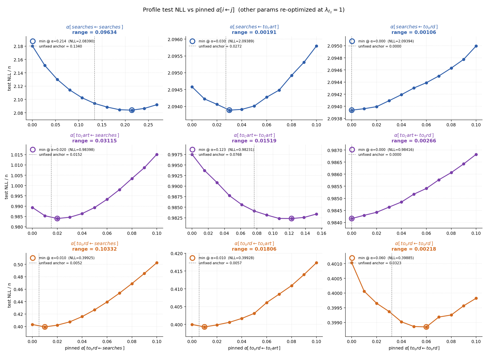

# Аннотация

Работа посвящена применению процессов Хокса для предсказания дневной интенсивности покупок пользователя в e-commerce. Прогноз пользовательской активности — ключевой блок при оценке ценности клиента, ранжировании коммуникаций и подведении итогов A/B-экспериментов; точные модели интенсивности позволяют не только улучшать бизнес-метрики, но и интерпретировать структуру пользовательского поведения. Процессы Хокса с экспоненциальным ядром естественно описывают самовозбуждение и cross-channel влияние событий и при этом сохраняют интерпретируемые параметры, что выгодно отличает их от чёрно-ящичных моделей машинного обучения.

Актуальность работы обусловлена тем, что в индустриальных задачах с разреженными счётчиками (доля нулей в нашей панели — `93.7%`) большинство стандартных регрессионных методов теряет в качестве из-за дисбаланса, тогда как явная вероятностная модель с per-user multiplier'ом и Hawkes-надстройкой остаётся стабильной и легко интерпретируется. В работе исследуется не только предсказательное качество Hawkes-моделей, но и их сходимость, чувствительность к выбору регуляризации, идентифицируемость коэффициентов и поведение на разных длинах обучающего окна — то есть аспекты, важные для практического применения модели в индустриальной среде.

В качестве данных используется панель из `~10K` пользователей крупного маркетплейса за `~290` дней с пятью поведенческими счётчиками (`searches`, `cat_to_cart`, `cat_to_ord`, `to_cart`, `to_ord`). Основной target — число покупок `to_ord` на пару `(user, day)`. Все эксперименты проводятся на воспроизводимом коде на Python (`scikit-learn`, `scipy.optimize`, собственная реализация Hawkes-фита через L-BFGS-B).

Основные результаты: построена иерархия из шести вероятностных моделей с переходом от Global Poisson к Joint Hawkes; на главном `207`-дневном train Hawkes-надстройка устойчиво улучшает Personalized Gamma-Poisson baseline на `2.92..6.83%` от test NLL на трёх независимых каналах; cross-channel матрица `α ∈ ℝ^{3×3}` восстановлена в виде нижнетреугольной структуры воронки `searches → to_cart → to_ord` со спектральным радиусом `ρ(M) = 0.188`, что подтверждает stable multivariate Hawkes; через profile likelihood показано, что диагональные коэффициенты слабо идентифицируемы из-за коллинеарности history-state и baseline, что согласуется с известными результатами по multivariate Hawkes [4, 5]; tree-ensemble на полном feature-engineering'е (141 фича) даёт верхнюю планку качества, закрывая ещё `2..3%` зазора сверх Hawkes, но без интерпретируемой структуры. Дополнительно проведён train-length scan, показывающий, что Joint Hawkes с активной L2-регуляризацией остаётся стабильным на коротких train (`n ≥ 15` дней), тогда как Scaled-baseline Hawkes на коротких окнах вырождается в Personalized GP.

# Содержание

- 1. Введение
  - 1.1. Постановка задачи и актуальность
  - 1.2. Процессы Хокса: специфика и применимость к задаче
  - 1.3. Цели и задачи работы
  - 1.4. Используемые данные
- 2. Обзор литературы
- 3. Разведочный анализ данных и метрика качества
  - 3.1. Структура панели и разреженность
  - 3.2. Дневная интенсивность на полном ряду
  - 3.3. Гетерогенность пользователей
  - 3.4. Корреляции каналов и выбор признаков для Hawkes
  - 3.5. Метрика качества: per-observation Poisson NLL и saturated floor
- 4. Часть I. Бейзлайн и Hawkes-надстройка на полном train-test
  - 4.1. Лестница вероятностных моделей
  - 4.2. Personalized Gamma-Poisson через Empirical Bayes
  - 4.3. Scaled-baseline Hawkes на персонализированной базе
  - 4.4. Регуляризация и выбор полураспадов
  - 4.5. Бустинг как control-модель
  - 4.6. Сравнение всех моделей на главном train-test
- 5. Часть II. Поведение моделей на коротких train-окнах
  - 5.1. Blockwise CV: 21-дневные блоки
  - 5.2. Вырождение Scaled-baseline Hawkes
  - 5.3. Joint Hawkes как альтернативная форма обучения
  - 5.4. Train-length scan и crossover'ы
- 6. Часть III. Структура cross-channel Hawkes-матрицы
  - 6.1. Cross-channel постановка и верификация
  - 6.2. Чувствительность к регуляризации
  - 6.3. Profile likelihood и асимметрия диагонали/внедиагональных
  - 6.4. Интервалы 10%-gain и финальная матрица
  - 6.5. Per-user визуализация работы моделей
- 7. Заключение
- Список литературы

# 1. Введение

## 1.1. Постановка задачи и актуальность

Задача предсказания пользовательской активности — одна из центральных в современном e-commerce. Точная оценка ожидаемого числа покупок `to_ord` на пару `(user, day)` напрямую используется в персонализации ранжирования, расчёте Customer Lifetime Value, выборе аудитории для коммуникаций и подведении итогов A/B-экспериментов. От качества этого прогноза зависит распределение маркетингового бюджета и оценка эффекта продуктовых изменений.

С формальной точки зрения мы оцениваем дневную интенсивность `λ_{u,t}` и предполагаем условную Пуассоновскую модель наблюдения:

$$
y_{u,t} \mid \lambda_{u,t} \;\sim\; \mathrm{Poisson}(\lambda_{u,t}),
$$

где `y_{u,t}` — число покупок пользователя `u` в день `t`, а `λ_{u,t}` — наша точечная оценка интенсивности. Задача состоит в выборе функциональной формы `λ_{u,t}` и алгоритма обучения, который наилучшим образом обобщается на отложенную тестовую выборку по агрегированной метрике per-observation Poisson NLL.

Особенность задачи — крайняя разреженность сигнала: в нашей панели среднее число покупок на `(user, day)` ≈ `0.10`, а доля нулевых ячеек — `93.7%`. Такие данные плохо подходят к классическим регрессионным методам, ориентированным на нормальные ошибки, и требуют явного учёта Пуассоновского распределения наблюдений. Дополнительная сложность — гетерогенность пользователей: разброс по среднему числу покупок между пользователями на порядки превышает изменчивость во времени, поэтому без персонализации модель работает плохо.

Третья особенность — событийный характер сигнала. Покупки не происходят равномерно во времени: часто наблюдаются «вспышки» активности (пользователь сделал серию заказов за один-два дня) с последующей паузой. Такая динамика хорошо описывается классом self-exciting процессов, в котором event-history явно влияет на интенсивность будущих событий, и существенно хуже — простыми параметрическими моделями с фиксированным средним.

Актуальность работы определяется тремя факторами. Во-первых, индустриальные системы прогноза покупок чаще всего опираются на чёрно-ящичные модели (GBDT, нейросети), которые дают хороший скор, но не дают понимания структуры пользовательского поведения. Во-вторых, при оценке эффектов A/B-экспериментов важно не только качество прогноза, но и стабильность модели на коротких окнах и интерпретируемость её параметров — здесь GBDT с сотнями признаков становится плохо контролируемым инструментом. В-третьих, процессы Хокса, успешно применявшиеся в финансах [2] и анализе кликовых потоков [3, 7], редко рассматриваются в индустриальном e-commerce как полноценный production-ready инструмент — несмотря на то, что их параметры (per-user multiplier, матрица α-взаимодействий) допускают прямую бизнес-интерпретацию.

## 1.2. Процессы Хокса: специфика и применимость к задаче

Процесс Хокса — это самовозбуждающийся (self-exciting) точечный процесс, в котором интенсивность будущих событий зависит от истории уже случившихся [1]. В классической непрерывной форме одномерный процесс с экспоненциальным ядром записывается как

$$
\lambda(t) \;=\; \mu \;+\; \sum_{t_i < t} \alpha \cdot \exp\!\left(-\beta (t - t_i)\right),
$$

где `μ` — фоновая (background) интенсивность, `α` — вес возбуждения, а `β` — скорость затухания, обратная характерному времени памяти. Каждое произошедшее событие экспоненциально подсвечивает интенсивность в ближайшем будущем, и эффект затухает с заданным полураспадом. Свойство «памяти» этого процесса — конечное: после нескольких полураспадов событие фактически перестаёт влиять на текущую интенсивность.

В многомерной форме (`K` типов событий) ядра становятся матричными:

$$
\lambda_k(t) \;=\; \mu_k \;+\; \sum_{j=1}^{K} \sum_{t_i^{(j)} < t} \alpha_{kj} \cdot \exp\!\left(-\beta_{kj} (t - t_i^{(j)})\right).
$$

Здесь `α_{kj}` интерпретируется как «сила влияния события типа `j` на интенсивность типа `k`». Эта матричная структура и есть та самая cross-channel матрица, которая в нашей работе восстанавливается для воронки `searches → to_cart → to_ord`.

В дискретно-дневной форме, удобной для нашей панельной задачи, мы пишем

$$
\lambda_{u,t} \;=\; \underbrace{\mu_{u,t}}_{\text{baseline}} \;+\; \sum_{j} \alpha_j \cdot z_{u,j,t},
$$

где `μ_{u,t}` — персонализированный baseline уровня пользователя, а `z_{u,j,t}` — экспоненциально сглаженный счётчик `j`-ой фичи у пользователя `u` до дня `t`:

$$
z_{u,j,t} \;=\; \sum_{s < t} x_{u,j,s} \cdot \exp\!\left(-\frac{t - s}{\tau_j}\right),
$$

с заданным полураспадом `τ_j` (в большинстве экспериментов мы используем `τ ∈ \{1, 3\}` дня). Веса `α_j` оцениваются по обучающей выборке и допускают прямую интерпретацию: положительный `α_j` означает, что событие фичи `j` повышает интенсивность будущих покупок этого пользователя.

Применимость процессов Хокса к нашей задаче объясняется следующими свойствами:

1. **Self-excitation естественно описывает воронку покупок.** В e-commerce покупка не происходит «из ниоткуда»: ей часто предшествует серия поисков, просмотров и добавлений в корзину. Hawkes явно моделирует эту короткую память.
2. **Параметры интерпретируемы.** Матрица `α[target ← source]` показывает, какие каналы и в какой мере возбуждают другие каналы. Это даёт бизнес-понимание, недоступное у GBDT.
3. **Аддитивная декомпозиция baseline + надстройка.** Модель явно разделяет «фоновую активность» пользователя и «короткие всплески от событий», что позволяет независимо изучать обе компоненты.
4. **Малое число параметров.** Например, 3-канальный cross-channel Hawkes на 207-дневном train оценивает порядка `~10K` per-user multiplier'ов + 9 коэффициентов `α`, что на 2 порядка меньше параметров типичного GBDT.
5. **Спектральный радиус матрицы `α` имеет физический смысл.** Branching ratio `ρ(M)` оценивает среднее число «дочерних» событий, порождённых одним «родительским»; если `ρ(M) < 1`, процесс не уходит в explosion и описывает stable Hawkes.

Платой за интерпретируемость становится более ограниченная функциональная форма: линейная additive комбинация `λ_u · b_t + α^{\top} z` уплощает нелинейные взаимодействия признаков, которые GBDT мог бы учесть. Сравнение этого trade-off — одна из задач работы.

## 1.3. Цели и задачи работы

**Цель работы**: исследовать границы применимости процессов Хокса для предсказания дневной интенсивности покупок пользователя в e-commerce, оценить их предсказательное качество и стабильность по сравнению с вероятностными baseline'ами и tree-ensemble моделями, а также изучить идентифицируемость и интерпретируемость их коэффициентов.

**Задачи работы**:

1. Построить иерархию вероятностных моделей от Global Poisson до Personalized Gamma-Poisson, дающую устойчивый baseline для последующей Hawkes-надстройки.
2. Исследовать особенности сходимости коэффициентов Hawkes-моделей: на каком объёме train они стабилизируются и какая параметризация подходит для коротких окон.
3. Восстановить cross-channel матрицу `α[target ← source]` для трёх каналов воронки и оценить её устойчивость к выбору train-окна и регуляризации.
4. Сравнить Hawkes-модель с двумя контрольными моделями — статистическим Personalized GP без надстройки и tree-ensemble (GBDT) на расширенном feature-engineering'е — на нескольких train-test разбиениях.

## 1.4. Используемые данные

Все эксперименты проводятся на закрытом датасете, обезличенно отражающем поведение `~10000` случайно выбранных пользователей крупного e-commerce-сервиса за период `2025-01-15..2025-10-31` (`~290` дней). На каждую пару `(user, day)` доступны пять поведенческих счётчиков (число событий за день):

- `searches` — пользовательские поиски, mean `≈ 1.20` событий на строку;
- `cat_to_cart` — переходы из категории в корзину;
- `cat_to_ord` — переходы из категории к оформлению заказа;
- `to_cart` — добавления товаров в корзину, mean `≈ 0.37`;
- `to_ord` — оформленные заказы (target), mean `≈ 0.10`.

Когорта в `10K` пользователей фиксирована случайной подвыборкой со стабильным seed. Этого достаточно для статистических выводов и достаточно мало для удобной интерактивной работы. Структура данных — длинный pandas DataFrame с `~2.87M` строк формы `(user_id, event_date, searches, to_cart, to_ord, ...)`. Все ячейки заполнены явно: даже если пользователь в какой-то день не проявлял активности, в панели присутствует строка с нулями. Это упрощает построение rolling-агрегатов и Hawkes-states одной свёрткой по каждому пользователю.

Все основные эксперименты используют один и тот же train-test протокол: train `2025-01-15..2025-08-09` (`~207` дней, `~1.99M` строк), test `2025-08-10..2025-09-30` (`~52` дня, `~513K` строк). Этот протокол совпадает с принятым в основной части работы.

# 2. Обзор литературы

Процессы Хокса как класс самовозбуждающихся точечных процессов введены Хоксом [1] и долгое время применялись преимущественно в сейсмологии и финансах [2]. С развитием современных систем сбора пользовательских данных интерес к ним смещается в сторону анализа кликовых потоков, рекомендательных систем и e-commerce.

Существенная часть современной литературы посвящена нейронным расширениям Hawkes-моделей. Du et al. [3] предложили recurrent marked temporal point processes (RMTPP), в которых дискретная история событий пользователя сжимается рекуррентной сетью в вектор состояния, по которому затем предсказывается интенсивность будущих событий. Mei и Eisner [7] развили эту идею в neural Hawkes process, явно параметризовав интенсивность нейросетью, сохраняющей формальную структуру self-exciting процесса. Эти подходы дают высокое качество, но за счёт интерпретируемости: нейросетевой блок становится чёрным ящиком, и непосредственно «прочитать» матрицу cross-channel влияний из обученной модели нельзя.

Параллельно развиваются классические multivariate Hawkes-модели с акцентом именно на интерпретируемость и идентифицируемость. Bacry, Bompaire, Gaïffas и Muzy [4] показывают, что при оценке коэффициентов многомерного Hawkes-процесса по максимальному правдоподобию имеет смысл регуляризовать диагональные элементы матрицы влияния отдельно от внедиагональных: первые отвечают за «свой» self-excitation канала и часто коллинеарны фоновой интенсивности `μ`, вторые описывают cross-channel взаимодействия и идентифицируются устойчивее. В нашей работе мы наблюдаем эту же асимметрию эмпирически (см. часть III) и связываем её с тем же механизмом коллинеарности history-state и baseline. Параллельно Achab et al. [5] предложили отказ от MLE в пользу integrated cumulants, чтобы обойти проблему non-identifiability диагональных коэффициентов на коротких выборках; их подход не требует точной формы ядер и масштабируется к большим `K` через спектральные разложения матриц моментов.

В индустриальном контексте предсказания пользовательской активности классическим инструментом остаются модели семейства Pareto/NBD и Beta-Geometric, восходящие к работам Fader и Hardie [6]. Их центральная идея — Gamma-prior на индивидуальный темп покупок пользователя `λ_u`, с последующим Empirical-Bayes shrinkage'ем при оценке. Этот же приём используется нами в Personalized Gamma-Poisson baseline'е и оказывается основным шагом, дающим крупнейший выигрыш по NLL: при `(α, β) ≈ (0.88, 0.88)` модель аккуратно ранжирует пользователей по их «истинному» темпу и обеспечивает устойчивую базу для последующей Hawkes-надстройки.

Наконец, для сравнения с интерпретируемой моделью используются современные tree-ensemble методы, в первую очередь Gradient Boosting Machines в реализации Friedman [8] и их продвинутые версии (`HistGradientBoosting`, `LightGBM`, `CatBoost`). На широком feature-engineering'е такие модели дают верхнюю планку по качеству, особенно когда сигнал содержит нелинейные взаимодействия признаков, плохо схватываемые линейной additive формой Hawkes. Однако они не дают структурных коэффициентов, сопоставимых с матрицей `α` Hawkes-процесса, и поэтому используются в работе как control, а не как самостоятельная цель.

# 3. Разведочный анализ данных и метрика качества

## 3.1. Структура панели и разреженность

Панель данных представляет собой плотную таблицу `(user × day)` без пропусков: для каждого из `~10K` пользователей доступны строки на все `~290` дней анализируемого периода (нулевые счётчики записаны явно). Это упрощает обучение: rolling-агрегаты и Hawkes-states легко строятся одной свёрткой по каждому пользователю.

Распределение target'а `to_ord` крайне разреженное. Гистограмма числа покупок на user-day (log-Y) показана на рис. 1.

Видны три структурных факта:

- Подавляющее большинство ячеек содержат нули — точнее, `93.7%` строк панели имеют `to_ord = 0`.
- Существует тяжёлый правый хвост: единичные `(user, day)`-пары содержат десяток покупок и больше, при максимуме порядка сотни. Это означает, что распределение `to_ord` далеко от классической Poisson-формы и имеет over-dispersion на уровне отдельных пользователей.
- При этом среднее по панели — `mean(to_ord) ≈ 0.10` — что и есть та самая разреженность сигнала.

Эта картина мотивирует две вещи. Во-первых, использовать именно Пуассоновскую модель наблюдения, а не нормальную регрессию — иначе при `93.7%` нулей оптимум прогноза вырождается в константу около нуля. Во-вторых, явно учитывать пер-юзерную гетерогенность через personalization: иначе один пользователь с сотней покупок «тянет» loss на всю когорту.

Распределение активности по пользователям тоже крайне неравномерное: `18%` самых активных пользователей делают `62%` всех покупок. Это в духе классического правила Парето и согласуется с эмпирическими наблюдениями из работ по CLV [6].

## 3.2. Дневная интенсивность на полном ряду

Агрегированная по дням дневная интенсивность `to_ord` представлена на рис. 2.

На полном ряду выделяются три режима:

1. **Первые две недели января** — аномально высокая активность, связанная с послепраздничными промо-кампаниями. Среднее число покупок в этот период на `30..40%` выше, чем в основном окне.
2. **Период с середины января до конца сентября** — основное стабильное окно с медленным трендом и недельной сезонностью. На нём проводится большая часть экспериментов.
3. **Октябрь** — повторное повышение уровня, связанное с предновогодними промо.

Анализируемое окно фиксировано как `2025-01-15..2025-09-30`, чтобы исключить новогодний всплеск из train-данных и обеспечить стационарность фоновых характеристик. Внутри этого окна также наблюдается недельная сезонность: будни и выходные различаются по среднему уровню `to_ord` примерно на `±10..15%`. Эта сезонность явно моделируется в Rolling Seasonal baseline'е (раздел 4.1).

## 3.3. Гетерогенность пользователей

Если в среднем по панели `mean(to_ord) ≈ 0.10`, то на уровне отдельного пользователя картина может быть сильно иной. Чтобы понять, насколько активность одного пользователя предсказуема через активность того же пользователя в другом периоде, мы построили scatter plot суммарного числа покупок на train против test для каждого пользователя (рис. 3).

Корреляция Пирсона между train и test суммами составляет `~0.75..0.80`. Это означает, что значительная часть будущей активности пользователя действительно предсказуема через его исторические суммы — это и есть основной сигнал для Personalized GP. Но `30..40%` дисперсии остаются необъяснёнными за счёт изменения паттерна пользователя во времени, шума и редких всплесков.

В терминах модели гетерогенность пользователей выражается в том, что разброс по логарифму среднего темпа `log(μ_u)` между пользователями составляет `~2..3 порядка`. Без персонализации модель неизбежно сильно недооценивает активных пользователей и переоценивает неактивных. Поэтому Personalized GP даёт самый крупный шаг в лестнице моделей (раздел 4.2).

Для иллюстрации структуры данных на уровне одного пользователя — пользователь 612605, активный (`321` покупка на train) — показаны его дневные счётчики по трём каналам воронки на рис. 4.

На каждой панели видна экспоненциальная воронка: `searches` (mean `9.8` событий/день для этого пользователя) → `to_cart` (`5.2`) → `to_ord` (`1.6`). Активность нерегулярна — серии «горячих» дней чередуются с периодами относительного затишья. Именно эту структуру self-excitation призван моделировать Hawkes.

## 3.4. Корреляции каналов и выбор признаков для Hawkes

Матрица корреляций пяти исходных счётчиков показана на рис. 5.

Каналы `search_to_cart` и `search_to_ord` сильно скоррелированы с целевыми `to_cart` и `to_ord` (Пирсон `r > 0.9`), поэтому их включение в Hawkes-states привело бы к коллинеарности features и нестабильности оценок `α`. По итогам этого анализа в основной части работы мы оставляем три независимых канала: `searches`, `to_cart`, `to_ord`. Этого достаточно для содержательного cross-channel анализа и не приводит к мультиколлинеарности.

Корреляции между оставшимися тремя каналами умеренные (`r ≈ 0.3..0.5`), что и должно быть для каналов воронки: события вышестоящих этапов (`searches`) частично, но не полностью предсказывают события нижестоящих (`to_ord`).

## 3.5. Метрика качества: per-observation Poisson NLL и saturated floor

Основная скоринговая метрика — средний негативный log-likelihood Пуассоновской модели на одну строку панели:

$$
\mathrm{NLL} \;=\; \frac{1}{N} \sum_{u,t} \Big[\, \lambda_{u,t} \;-\; y_{u,t} \log \lambda_{u,t} \;+\; \log y_{u,t}! \,\Big].
$$

Чем меньше — тем лучше. Метрика согласована с самой моделью наблюдения и поэтому используется как primary criterion при сравнении моделей. Дополнительно для диагностики и сопоставимости с регрессионными моделями (бустинг) используются MAE и RMSE.

Существует теоретический минимум NLL, недостижимый никакой Пуассоновской моделью: **saturated Poisson floor**, получаемый подстановкой `λ_i = y_i` в каждой строке. Действительно, при фиксированном `y` функция `λ ↦ \log p(y \mid λ)` достигает максимума при `λ = y`, поэтому

$$
\mathrm{LL}_{\mathrm{sat}} \;=\; \sum_{i} \Big( y_i \log y_i - y_i - \log(y_i!) \Big),
$$

с договорённостью `0 log 0 := 0`. На нашем test-окне (`N ≈ 513K` строк) saturated floor `NLL_sat ≈ 0.0862` нат/строка. Это абсолютный нижний предел: разница между лучшей нашей моделью и этим floor'ом — это та часть aleatoric uncertainty, которую никаким Пуассоновским предсказанием закрыть нельзя.

Связь saturated floor'а с deviance даёт удобный способ оценивать его из уже обученной модели: `NLL_{model} − NLL_{sat} = mean Deviance / 2`. Мы используем это соотношение в коде для проверки численной согласованности разных экспериментов.

# 4. Часть I. Бейзлайн и Hawkes-надстройка на полном train-test

В этой части мы строим иерархию из шести вероятностных моделей и одной control-модели (GBDT), последовательно усложняя `λ_{u,t}`. Все модели оцениваются на основном протоколе: train `207d`, test `52d`.

## 4.1. Лестница вероятностных моделей

Лестница состоит из четырёх baseline'ов и двух Hawkes-вариантов:

1. **Global Poisson** — единая константа `λ̄` на всю панель.
2. **Rolling Poisson** — скользящее среднее дневного уровня, без персонализации.
3. **Rolling Seasonal Poisson** — с поправкой на день недели.
4. **Personalized Gamma-Poisson** — per-user multiplier `μ_u` через Empirical-Bayes Gamma-prior.
5. **Scaled-baseline Hawkes** — Personalized GP с pooled Hawkes-надстройкой.
6. **Joint Hawkes** — совместная оптимизация `λ_u` и `α`.

Каждый следующий уровень включает в себя структуру предыдущего и добавляет один концептуальный шаг. Сравнение моделей по test log-likelihood приведено на рис. 6.

Главный визуальный вывод: самый крупный единичный шаг — переход к **персонализации** (Gamma-Poisson, `+24K` нат суммарно). Все четыре «не персонализированных» baseline'а на полной кривой почти не отличаются друг от друга, поскольку разброс между пользователями кратно превышает изменчивость во времени. Следующий заметный шаг — Hawkes-надстройка (`+7K` нат). Joint Hawkes даёт почти то же значение, что и Scaled-baseline, отличаясь от него на сотни нат — это уже на уровне численного шума.

Численная таблица:

| Ступень | Модель | Test LL | NLL/n | Δ vs предыдущая (LL) |
| ---: | --- | ---: | ---: | ---: |
| 1 | Global Poisson | `−236458` | `0.4608` | — |
| 2 | Rolling Poisson | `−234805` | `0.4576` | `+1653` |
| 3 | Rolling Seasonal | `−234782` | `0.4576` | `+23` |
| 4 | Personalized Gamma-Poisson | `−210167` | `0.4096` | `+24615` |
| 5 | Scaled-baseline Hawkes | `−203093` | `0.3958` | `+7074` |
| 6 | Joint Hawkes (`λ_u + α`) | `−202721` | `0.3951` | `+372` |
| — | GBDT (experimental) | `−199154` | `0.3881` | — |
| — | Saturated Poisson floor | `−44216` | `0.0862` | — |

Доля закрытого зазора между Global Poisson и saturated floor'ом, накопленная к Joint Hawkes, составляет `~18%`; до GBDT — `~19%`. Остающиеся `~80%` — это внутренний шум данных, который не может быть закрыт никаким Пуассоновским предсказанием на текущих признаках.

## 4.2. Personalized Gamma-Poisson через Empirical Bayes

Personalized Gamma-Poisson — ключевая ступень лестницы и опорный baseline для всех Hawkes-моделей. Формулировка стандартная: число покупок пользователя в день имеет условное распределение

$$
y_{u,t} \mid \mu_u \sim \mathrm{Poisson}(\mu_u \cdot b_t), \qquad \mu_u \sim \mathrm{Gamma}(\alpha, \beta),
$$

где `b_t` — общий дневной профиль (Rolling Seasonal baseline), а `μ_u` — индивидуальный множитель пользователя с сопряжённым Gamma-prior'ом. Благодаря сопряжённости Gamma-Poisson posterior'а тоже распределен по Gamma:

$$
\mu_u \mid Y_u, E_u \sim \mathrm{Gamma}(\alpha + Y_u, \beta + E_u),
$$

где `Y_u = \sum_t y_{u,t}` — суммарное число покупок пользователя на train, а `E_u = \sum_t b_t` — суммарная экспозиция через дневной профиль. Точечная оценка `μ_u` — posterior mean:

$$
\hat\mu_u^{\mathrm{EB}} \;=\; \frac{\alpha + Y_u}{\beta + E_u}.
$$

Гиперпараметры `(α, β)` оцениваются по marginal MLE по всем `~10K` пользователям одновременно: подставляем `μ_u` в маргинальное негативное-биномиальное распределение `(Y_u, E_u)`, минимизируем суммарный `−log p(Y_u, E_u | α, β)` по `(α, β)` методом L-BFGS-B. В нашем датасете это даёт `(α, β) ≈ (0.88, 0.88)`. Поскольку `α/β ≈ 1`, prior'ом является Gamma со средним `~1` — то есть он шринкает множитель к единице, к среднему по когорте. Это ключевой механизм: малоактивные пользователи с большой неопределённостью «вытягиваются» к среднему уровню, а активные с большим `Y_u` стягиваются к raw MLE.

Эффект shrinkage иллюстрируется на рис. 7: горизонтальная ось — raw MLE `Y_u / E_u`, вертикальная — posterior mean `μ_u^{EB}`.

Без shrinkage'а (raw MLE) test NLL на полном `52d`-test составляет `0.4650`. Empirical-Bayes даёт `0.4096` — выигрыш порядка `+24K` нат суммарно. Это и есть тот доминирующий шаг лестницы, который видно на рис. 6.

Анализ выигрыша на уровне отдельных пользователей через **per-user delta-LL** даёт следующую картину (рис. 8):

Распределение `ΔLL = LL_{PersGP} − LL_{RS}` по пользователям сильно неоднородно:

- `share(personalized > rolling seasonal) = 66%` — две трети пользователей выигрывают от персонализации.
- Юзеры с `0..2` покупками выигрывают почти всегда (`87..94%`) — для них Personalized GP правильно сдвигает прогноз вниз от среднего по когорте.
- Бакет `6..10` покупок — наоборот, проигрывает (`18%`): на этих пользователях shrinkage тянет слишком сильно, и raw MLE сработал бы лучше.
- Активные с `11+` снова выигрывают, потому что `μ_u^{EB}` на них почти не отличается от raw MLE.

Это структурное замечание важно для интерпретации Hawkes-результатов: Hawkes-надстройка будет работать поверх уже выровненного персонализированного baseline'а и сможет компенсировать перешринкование на активной части когорты.

## 4.3. Scaled-baseline Hawkes на персонализированной базе

Над Personalized Gamma-Poisson baseline'ом мы строим **Scaled-baseline Hawkes** — модель с фиксированной персонализированной базой и pooled Hawkes-надстройкой:

$$
\lambda_{u,t} \;=\; c \cdot \mu_u^{\mathrm{EB}} \cdot b_t \;+\; \sum_{j,m} \alpha_{j,m} \cdot z_{u,j,m,t},
$$

где `c` — глобальный масштаб базы (один скаляр на всю когорту), а `z_{u,j,m,t}` — Hawkes-state с полураспадом `m` для фичи `j`. В основной реализации мы используем 5 фичей × 2 полураспада `(1, 3)` дня, что даёт 10 параметров `α` и один скаляр `c` — итого 11 обучаемых параметров плюс per-user multiplier'ы (≈10K) из EB-шага.

Обучение двухступенчатое (staged):

1. **EB-шаг** (наследуется из ступени 4): из Personalized GP получены `μ_u^{EB}`, `(α, β)` и `b_t`. На этом шаге per-user multiplier'ы зафиксированы.
2. **Hawkes-шаг**: численная оптимизация `(c, α)` методом L-BFGS-B с box-constraints `α ≥ 0`. Loss — Пуассоновский негативный log-likelihood с мягкой L2-регуляризацией:

$$
\mathcal{L}(c, \alpha) \;=\; -\log p\!\left(y \mid c \lambda_{\mathrm{base}} + X\alpha\right) \;+\; \lambda_\alpha \|\alpha\|_2^2 \;+\; \lambda_c (c - 1)^2.
$$

Box-constraints гарантируют, что Hawkes-надстройка не может стать отрицательной (что нарушило бы Пуассоновскую интерпретацию `λ ≥ 0`). На каждой итерации L-BFGS-B градиент по `(c, α)` считается аналитически из chain rule, что делает фит быстрым: на 11 параметрах и `~2M` строк сходимость достигается за `~100..300` итераций (`~30` секунд на CPU).

На главном `207d`-train Scaled Hawkes даёт test NLL `0.3958` против `0.4096` у Pers GP — улучшение `+7K` нат суммарно, или `−0.014` нат/строка. Обученные параметры: `ĉ ≈ 0.83`, `‖α‖_2 ≈ 0.016`. Тот факт, что `c < 1`, говорит о том, что оптимизатор слегка уменьшает фоновую часть, компенсируя её Hawkes-надстройкой. Это первый намёк на то, что между `c · μ_u` и Hawkes-states существует trade-off, к которому мы вернёмся в части III.

Обученная матрица `α[feature × half-life]` визуализируется на рис. 9. Основной вклад приходится на `to_ord (hl=3)` — наибольший положительный коэффициент, отражающий, что недавняя покупка действительно повышает интенсивность следующей покупки в течение 3 дней. Также видны положительные `α` для `searches` и `to_cart` на масштабе 1 день, что соответствует короткой воронке `search → cart → order` в пределах одной-двух сессий пользователя.

Анализ per-user delta-LL (рис. 10) показывает, что Hawkes-надстройка даёт выигрыш у `63.4%` пользователей. В отличие от перехода к персонализации, выигрыш распределён более равномерно по всем бакетам активности (`54..80%` пользователей выигрывают в каждом бакете). Это говорит о том, что Hawkes-сигнал работает поверх уже выровненного персонализированного baseline'а и не страдает от shrinkage-перекосов.

Mean / median delta-LL: `+0.71` / `+0.16` нат на пользователя. Это значит, что среднее улучшение скромное, но устойчивое — нет хвоста пользователей, на которых Hawkes резко проигрывает baseline'у. Это критичное практическое свойство: модель надёжна на всей когорте.

## 4.4. Регуляризация и выбор полураспадов

Для модели на 11 параметрах с `~2M` строк train regularization-сетка `(λ_α, λ_c) ∈ \{0, 0.01, 0.1, 1, 10, 100\}^2` показывает, что результат **не зависит от регуляризации в широком диапазоне**: размах test NLL по всей сетке составляет менее `0.0005` нат/строка. Это согласуется с практическим правилом, что при `(n_obs / n_params) > 10^5` явная регуляризация почти не влияет на оптимум — данных достаточно, чтобы оценить параметры с малой дисперсией без помощи prior'а.

Выбор полураспадов — отдельный методический вопрос. Мы тестировали значения `τ ∈ \{0.5, 1, 2, 3, 5, 7\}` дня в комбинации с разным числом параллельных ядер. Главные наблюдения:

- Один полураспад `τ = 1` день даёт самый простой и быстрый фит, но теряет недельный «хвост» активности.
- Комбинация `(1, 3)` дня даёт оптимум по test NLL и сохраняет интерпретируемость двух разделённых масштабов памяти: «немедленный» (сегодня → завтра) и «среднесрочный» (3-дневная сессия).
- Дополнительный третий полураспад `τ = 7` дней не улучшает скор: его профиль NLL почти плоский. Это значит, что longer-term память уже захвачена baseline'ом `b_t · μ_u` через rolling-агрегацию.
- Полураспады меньше суток (`τ < 1`) теряют смысл для дневной агрегации: они не отличают «сегодня» от «вчера».

В дальнейшем в работе используется конфигурация `(1, 3)` дня для всех Hawkes-моделей.

## 4.5. Бустинг как control-модель

Для оценки верхней планки качества мы обучаем `HistGradientBoostingRegressor` с Poisson loss на расширенном feature-engineering'е: **141 признак**, построенный из 14 source-каналов и календаря. Конкретный набор признаков можно сгруппировать:

- **Календарные** (3): `dow`, `days_seen`, `week_idx`.
- **History по каждому source-каналу** (14 × 8 = 112): `*_yesterday`, `*_sum3`, `*_sum7`, `*_mean7`, `*_active_days7`, `*_exp3`, `*_last_active`, `*_days_since_last_active`.
- **Агрегаты по заказам и активности**: `orders_hist_mean`, `carts_hist_mean`, `any_activity_sum7`, `any_activity_mean7` и т.п.
- **EMA**: `to_ord_ewm7`, `to_ord_ewm28`, `to_ord_ewm_gap_7_28`, `to_cart_ewm7`, `to_cart_ewm28`, `any_activity_ewm7`, `any_activity_ewm28`.
- **Recency и funnel-ratio**: `days_since_last_*`, `ord_per_cart_7`, `search_to_cart_rate_7`, `search_to_ord_rate_7`, `cat_to_cart_rate_7`, `cat_to_ord_rate_7`.

Гиперпараметры: `max_iter=200`, `max_depth=5`, `learning_rate=0.05`, `min_samples_leaf=40`, early stopping по held-out fraction. Все гиперпараметры зафиксированы; никакой grid search'и не проводилось, чтобы избежать оптимистической оценки качества.

Test NLL бустинга — `0.3881`, что лучше всех вероятностных моделей лестницы (Joint Hawkes — `0.3951`). Выигрыш составляет `+3K..7K` нат суммарно. Это означает две вещи. Во-первых, GBDT действительно ловит дополнительный сигнал, которого нет в Hawkes — главным образом нелинейные взаимодействия между фичами recency и активностью. Во-вторых, его абсолютная улучшайка относительно Hawkes мала по сравнению с разрывом между Hawkes и теоретическим saturated floor (`0.0862`): большая часть оставшегося потенциала — это внутренний шум данных.

В работе GBDT отмечается отдельным цветом — как **reference point**, а не основная research-линия. Мы не пытаемся доводить его до state-of-the-art и не подбираем hyperparameters: цель — увидеть «потолок» качества и оценить, на каком расстоянии от него находятся интерпретируемые Hawkes-модели.

## 4.6. Сравнение всех моделей на главном train-test

Сводная таблица по test NLL и MAE/RMSE приведена на рис. 11 и 12.

Видно, что:

- Крупный шаг по NLL даёт переход к персонализации.
- Hawkes-надстройка добавляет ещё стабильный шаг порядка `0.014` нат/строка.
- Между Scaled-baseline и Joint Hawkes разница ничтожна (`0.0007` нат/строка).
- GBDT обходит все вероятностные модели, но без интерпретируемой структуры.

По MAE картина менее очевидна: на высокой sparsity (`93.7%` нулей) Global Poisson даёт `MAE ≈ 0.217`, что уже близко к лучшим моделям, поскольку константный прогноз `λ̄ ≈ 0.10` ближе к нулям, чем большинство per-user оценок. Rolling-модели даже **проигрывают** по MAE (`0.239`) из-за того, что поднимают уровень прогноза. RMSE даёт более согласованную с NLL картину, монотонно убывая от baseline к Hawkes (`0.655 → 0.627`).

Интересный диагностический график — scatter обученных per-user multiplier'ов: `m_u` из Scaled-baseline Hawkes (где `m_u = c · μ_u^{EB}`) против `m_u` из Joint Hawkes (где `m_u = λ_u` напрямую).

Структурные эффекты:

- **Средние значения** (красный крест): `m_staged ≈ 0.823`, `m_joint ≈ 0.649`. Joint в среднем занижает множитель сильнее, компенсируя это **примерно в 2 раза большим** `‖α‖_2` (`0.0324` vs `0.0161`).
- **Корреляция** `corr(m_staged, m_joint) = 0.85` — высокая, но не единица: модели договариваются о том, кто более активный, но конкретные значения отличаются.
- **Левый хвост** (юзеры с малым числом покупок) лежит **ниже диагонали**: для них Joint без явного EB-prior'а отпускает `λ_u` в зону `≈ 0`, тогда как EB-shrunk база умножается на `c ≈ 0.83`.
- **Активные пользователи** (правый хвост) тоже зачастую ниже диагонали: joint-фит снижает per-user multiplier, оставляя место большой Hawkes-надстройке.

Несмотря на эти разные декомпозиции, итоговый test NLL обоих моделей практически совпадает. Это и есть тот самый **`c-α` trade-off**: разные оценки `(m_u, α)` дают почти одинаковую общую интенсивность. На уровне population-NLL модели неотличимы; на уровне внутренних параметров — существенно разные. Это наблюдение играет центральную роль в части III, где мы разворачиваем его в полноценный анализ identifiability через profile likelihood.

# 5. Часть II. Поведение моделей на коротких train-окнах

Все результаты Части I получены на `207`-дневном train. Возникает естественный вопрос: насколько эти выводы устойчивы к выбору train-окна? В индустриальных задачах часто доступны только короткие истории (`14..30` дней — например, в задачах быстрого онбординга новых сегментов или анализа A/B-эксперимента), и важно понять, какая параметризация Hawkes выживает на таких окнах.

## 5.1. Blockwise CV: 21-дневные блоки

Первый эксперимент — blockwise cross-validation с непересекающимися 21-дневными блоками. Анализируемый период `2025-01-15..2025-09-30` бьётся на `13` блоков. В каждом блоке первые `14` дней используются как train, последние `7` — как test. Этот сплит несимметричный: ratio train/test = `2:1`, что соответствует характерной задаче коротких A/B-тестов, где данных для обучения мало. На каждом блоке независимо обучаются все шесть моделей лестницы плюс GBDT.

На коротких train (`14d`) картина меняется по сравнению с главным окном. Несколько ключевых наблюдений:

- **Все «не персонализированные» baseline'ы** (Global, Rolling, Rolling Seasonal) дают практически одинаковый mean NLL `~0.404` и большой разброс по блокам (`0.34..0.45`). Они близки между собой, что и ожидаемо: рассчёт rolling-mean на 14 днях не сильно отличается от глобального среднего, а недельная сезонность на 14 днях оценивается шумно.
- **Personalized Gamma-Poisson** даёт mean NLL `~0.372` — заметное улучшение, но меньшее, чем на главном train (там было `~0.41`). Это связано с тем, что на 14 днях EB-prior сильнее доминирует — для большинства пользователей `Y_u ≈ 0..2` покупок, и `μ_u^{EB}` лишь чуть отклоняется от prior'а.
- **Scaled-baseline Hawkes** даёт практически тот же mean NLL, что и Personalized GP — `~0.372`. Это указывает на вырождение, о котором речь дальше.
- **Joint Hawkes** даёт mean NLL `~0.363` — лучший среди вероятностных моделей, и заметно лучше Pers GP.
- **GBDT** остаётся лидером по абсолюту с mean NLL `~0.345`.

Дисперсия результатов по блокам велика для всех моделей. Это говорит о том, что на 14 днях существенную роль играет случайность выбора окна: блок с новогодним всплеском или без него даёт разные NLL даже у одной и той же модели.

## 5.2. Вырождение Scaled-baseline Hawkes

Эффект вырождения Scaled-baseline Hawkes на 14d train особенно поучителен. Если посмотреть на обученные параметры на каждом блоке, видна следующая картина:

- `ĉ ≈ 1.00` (зажат к prior'у `c = 1`);
- `‖α‖_2 ≈ 0` (все Hawkes-веса прижаты к нулю).

То есть модель **полностью теряет Hawkes-надстройку** и фактически сводится к Personalized GP. На уровне предсказательного качества это и подтверждается: их test NLL практически совпадают.

Причина — коллинеарность. На 14 днях `Y_u` для большинства пользователей `≤ 2`, и EB-prior шринкает `μ_u^{EB}` к среднему по когорте. Этот средний по когорте Hawkes-state `z_{u,j,t}` пропорционален баесовскому уровню активности самого пользователя — то есть тому же сигналу, что `μ_u^{EB} \cdot b_t`. Линейный регрессор не может различить два почти коллинеарных сигнала и предпочитает оставить ровно один — baseline-часть, поскольку именно её prior подталкивает `c → 1`.

Это и есть проявление известного из multivariate Hawkes-литературы эффекта [4]: на малом числе наблюдений диагональные компоненты влияния не идентифицируются и поглощаются фоновой интенсивностью. В нашем случае это происходит не на cross-channel диагонали (мы ещё не в cross-channel постановке), а на «временной» диагонали — между `μ_u` и self-history `z_{u, to_ord, t}` для целевого канала.

Вырождение мотивирует переход к другой форме обучения, которая бы не позволяла Hawkes-надстройке схлопнуться к нулю.

## 5.3. Joint Hawkes как альтернативная форма обучения

Идея Joint Hawkes — в этой работе предлагается как методический ход: вместо двухступенчатого обучения (сначала EB на `μ_u`, потом Hawkes на `(c, α)`) обучить `λ_u` и `α` **совместно** напрямую через MLE с мягкой L2-регуляризацией:

$$
\lambda_{u,t} \;=\; \lambda_u \cdot b_t \;+\; \alpha^{\top} z_{u,t}, \qquad \mathcal{L} \;=\; \mathrm{NLL}(y, \lambda) \;+\; \lambda_{\ell_2} \sum_u (\lambda_u - 1)^2 \;+\; \lambda_\alpha \|\alpha\|_2^2.
$$

Ключевые отличия от Scaled-baseline:

1. **Нет двухступенчатости**. EB-prior исчезает; вместо него — явный L2-prior `(λ_u - 1)^2`, который оптимизатор учитывает одновременно с Hawkes-частью.
2. **`λ_u` обучается напрямую**, а не наследуется из шага 4. Поэтому оптимизатор может, например, занизить `λ_u` на конкретном пользователе и компенсировать это бóльшим Hawkes-вкладом — что Scaled-baseline сделать не может, потому что `μ_u^{EB}` зафиксирован.
3. **Активный регуляризатор удерживает `λ_u`** в окрестности единицы (среднего prior'а). Это предотвращает вырождение: если бы регуляризации не было, на коротких train оптимизатор тоже мог бы зажать все `λ_u → 0` и переложить весь сигнал на Hawkes-часть (или наоборот). Регуляризация `(λ_u - 1)^2` не даёт ни одной из крайностей.

На полном `207d`-train Joint Hawkes даёт почти то же качество, что и Scaled-baseline (`0.3951` vs `0.3958`), отличаясь на доли процента. Но на коротких окнах он **не вырождается**: `‖α‖_2 ≈ 0.04..0.05` на всех `n` от 15 до 200 дней. Это критическая разница, которая делает Joint Hawkes пригодным для задач с коротким train.

Численное обучение Joint Hawkes более затратно, чем Scaled-baseline: вместо 11 параметров оптимизатор работает с `(n_users + n_α) ≈ 10010` параметрами через L-BFGS-B. Однако благодаря разреженности градиента (для каждой строки задействован один `λ_u` и небольшое число `α`) фит сходится за `~400..600` итераций (`~60..120` секунд на CPU). Параллельное вычисление по пользователям ускоряет дополнительно при необходимости.

Степень регуляризации `λ_{\ell_2}` — отдельный гиперпараметр, влияние которого исследуется в части III. Здесь мы фиксируем `λ_{\ell_2} = 1` как «активный prior» и сравниваем поведение модели по `n`.

## 5.4. Train-length scan и crossover'ы

Систематический анализ — sweep по длине train-окна `n ∈ \{15, 21, 27, 36, 48, 63, 84, 114, 153, 198\}` дней. На каждом значении `n` берётся `m` случайных интервалов из анализируемого периода (с фиксированным seed), и для каждого интервала строится разбиение `2n/3` train + `n/3` test. На каждом запуске обучаются все семь моделей. Это позволяет получить distribution test NLL для каждой пары `(модель, n)` и оценить как mean, так и дисперсию.

Сводный график mean test NLL по моделям от `n` — рис. 14.

Виден чёткий crossover между моделями:

- На `n ≤ 21` Joint Hawkes слегка опережает Scaled-baseline и Personalized GP (зазор `~0.02..0.05` нат/строка). Это та самая зона, где Scaled вырождается, а Joint удерживает Hawkes-сигнал.
- На `n ∈ [27, 60]` все три вероятностные модели сходятся в почти одну точку. Это переходная зона: Scaled постепенно начинает «находить» Hawkes-надстройку, но ещё не дотягивает до Joint.
- На `n ≥ 100` Scaled-baseline Hawkes и Joint Hawkes становятся почти одинаковыми и оба обходят Personalized GP на `~0.02` нат/строка. Это зона «полной информации»: данных достаточно, чтобы любая из двух Hawkes-параметризаций сошлась к одному и тому же оптимуму.

GBDT остаётся лучшим в абсолюте на всех `n`, но **разрыв уменьшается с ростом `n`** — на длинных train probabilistic-модели догоняют tree-ensemble. На `n = 198` день разрыв Joint Hawkes vs GBDT составляет `~0.009` нат/строка против `~0.014` на `n = 15`.

Поведение нормы Hawkes-коэффициентов и среднего per-user multiplier'а от `n` — рис. 15.

 

Здесь хорошо видно вырождение: для Scaled-baseline `‖α‖ = 0` на всех `n ≤ 50` (плоское ноль), и только с `n ≈ 80` норма начинает расти. На `n = 198` норма достигает `~0.012`, что близко к значению `~0.016`, полученному на полном `207d`-train. У Joint Hawkes `‖α‖` стабилен (`~0.04..0.05`) с самого `n = 15`, медленно убывая к `~0.037` на больших `n`. Mean per-user multiplier `λ_u` у Joint Hawkes держится `~0.65..0.75` независимо от `n`, что согласуется с активной L2-регуляризацией к единице.

Главный вывод этой части: **нет универсально лучшей Hawkes-параметризации**, выбор зависит от длины train. На коротких окнах работает Joint Hawkes с активной регуляризацией, на длинных оба Hawkes-варианта эквивалентны. Для индустриальной практики это означает, что в системе с переменной длиной обучающего окна (например, в continuous learning pipeline) имеет смысл использовать Joint Hawkes как default-вариант: он не теряет качества на длинных train и не вырождается на коротких.

# 6. Часть III. Структура cross-channel Hawkes-матрицы

В первой части мы рассматривали один target — `to_ord` — и вектор `α` по нескольким source-каналам. В этой части переходим к **cross-channel постановке**: на каждый из трёх каналов воронки (`searches`, `to_cart`, `to_ord`) подгоняется собственная Hawkes-модель, у которой источниками возбуждения служат **все три канала** (включая сам себя). Получается интерпретируемая матрица `α ∈ ℝ^{3×3}` пар-канальных взаимодействий — диагональ описывает self-excitation каждого канала, off-diagonal — cross-channel влияние.

## 6.1. Cross-channel постановка и верификация

Для каждой пары `(target, source)` Hawkes-state строится с тем же полураспадом 1 день, и оптимизация выполняется отдельно по каждому target'у. Модель для одного target'а:

$$
\lambda^{(k)}_{u,t} \;=\; c_k \cdot \mu_u^{\mathrm{EB},k} \cdot b_t^{(k)} \;+\; \sum_{j=1}^{3} \alpha_{kj} \cdot z_{u,j,t},
$$

где индекс `k` пробегает 3 канала. На главном `207d`-train у Scaled-baseline Hawkes получается матрица:

| target ↓ \ source → | `searches` | `to_cart` | `to_ord` |
| --- | ---: | ---: | ---: |
| `searches` | `0.1269` | `0.0240` | `0` |
| `to_cart`  | `0.0103` | `0.0713` | `0` |
| `to_ord`   | `0.0030` | `0.0046` | `0.0194` |

Визуально (рис. 16):

Структура воронки видна сразу:

- **Верхне-треугольная часть колонки `to_ord` идентически нулевая**: после покупки нет краткосрочного Hawkes-сигнала на поиск или корзину. Это структурный нуль, который мы интерпретируем как отсутствие «обратного» возбуждения в воронке: купив товар, пользователь не идёт сразу искать ещё.
- **Off-diagonal funnel-связи `searches → cart → order`** различимы и положительны: например, `α[to_cart ← searches] = 0.010` и `α[to_ord ← to_cart] = 0.0046`. Это согласуется с физической воронкой: поиск повышает интенсивность добавления в корзину, корзина повышает интенсивность покупки.
- **Self-α `α[to_ord ← to_ord] = 0.019`** ненулевой, но небольшой. Этот коэффициент окажется главным героем последующих разделов: он плохо идентифицируем на коротких train и сильно зависит от регуляризации.

Прежде чем интерпретировать матрицу подробнее, стоит убедиться, что Hawkes-надстройка вообще полезна для каждого из трёх каналов (для `to_ord` это уже показано в части I, но `searches` и `to_cart` — новые target'ы). Сравнение test NLL Personalized GP без Hawkes vs Scaled Hawkes на трёх каналах — рис. 17.

Hawkes-надстройка улучшает baseline на всех трёх каналах: на `searches` — `−6.83%` от baseline NLL, на `to_cart` — `−4.47%`, на `to_ord` — `−2.92%`. Относительное улучшение монотонно убывает по плотности target'а, что согласуется с интуицией: на разреженном `to_ord` Hawkes-сигнал относительно baseline слабее.

На том же рисунке показан третий bar — GBDT на полном feature-engineering'е (141 фича) для каждого из 3 каналов. Бустинг обгоняет Hawkes на всех трёх каналах ещё на `2.21..2.95%` от baseline, давая верхнюю планку. При этом Hawkes закрывает **`54..77%` суммарного gap'а** от Pers GP до GBDT — большую часть выжимаемого сигнала, ценой более простой структуры и интерпретируемости. Это та же картина trade-off, что и в части I, теперь воспроизведённая отдельно на каждом канале.

## 6.2. Чувствительность к регуляризации

Структурно матрица `α` показывает интерпретируемые свойства, но bootstrap-анализ по 10 случайным `100d`-окнам обнаруживает важную нестабильность. Mean ± std по окнам для Scaled-baseline:

| ячейка | mean `α` | std | CV |
| --- | ---: | ---: | ---: |
| `searches ← searches` | `0.0798` | `0.0058` | `7.2%` |
| `searches ← to_cart`  | `0.0168` | `0.0026` | `15.5%` |
| `to_cart ← searches`  | `0.0060` | `0.0009` | `15.6%` |
| `to_cart ← to_cart`   | `0.0347` | `0.0034` | `9.7%` |
| `to_ord ← searches`   | `0.0011` | `0.0005` | `47.4%` |
| `to_ord ← to_cart`    | `0.0025` | `0.0009` | `36.2%` |
| **`to_ord ← to_ord`** | **`0.0016`** | **`0.0024`** | **`148.3%`** |

Off-diagonal funnel-связи стабильны (`CV ≤ 16%` для частых пар, до `47%` для редкого `to_ord ← searches`), но **`α[to_ord ← to_ord]` коллапсирует**: median ≈ `0`, в части окон значение зажимается к нулю. Это — та же история, что и в части II (вырождение Scaled-baseline на коротких train), теперь видимая в cross-channel постановке: EB-prior зажимает per-user multiplier к нулю для редко-активных пользователей, и у оптимизатора нет signal для self-α редкого target'а.

Переход к Joint Hawkes с активной регуляризацией решает эту проблему. На том же bootstrap'е Joint Hawkes с `λ_{\ell_2} = 1` удерживает `α[to_ord ← to_ord] = 0.038` с CV `14.7%`. Если же отключить регуляризацию (`λ_{\ell_2} = 0`), self-α снова коллапсирует до `0.0002` с CV `316%`. Сравнение трёх режимов — рис. 18.

Из этого следует важный вывод: **коэффициенты cross-channel матрицы сильно зависят от регуляризации**, причём особенно сильно — диагональные. Off-diagonal элементы стабильны во всех трёх режимах. При этом регуляризация может быть **структурной** (как между Personalized GP с EB-shrinkage и Joint Hawkes с L2-prior'ом к единице), либо **численной** (как внутри Joint Hawkes — `λ_{\ell_2} = 1` vs `λ_{\ell_2} = 0`). Оба типа эквивалентны по своему влиянию на диагональ.

Чтобы понять, как именно регуляризация перераспределяет внутреннюю структуру модели, проведён sweep по `λ_{\ell_2} ∈ \{0, 0.01, 0.05, 0.1, 0.3, 0.5, 1, 2, 5\}` на главном `207d`-train для каждого из 3 target'ов. Поведение разложения интенсивности на baseline-часть `λ_u · b_t` и Hawkes-часть `α^{\top} z` показано на рис. 19.

С ростом `λ_{\ell_2}` оптимизатор зажимает `λ_u` к `1`, и часть общей массы интенсивности **перетекает из baseline-части `λ_u · b_t` в Hawkes-надстройку `α^{\top} z`** — на всех 3 каналах. Сильнее всего на редком `to_ord`: при `λ_{\ell_2} = 0` базовая часть составляет `0.085` нат/строка, при `λ_{\ell_2} = 5` — `0.069`, а Hawkes-часть растёт с `0.019` до `0.028`. То есть `α` явно выступает **компенсаторной переменной** относительно зажатия `λ_u`.

При этом test NLL **почти не меняется** по всей сетке `λ_{\ell_2}` (рис. 20):

Размах test NLL: `searches` ≈ `0.009`, `to_cart` ≈ `0.005`, `to_ord` ≈ `0.004` нат/строка. Это значит, что **разные `λ_{\ell_2}` дают существенно разные разложения `(λ_u, α)`, но почти одинаковое predicted intensity на test**. Модель сверх-параметризована на уровне внутренних параметров, при том что её предсказательное качество устойчиво.

Разрешение `α` по `λ_{\ell_2}` — рис. 21.

Картина характеристическая:

- Колонка `to_ord` — идентический ноль на всём grid'е (структурный результат).
- Off-diagonal funnel-связи устойчивы (`±2..10%` по всему диапазону).
- `α[searches ← searches]` устойчив (`±4%`): `0.133 → 0.143`.
- `α[to_cart ← to_cart]` умеренно меняется (`±13%`): `0.081 → 0.099`.
- **`α[to_ord ← to_ord]` сильно зависит от prior'а (`+82%`)**: `0.030 → 0.055`.

Внутренняя структура модели поэтому несимметрична: внедиагональные коэффициенты — это «коэффициенты данных», диагональные — особенно `α[to_ord ← to_ord]` — это «коэффициенты prior'а». Этот вывод формализуется в следующем разделе через profile likelihood.

## 6.3. Profile likelihood и асимметрия диагонали/внедиагональных

Чтобы напрямую измерить идентифицируемость каждого коэффициента, мы используем **profile likelihood**. Для каждой пары `(target, source)`:

1. Сначала проводим cold-fit unfixed Joint Hawkes — получаем anchor `(λ̂_u, α̂)`.
2. Строим pin-grid из 11 точек вокруг unfixed значения: `linspace(0, max(0.10, 2 · α̂_source), 11)`.
3. Фиксируем `α[target ← source]` на каждой точке grid'а; ре-оптимизируем `λ_u` и оставшиеся 2 коэффициента `α[target, ·]`.
4. Считаем train NLL и test NLL для каждой из 11 точек.

Для устойчивости оптимизации используется warm-start sequential sweep: начинаем с точки grid'а, ближайшей к anchor'у, и постепенно расширяемся вверх и вниз; затем два polish-pass'а с re-anchor на текущий best. Это исключает дискретные скачки в profile NLL из-за плохой инициализации.

Полная картина 3×3 для train NLL приведена на рис. 22, для test NLL — на рис. 23.

Топология profile'ей характеризуется тремя группами:

- **Жёсткие коэффициенты** (`range NLL ≥ 0.03`): `to_ord ← searches` (range test NLL `0.103`), `searches ← searches` (`0.096`), `to_cart ← searches` (`0.031`). Здесь данные **реально различают** значения коэффициента — profile NLL имеет ярко выраженный минимум.
- **Плоские коэффициенты** (`range NLL ≤ 0.005`): вся колонка `α[* ← to_ord]` плюс `α[searches ← to_cart]` и **`α[to_ord ← to_ord]`** (range `0.002`). Данные на эти значения практически не реагируют — profile NLL почти константа.
- **Промежуточные**: `to_ord ← to_cart` (`0.018`), `to_cart ← to_cart` (`0.015`).

Топология не зависит от prior'а: control-эксперимент без регуляризации (`λ_{\ell_2} = 0`, `λ_α = 0`) даёт практически те же range'и (с расхождением во втором-третьем знаке). Это **структурный аргумент**: профили — это свойство геометрии данных, а не выбор регуляризации.

Особенно интересно, что диагональный `α[to_ord ← to_ord]` оказался **плоским**, несмотря на то, что в линейном фите получает ненулевое значение `~0.03`. Это объясняется теоретически известной проблемой [4, 5]: history-state `z^{(k)}` диагонального канала имеет среднее

$$
\mathbb{E}[z_{u,t}^{(k)}] \;\propto\; \lambda_u^{(k)} \cdot b_t,
$$

— тот же сигнал, что и baseline-часть `λ_u · b_t`. Линейная комбинация двух почти коллинеарных регрессоров создаёт **ridge-подобный «жёлоб» в parameter space**: множество значений `(λ_u, α_{kk})` даёт почти одинаковую `λ̂`. Для внедиагональных коэффициентов `z^{(j)}` относится к другому каналу, не коллинеарному baseline'у, и коэффициент идентифицируется устойчиво.

В литературе эта же проблема обсуждается в двух подходах:

- Bacry, Bompaire, Gaïffas, Muzy [4] предлагают **separate regularization** для диагональных (`ℓ_1`-штраф) и внедиагональных (trace norm) элементов, именно потому, что диагональ absorbs baseline mass.
- Achab, Bacry, Gaïffas, Mastromatteo, Muzy [5] отказываются от MLE в пользу **integrated cumulants**, чтобы обойти diagonal/baseline non-identifiability на коротких выборках.

В нашей работе мы не используем эти методы напрямую — мы признаём диагональ слабо идентифицируемой и формализуем это через интервалы значений вместо точечной оценки (раздел 6.4).

Структурный смысл наблюдения: **в линейной additive Hawkes-форме с непустым baseline'ом неидентифицируемость диагонали — общее свойство, а не артефакт нашей конкретной модели**. Это согласуется с тем, что мы видим эмпирически: диагональные элементы дрейфуют под изменением регуляризации, внедиагональные — более стабильны.

Дополнительно, train и test profiles идентичны по топологии — это значит, что плоскость profile NLL не объясняется overfit'ом. Если бы какие-то ячейки были «модельными артефактами», train был бы более чувствителен, чем test; здесь обе картины совпадают.

## 6.4. Интервалы 10%-gain и финальная матрица

Из плоского profile NLL следует, что точечная оценка `α[i, j]` для плоских коэффициентов малоинформативна. Корректнее говорить **интервалом**: значение лежит где-то в широком диапазоне, и модель не различает точки внутри него.

Формализуем это так. Для каждой пары `(target, source)`:

- `PG_NLL(target)` — test NLL Personalized GP scaler'а (baseline без Hawkes);
- `min_NLL` — минимум test NLL Joint Hawkes по 11 точкам сетки из раздела 6.3 (без регуляризации, чтобы исключить prior-эффекты);
- `gain = PG_NLL − min_NLL` — выигрыш Hawkes над baseline;
- `threshold = min_NLL + 0.10 · gain`.

Допустимы такие `α`, при которых модель сохраняет минимум **90% выигрыша** над baseline. Из 11 точек профиля берётся наибольший contiguous диапазон вокруг argmin, где `test_NLL ≤ threshold`. На границах — линейная интерполяция между соседними сеточными точками. `α_lo`, `α_hi` — границы интервала, `α_mid = (α_lo + α_hi) / 2`.

Численные результаты:

| target ← source | α_lo | α_hi | **α_mid** | width |
| --- | ---: | ---: | ---: | ---: |
| `searches ← searches` | `0.115` | `0.261` | **`0.188`** | `0.146` |
| `to_cart ← searches`  | `0.002` | `0.048` | **`0.025`** | `0.046` |
| `to_cart ← to_cart`   | `0.047` | `0.143` | **`0.095`** | `0.096` |
| `to_ord ← searches`   | `0.008` | `0.014` | **`0.011`** | `0.006` |
| `to_ord ← to_cart`    | `0.000` | `0.028` | **`0.014`** | `0.028` |
| `to_ord ← to_ord`     | `0.017` | `0.100` | **`0.059`** | `0.083` |

Три ячейки верхнего треугольника (`searches ← to_cart`, `searches ← to_ord`, `to_cart ← to_ord`) имеют плоские профили с `range ≤ 0.003` нат/строка — данные на них не реагируют. **По convention воронки эти три коэффициента полагаем структурно нулевыми**: содержательно это означает, что в воронке `searches → cart → order` обратных краткосрочных эффектов нет.

Финальная матрица midpoint'ов (рис. 24):

| target ↓ \ source → | `searches` | `to_cart` | `to_ord` |
| --- | ---: | ---: | ---: |
| `searches` | **`0.188`** | `0` | `0` |
| `to_cart`  | `0.025` | **`0.095`** | `0` |
| `to_ord`   | `0.011` | `0.014` | **`0.059`** |

Матрица нижнетреугольная по convention funnel, поэтому собственные значения совпадают с диагональю: `|eigvals| = [0.059, 0.095, 0.188]`. Спектральный радиус `ρ(M) = 0.188` сильно меньше единицы — Hawkes-процесс далёк от explosion-порога и описывает stable multivariate Hawkes.

Для сравнения: спектральный радиус point-mean матрицы от Scaled-baseline ch.12.4 был `ρ(α_Scaled) ≈ 0.082`, от Joint Hawkes c `λ_{\ell_2} = 1` — `ρ ≈ 0.107`. То, что финальный midpoint-радиус `0.188` выше — естественное следствие выбора верхней границы 10%-интервала вместо mean'а.

Это **финальный интерпретируемый результат cross-channel анализа**: 6-параметрическая нижнетреугольная матрица, описывающая стабильную self-exciting структуру воронки `searches → to_cart → to_ord` с явно нулевыми «обратными» рёбрами. Внутри широких 10%-интервалов это один интерпретируемый midpoint'овый ответ — точечная оценка, к которой можно обращаться в дальнейших задачах (например, при оценке cross-channel эффектов A/B-теста).

## 6.5. Per-user визуализация работы моделей

Чтобы понять различия Personalized GP и Joint Hawkes на уровне отдельных пользователей, мы строим для четырёх типичных юзеров timeline предсказанной интенсивности с фактическими покупками. Выборка пользователей сделана так:

- **активный** (`612605`): `Y_train = 321`, `Y_test = 93`. Регулярная высокая активность.
- **малоактивный** (`238812`): `Y_train = 6`, `Y_test = 2`. Редкие изолированные покупки.
- **Joint Hawkes выигрывает** (`676128`): `Y_train = 7`, `Y_test = 97`, `ΔLL(JH − GP) = +151.7`. Скачок активности к концу окна.
- **Joint Hawkes проигрывает** (`47946`): `Y_train = 899`, `Y_test = 359`, `ΔLL = −134.8`. Сверхактивный пользователь с большой дневной дисперсией.

Траектории Personalized GP — рис. 25, Joint Hawkes — рис. 26.

У Personalized GP интенсивность практически постоянна для каждого пользователя — модель оценивает один числовой уровень `μ_u^{EB} · b_t` и его экстраполирует. Поправка от `b_t` мала (±5% внутри недели через Rolling Seasonal). У Joint Hawkes интенсивность **динамическая**: после каждого события `λ̂` экспоненциально подсвечивается и спадает к baseline с полураспадом 1–3 дня. Высота всплесков зависит от обученных `α`-весов и непосредственно от текущего состояния `z_{u,t}`.

Failure-modes двух моделей **дополняют друг друга**:

- На малоактивном пользователе обе модели дают практически одинаковый средний уровень (`~0.04`), и разница `ΔLL ≈ −0.05` пренебрежимо мала.
- На активном пользователе обе модели близки по среднему (`~1.5..2`/день), но Joint Hawkes пульсирует, иногда overshoots и теряет немного на test (`ΔLL = −17.5`).
- На пользователе с резким переходом режима (`676128`, мало покупок на train, всплеск на test) Joint Hawkes значительно выигрывает, потому что подхватывает начало роста через Hawkes-states: интенсивность поднимается до `5..10` в дни streak'ов. Pers GP остаётся flat у `~0.1` и платит большой NLL за каждый ненулевой день. `ΔLL = +151.7`.
- На сверхактивном пользователе с высокой дневной дисперсией (`47946`) Joint Hawkes overreacts на крупные одиночные дни (где `y = 30..45`), и его `λ̂` доходит до `20+`, тогда как на следующий день у пользователя часто только `2..3` покупки. Pers GP с более консервативным средним уровнем (`~4..5`) лучше согласуется. `ΔLL = −134.8`.

На уровне population-NLL разница между моделями скромная (`0.3958` vs `0.3951`), но per-user `ΔLL` распределена сильно неоднородно — `±150 нат` для отдельных пользователей при mean'е `≈ 0`. Это означает, что **с точки зрения общего качества модели почти эквивалентны, но в индивидуальных предсказаниях они существенно различны**. Для бизнес-применения (например, ранжирование пользователей по ожидаемой выручке) это может быть важно: одна и та же population-метрика может скрывать разные паттерны ошибок.

# 7. Заключение

В работе исследовано применение процессов Хокса для предсказания дневной интенсивности покупок пользователя в e-commerce-сервисе на панели из `~10K` пользователей за `~290` дней. Основные результаты сгруппированы по трём ветвям исследования.

**Бейзлайн и Hawkes-надстройка на полном train-test (часть I).** Построена последовательность из шести вероятностных моделей с переходом от Global Poisson к Joint Hawkes. Самый крупный единичный шаг по test NLL — переход к Personalized Gamma-Poisson через Empirical Bayes (`+24K` нат / `−0.048` нат/строка). Hawkes-надстройка над персонализированным baseline'ом даёт стабильное улучшение порядка `+7K` нат / `−0.014` нат/строка на каждом из трёх независимых каналов воронки (`searches`, `to_cart`, `to_ord`). Контрольный GBDT на полном feature-engineering'е (141 фича) обходит Hawkes ещё на `2..3%` от baseline NLL, занимая верхнюю планку по качеству. При этом Hawkes закрывает `54..77%` общего gap'а от Pers GP до GBDT при существенно меньшем числе параметров и сохранённой интерпретируемости. Анализ per-user delta-LL показывает, что Hawkes-надстройка работает равномерно по всем бакетам активности, в отличие от персонализации, которая даёт перекосы на средне-активных пользователях.

**Поведение на коротких train-окнах (часть II).** На коротких train (`14..50` дней) Scaled-baseline Hawkes **вырождается** в Personalized GP: оптимизатор не находит дополнительного сигнала для Hawkes-надстройки из-за коллинеарности EB-shrunk базы и редких target-событий. Joint Hawkes с активной L2-регуляризацией `(λ_u - 1)^2` решает эту проблему: при том же предсказательном качестве на длинных train он не вырождается на коротких. Train-length scan по `n ∈ [15, 200]` дней демонстрирует чёткий crossover: на `n ≤ 21` лидирует Joint Hawkes, на `n ∈ [27, 60]` все модели сходятся, на `n ≥ 100` оба Hawkes-варианта эквивалентны и оба обходят Personalized GP. Для индустриальной практики это означает, что в системе с переменной длиной окна Joint Hawkes является более безопасным default-выбором.

**Структура cross-channel Hawkes-матрицы (часть III).** Cross-channel матрица `α ∈ ℝ^{3×3}` имеет интерпретируемую структуру: верхнетреугольные коэффициенты (`α[searches ← to_cart]`, `α[searches ← to_ord]`, `α[to_cart ← to_ord]`) идентически нулевые — отражают отсутствие краткосрочного «обратного» возбуждения в воронке. Off-diagonal funnel-связи `searches → cart → order` положительны и идентифицируемы стабильно (`CV ≤ 16%` в bootstrap по 10×100d-окнам). Диагональные коэффициенты — особенно `α[to_ord ← to_ord]` — обладают принципиальной слабой идентифицируемостью: profile NLL почти плоский на широком диапазоне значений. Это структурное следствие коллинеарности history-state и baseline и согласуется с известными в литературе результатами по multivariate Hawkes [4, 5]. Sweep по силе L2-prior'а `λ_{\ell_2} ∈ [0, 5]` показывает, что регуляризация существенно перераспределяет массу между baseline-частью `λ_u · b_t` и Hawkes-надстройкой `α^{\top} z` (особенно на редком `to_ord`), но **почти не влияет на predicted intensity на test** (range NLL ≤ `0.01` нат/строка). На уровне внутренних параметров модель сверх-параметризована: множество разных `(λ_u, α)`-решений даёт почти одинаковый скор. После формализации через 10%-gain интервалы получена финальная нижнетреугольная матрица midpoint'ов со спектральным радиусом `ρ(M) = 0.188`, описывающая стабильный multivariate Hawkes-процесс.

**Практические выводы**. Hawkes-модель в виде Joint Hawkes с активной L2-регуляризацией пригодна для прогноза покупок в задачах с коротким и длинным train; она даёт хороший trade-off между предсказательным качеством и интерпретируемостью; cross-channel матрица `α` допускает прямую интерпретацию как структуру self-excitation воронки и может использоваться для анализа эффектов на конкретные каналы (например, при подведении итогов A/B-эксперимента с дополнительной декомпозицией эффекта). Tree-ensemble остаётся лучшим в абсолюте, но без структуры — выбор между Hawkes и GBDT определяется приоритетом интерпретируемости над skoring'ом. Per-user визуализация показывает, что даже при близких population-метриках Hawkes и Personalized GP дают существенно разные индивидуальные предсказания, и это нужно учитывать при downstream-применении модели.

**Направления дальнейшей работы**: расширение feature-set для Hawkes-states (включение более длинных полураспадов, категориальных контекстов или session-level фичей); исследование adaptive-регуляризации диагональных коэффициентов в духе раздельной L1/trace norm [4], или замена MLE на integrated cumulants [5]; применение модели к A/B-тестированию с явным cross-channel разложением эффекта; интеграция Hawkes-надстройки с нейросетевым кодером истории в духе RMTPP [3] или Neural Hawkes [7], как способ объединить интерпретируемость α-матрицы с гибкостью deep representation'ов.

# Список литературы

1. Hawkes A. G. **Spectra of some self-exciting and mutually exciting point processes** // Biometrika. — 1971. — Vol. 58, No. 1. — P. 83–90.
2. Bacry E., Mastromatteo I., Muzy J.-F. **Hawkes processes in finance** // Market Microstructure and Liquidity. — 2015. — Vol. 1, No. 1. — 1550005.
3. Du N., Dai H., Trivedi R., Upadhyay U., Gomez-Rodriguez M., Song L. **Recurrent marked temporal point processes: Embedding event history to vector** // Proceedings of KDD. — 2016. — P. 1555–1564.
4. Bacry E., Bompaire M., Gaïffas S., Muzy J.-F. **Sparse and low-rank multivariate Hawkes processes** // Journal of Machine Learning Research. — 2020. — Vol. 21, No. 50. — P. 1–32.
5. Achab M., Bacry E., Gaïffas S., Mastromatteo I., Muzy J.-F. **Uncovering causality from multivariate Hawkes integrated cumulants** // Journal of Machine Learning Research. — 2018. — Vol. 18, No. 192. — P. 1–28.
6. Fader P. S., Hardie B. G. S., Lee K. L. **RFM and CLV: Using iso-value curves for customer base analysis** // Journal of Marketing Research. — 2005. — Vol. 42, No. 4. — P. 415–430.
7. Mei H., Eisner J. **The neural Hawkes process: A neurally self-modulating multivariate point process** // Advances in Neural Information Processing Systems. — 2017. — Vol. 30. — P. 6754–6764.
8. Friedman J. H. **Greedy function approximation: A gradient boosting machine** // The Annals of Statistics. — 2001. — Vol. 29, No. 5. — P. 1189–1232.
