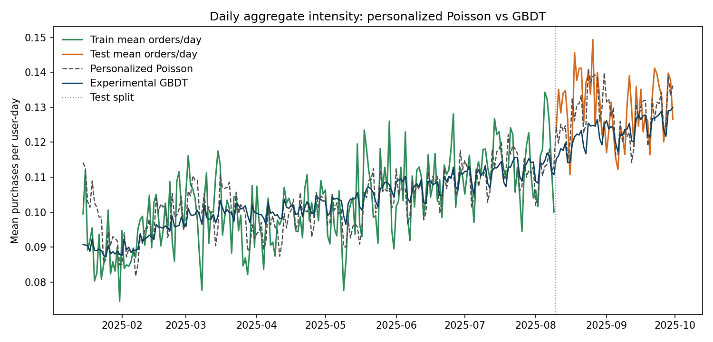

# Experimental 2. Global Poisson GBDT поверх персонализированного Пуассона

## E2.1. Зачем этот эксперимент

Этот эксперимент тоже не входит в основную лестницу глав и пока не встраивается в базовый дипломный pipeline. Его цель более узкая: быстро проверить, переносится ли на наш текущий протокол сильная GBDT-идея из соседнего research-пайплайна.

Источник идеи:

1. локальная reference-note: `diploma/references/dayuses_gbdt_improvement_ideas_20260401.md`;
2. текущая локальная реализация: `src/diploma_experimental/gbdt.py`;
3. текущий локальный раннер: `scripts/run_experimental_2_gbdt.py`.

Важно: из соседнего пайплайна здесь взята только идея модели. Train/test-окно, метрики и baseline в этом эксперименте используются наши.

## E2.2. С чем сравнивается GBDT

В качестве baseline здесь снова берется сильная модель из главы 4:

$$
\lambda_{\mathrm{base}}(u,t)
=
\hat{\mu}^{\mathrm{post}}_u \cdot \hat{\lambda}^{\mathrm{roll}}_t \cdot \hat{s}_{d(t)}.
$$

То есть GBDT должен улучшать уже сильный personalized rolling seasonal Poisson, а не простой глобальный Poisson.

## E2.3. Идея модели

Проверяется глобальная day-level Poisson regression на богатом наборе history-features:

$$
\hat{\lambda}_{u,t}
=
f\!\left(\mathcal{H}_{u,t-1}\right),
$$

где:

1. $u$ - пользователь;
2. $t$ - день;
3. $\mathcal{H}_{u,t-1}$ - вся доступная история пользователя до предыдущего дня.

Функция $f$ обучается через `HistGradientBoostingRegressor(loss="poisson")`. Следовательно, выход модели интерпретируется как ожидаемое число заказов пользователя в текущий день.

## E2.4. Какие признаки использовались

В эксперименте сохранена основная идея соседнего прогона: не писать ручную параметрическую модель интенсивности, а подать в GBDT широкий набор day-level history-features.

Используются пять групп признаков.

### Календарь

1. `dow`;
2. `days_seen`;
3. `week_idx`.

### История по исходным сигналам

Для каждого исходного сигнала строятся признаки вида:

1. `*_yesterday`;
2. `*_sum3`;
3. `*_sum7`;
4. `*_mean7`;
5. `*_active_days7`;
6. `*_exp3`;
7. `*_last_active`;
8. `*_days_since_last_active`.

В качестве исходных сигналов используются:

1. `search`;
2. `cat`;
3. `searches`;
4. `has_search_to_cart`;
5. `has_search_to_ord`;
6. `has_cat_to_cart`;
7. `has_cat_to_ord`;
8. `search_to_cart`;
9. `search_to_ord`;
10. `cat_to_cart`;
11. `cat_to_ord`;
12. `to_cart`;
13. `to_ord`;
14. `gmv`.

### Общие агрегаты по заказам и активности

1. `orders_hist_mean`;
2. `orders_hist_purchased_days`;
3. `carts_hist_mean`;
4. `any_activity_yesterday`;
5. `any_activity_sum7`;
6. `any_activity_mean7`;
7. `any_activity_active_days7`;
8. `days_since_last_any_activity`.

### EMA-признаки

1. `to_ord_ewm7`, `to_ord_ewm28`, `to_ord_ewm_gap_7_28`;
2. `to_cart_ewm7`, `to_cart_ewm28`, `to_cart_ewm_gap_7_28`;
3. `any_activity_ewm7`, `any_activity_ewm28`, `any_activity_ewm_gap_7_28`.

### Recency и funnel-ratio

1. `days_since_last_order`;
2. `days_since_last_cart`;
3. `days_since_last_search`;
4. `days_since_last_cat`;
5. `ord_per_cart_7`;
6. `search_to_cart_rate_7`;
7. `search_to_ord_rate_7`;
8. `cat_to_cart_rate_7`;
9. `cat_to_ord_rate_7`.

Итого в текущем запуске получается `141` признак.

## E2.5. Почему здесь нет leakage

Как и в соседнем пайплайне, один объект обучения - это один пользователь в один день. Для дня $t$ в признаки попадает только история до дня $t-1$.

Это означает:

1. модель работает в online one-step-ahead постановке;
2. на test у дня $t$ доступны уже прошедшие test-дни `< t`;
3. будущее при этом не используется.

То есть это не leakage, а естественный sequential forecasting protocol.

## E2.6. Протокол и окно анализа

Используется ровно то же окно, что и в основных главах:

$$
2025\text{-}01\text{-}15 \le t \le 2025\text{-}09\text{-}30.
$$

Split тот же:

1. train: до `2025-08-09`;
2. test: с `2025-08-10` по `2025-09-30`.

Параметры текущего запуска:

1. `max_depth = 5`;
2. `learning_rate = 0.05`;
3. `max_iter = 200`;
4. `min_samples_leaf = 40`;
5. `loss = "poisson"`.

## E2.7. Реализация

Код этого detour-эксперимента лежит отдельно от основного дипломного pipeline:

1. признаки и модель: `src/diploma_experimental/gbdt.py`;
2. pipeline: `src/diploma_experimental/pipeline.py`;
3. plots: `src/diploma_baselines/plots.py`;
4. раннер: `scripts/run_experimental_2_gbdt.py`.

Артефакты:

1. `diploma/reports/experimental_2_gbdt/summary.json`;
2. `diploma/reports/experimental_2_gbdt/daily_aggregate_analysis_window.png`;
3. `diploma/reports/experimental_2_gbdt/delta_ll_vs_test_purchases_personalized_to_gbdt.png`;
4. `diploma/reports/experimental_2_gbdt/user_ll_gain_hist.png`;
5. `diploma/reports/experimental_2_gbdt/user_ll_scores.csv`.

## E2.8. Что получилось на данных

Ниже `personalized rolling seasonal Poisson` из главы 4 рассматривается как предыдущая модель, а `experimental GBDT` как новая модель. В столбце `Delta vs baseline` стоит разность

$$
\text{GBDT} - \text{personalized Poisson}.
$$

Для `poisson_loglik` большее значение лучше. Для остальных метрик лучше меньшие значения.

### Train

| Metric | Personalized Poisson | GBDT | Delta vs baseline |
| --- | ---: | ---: | ---: |
| `poisson_loglik` | `-628387.14` | `-638192.65` | `-9805.51` |
| `mean_poisson_nll` | `0.31623` | `0.32117` | `+0.00493` |
| `mean_poisson_deviance` | `0.49387` | `0.50374` | `+0.00987` |
| `MAE` | `0.17606` | `0.17573` | `-0.00033` |
| `RMSE` | `0.55269` | `0.54915` | `-0.00354` |
| `aggregate_bias` | `0.00000` | `-0.00011` | `-0.00011` |

### Test

| Metric | Personalized Poisson | GBDT | Delta vs baseline |
| --- | ---: | ---: | ---: |
| `poisson_loglik` | `-210167.01` | `-199154.34` | `+11012.67` |
| `mean_poisson_nll` | `0.40959` | `0.38813` | `-0.02146` |
| `mean_poisson_deviance` | `0.64683` | `0.60391` | `-0.04292` |
| `MAE` | `0.21870` | `0.21340` | `-0.00530` |
| `RMSE` | `0.63140` | `0.62974` | `-0.00167` |
| `aggregate_bias` | `-0.00169` | `-0.00655` | `-0.00486` |
| `relative_aggregate_bias` | `-1.30%` | `-5.05%` | `-3.75 pp` |

На этом split GBDT оказывается заметно сильнее персонализированного Пуассона сразу по всем основным метрикам, кроме суммарной калибровки: общий отрицательный bias у него больше.

## E2.9. Дневная динамика

По дневной динамике видно следующее:

1. GBDT лучше подстраивается под локальные колебания уровня, чем personalized Poisson;
2. aggregate likelihood и pointwise-метрики из-за этого улучшаются;
3. при этом модель остается слегка консервативной по общему объему.

По aggregate bias:

1. у personalized Poisson `relative_aggregate_bias = -1.30%`;
2. у GBDT `relative_aggregate_bias = -5.05%`.

То есть модель лучше распределяет интенсивность по user-day точкам, но в сумме все еще недопредсказывает общий объем заказов.

## E2.10. Что означает этот результат

Здесь важно, что GBDT побеждает не только по likelihood, но и по `MAE`.

Это отличает его от experimental Hawkes:

1. Hawkes давал хороший likelihood gain, но ухудшал `MAE`;
2. GBDT улучшает и likelihood, и pointwise accuracy;
3. следовательно, на текущем split это более сильный практический benchmark.

При этом важно не переинтерпретировать результат. В отличие от главы 4, здесь уже нет компактной аналитической параметризации: выигрыш покупается более богатым набором history-features и существенно менее прозрачной моделью.

## E2.11. Где GBDT выигрывает и проигрывает

Подробное user-level сравнение `personalized Poisson -> GBDT` вынесено в отдельный файл:

1. `diploma/experimental_model_compare.md`.

Это сделано специально, чтобы не смешивать описание самой модели и compare-блок experimental-кандидатов с текущим сильным baseline.

## E2.12. Вывод

Этот быстрый эксперимент оказался очень содержательным.

1. Идея глобальной Poisson GBDT на rich history-features переносится на наш текущий протокол без изменений.
2. На текущем split модель дает сильный прирост поверх personalized rolling seasonal Poisson.
3. В отличие от Hawkes, здесь улучшаются не только likelihood-метрики, но и `MAE`, и `RMSE`.
4. Это делает GBDT сильнейшим practical benchmark из всех проверенных на данный момент моделей.
5. Одновременно модель заметно менее интерпретируема, чем probabilistic baseline из главы 4 и экспериментальный Hawkes.

Иными словами, если chapter-4 model сейчас является лучшим интерпретируемым baseline, то этот GBDT - лучший accuracy-oriented reference point для дальнейших Hawkes-экспериментов.
