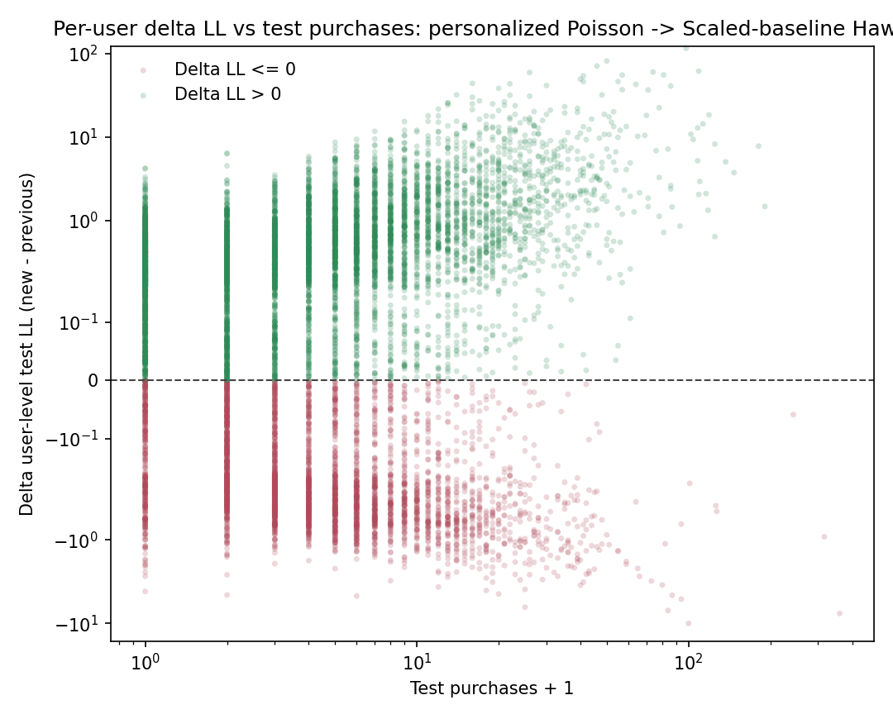
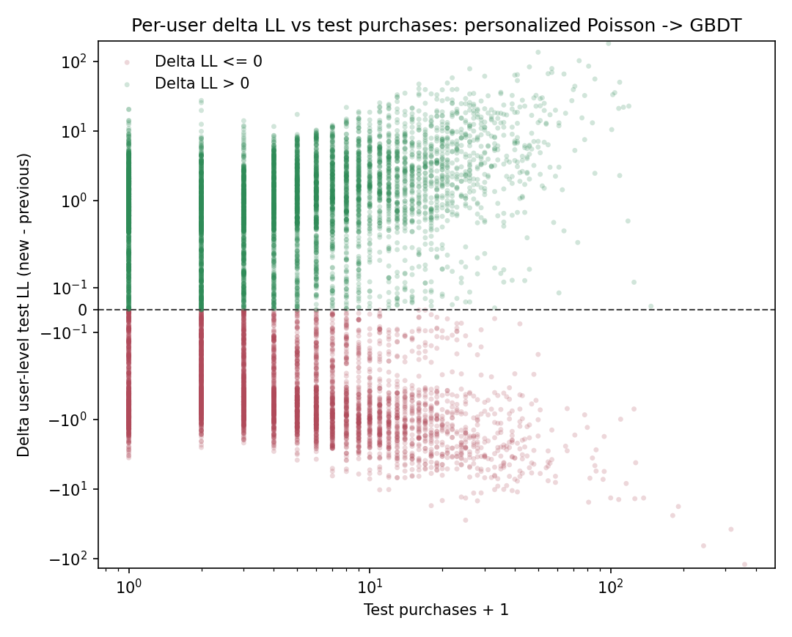

# Experimental Model Compare

Этот файл собирает сравнения experimental-моделей с текущим сильным baseline:

$$
\lambda_{\mathrm{base}}(u,t)
=
\hat{\mu}^{\mathrm{post}}_u \cdot \hat{\lambda}^{\mathrm{roll}}_t \cdot \hat{s}_{d(t)}.
$$

То есть здесь сравниваются не главы основной лестницы моделей между собой, а отдельные detour-эксперименты против `personalized rolling seasonal Poisson`.

## Hawkes From Chapter 06: personalized Poisson -> scaled-baseline Hawkes

Полное описание этой модификации находится в `diploma/06_hawkes_model.md`. Здесь фиксируется только пользовательская структура выигрыша.

Текущая модель из главы 06 уже использует сокращенный набор Hawkes-каналов:

1. `searches`;
2. `cat_to_cart`;
3. `cat_to_ord`;
4. `to_cart`;
5. `to_ord`.

Рассматривается величина

$$
\Delta \mathrm{LL}_u
=
\mathrm{LL}_u^{\mathrm{scaled\text{-}hawkes}}
-
\mathrm{LL}_u^{\mathrm{personalized}}.
$$

Сводка:

1. `share(new > prev) = 63.4%`;
2. `mean_delta_ll = +0.7127`;
3. `median_delta_ll = +0.1614`;
4. `q10_delta_ll = -0.4815`;
5. `q90_delta_ll = +1.7953`.

После введения обучаемого scale для baseline Hawkes-модель дает положительный user-level эффект уже для большинства панели.

По бакетам `test purchases`:

1. `0` покупок: `share(new > prev) = 80.4%`, `mean_delta_ll = +0.2511`;
2. `1` покупка: `55.1%`, `mean_delta_ll = +0.1229`;
3. `2` покупки: `54.2%`, `mean_delta_ll = +0.1365`;
4. `3-5` покупок: `59.0%`, `mean_delta_ll = +0.3691`;
5. `6-10` покупок: `62.1%`, `mean_delta_ll = +0.7233`;
6. `11+` покупок: `66.2%`, `mean_delta_ll = +2.3743`.

Вывод:

1. Добавление обучаемого scale и выбор компактного базиса `(1,3)` дают устойчивую user-level структуру улучшения.
2. Эта постановка выигрывает даже у low-activity пользователей.
3. Именно этот вариант Hawkes следует считать основным кандидатом для дальнейшего развития.

## Experimental 2: personalized Poisson -> global Poisson GBDT

Полное описание самой GBDT-модели находится в `diploma/experimental_2_gbdt_model.md`. Здесь фиксируется только пользовательская структура выигрыша.

Рассматривается величина

$$
\Delta \mathrm{LL}_u
=
\mathrm{LL}_u^{\mathrm{gbdt}}
-
\mathrm{LL}_u^{\mathrm{personalized}}.
$$

Сводка:

1. `share(new > prev) = 56.5%`;
2. `mean_delta_ll = +1.1095`;
3. `median_delta_ll = +0.1827`;
4. `q10_delta_ll = -1.1332`;
5. `q90_delta_ll = +3.7507`.

Структура этого перехода по-прежнему очень сильная, но теперь ее нужно сравнивать уже прежде всего с Hawkes-моделью из главы 06:

1. aggregate likelihood растет сильнее, чем у обоих Hawkes-вариантов;
2. положительный эффект получает уже большинство пользователей;
3. выигрыш распределен по панели достаточно равномерно, хотя у heavy users он по-прежнему больше.

По бакетам `test purchases`:

1. `0` покупок: `share(new > prev) = 63.8%`, `mean_delta_ll = +0.7064`;
2. `1` покупка: `47.4%`, `mean_delta_ll = +0.3415`;
3. `2` покупки: `53.2%`, `mean_delta_ll = +0.3502`;
4. `3-5` покупок: `57.6%`, `mean_delta_ll = +0.7291`;
5. `6-10` покупок: `55.7%`, `mean_delta_ll = +1.0696`;
6. `11+` покупок: `57.9%`, `mean_delta_ll = +3.0608`.

Вывод:

1. GBDT поверх personalized Poisson дает не локальный, а уже массовый user-level improvement.
2. Однако после появления Hawkes-модели из главы 06 уже нельзя сказать, что только GBDT выигрывает у сегмента с `0` покупок в test: scaled-baseline Hawkes тоже это делает.
3. При этом GBDT остается сильнейшей accuracy-oriented моделью по aggregate метрикам.
4. Это еще один аргумент в пользу того, что богатые day-level history-features и гибкая перекалибровка baseline сейчас описывают остаточную структуру данных лучше, чем более простые history-based надстройки.
