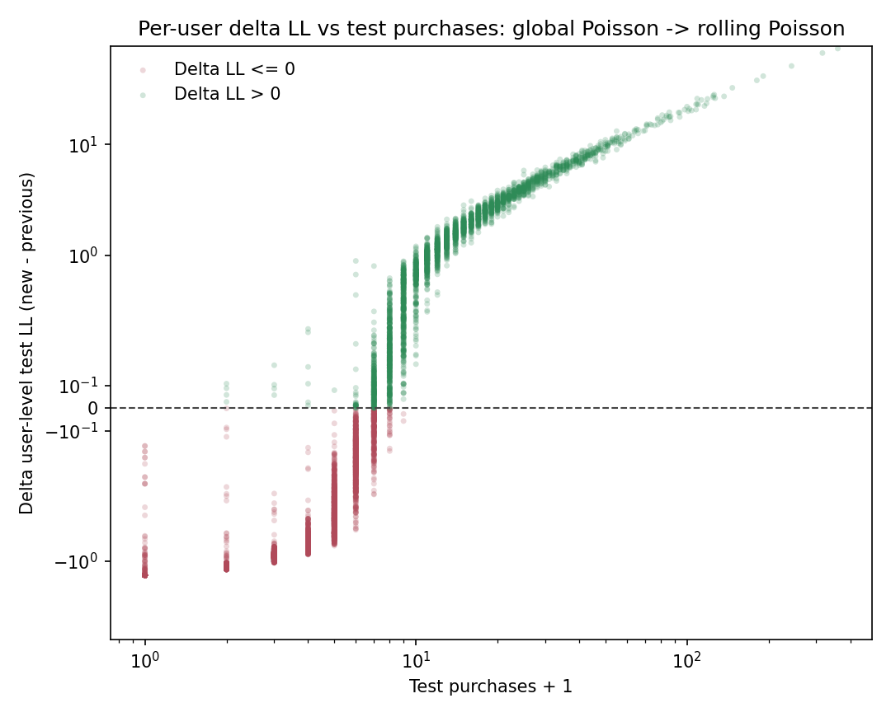
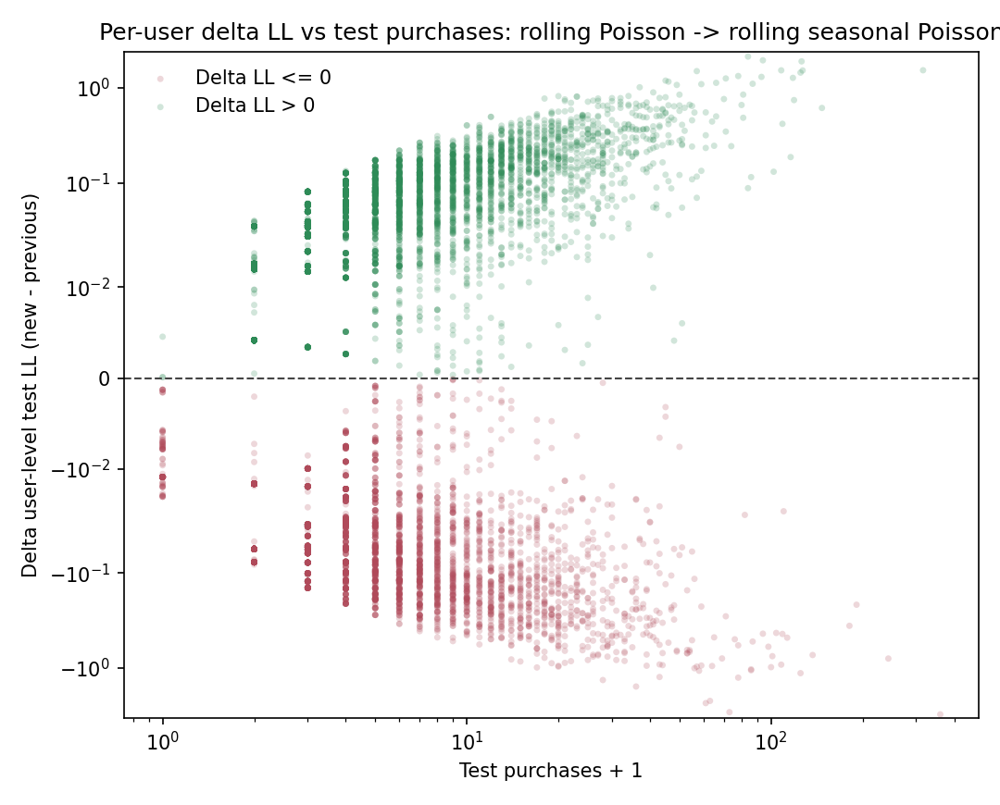
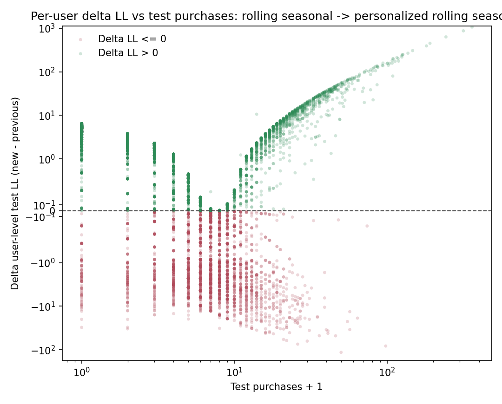

# Model Compare: неоднородность пользовательских улучшений в главах 1-4

## 3.11. Зачем нужна отдельная user-level диагностика

Во второй и третьей главах модели сравнивались по агрегированным метрикам на всем test-периоде. Такой анализ необходим, но у него есть ограничение: он не показывает, насколько однородно новое качество распределено по пользователям.

Для диплома это важно по двум причинам:

1. дальнейшие модели будут спускаться на уровень индивидуального пользователя;
2. даже глобальный выигрыш по суммарному `log-likelihood` не означает, что новая модель улучшает прогноз почти для всех пользователей.

Поэтому здесь вводится дополнительная диагностика: для каждого пользователя отдельно считается test `log-likelihood`, после чего строятся scatter-диаграммы “предыдущая модель против новой”.

## 3.12. User-level log-likelihood

Для пользователя $u$ рассмотрим его вклад в test `log-likelihood`:

$$
\mathrm{LL}_u = \sum_{t \in \mathcal{T}_{\mathrm{test}}}
\log p\left(y_{u,t} \mid \hat{\lambda}_{u,t}\right).
$$

Для Poisson-модели это выражение принимает вид

$$
\mathrm{LL}_u
=
\sum_{t \in \mathcal{T}_{\mathrm{test}}}
\left(
y_{u,t}\log \hat{\lambda}_{u,t}
- \hat{\lambda}_{u,t}
- \log(y_{u,t}!)
\right).
$$

Далее для двух моделей сравниваются величины

$$
\mathrm{LL}_u^{\mathrm{prev}}
\quad \text{и} \quad
\mathrm{LL}_u^{\mathrm{new}}.
$$

Если точка лежит выше диагонали, то новая модель лучше для данного пользователя. Если ниже, то лучше предыдущая.

## 3.13. Реализация

Для этой диагностики добавлены:

1. пайплайн: `src/diploma_baselines/pipeline.py`;
2. метрики: `src/diploma_baselines/metrics.py`;
3. графики: `src/diploma_baselines/plots.py`;
4. раннер: `scripts/compute/run_user_ll_diagnostics.py`.

Артефакты сохраняются в директорию:

1. `diploma/reports/user_ll_diagnostics/user_ll_scores.csv`;
2. `diploma/reports/user_ll_diagnostics/user_ll_scatter_poisson_vs_rolling.png`;
3. `diploma/reports/user_ll_diagnostics/user_ll_scatter_rolling_vs_rolling_seasonal.png`;
4. `diploma/reports/user_ll_diagnostics/delta_ll_vs_test_purchases_poisson_to_rolling.png`;
5. `diploma/reports/user_ll_diagnostics/delta_ll_vs_test_purchases_rolling_to_rolling_seasonal.png`;
6. `diploma/reports/user_ll_diagnostics/delta_ll_vs_test_purchases_rolling_seasonal_to_personalized.png`;
7. `diploma/reports/user_ll_diagnostics/summary.json`.

В расчете участвуют `9926` пользователей, присутствующих в test-окне.

## 3.14. Переход от главы 1 к главе 2: global Poisson -> rolling Poisson

Для более интерпретируемого анализа удобно смотреть не на пару `LL_prev` и `LL_new`, а сразу на приращение

$$
\Delta \mathrm{LL}_u
=
\mathrm{LL}_u^{\mathrm{rolling}}
-
\mathrm{LL}_u^{\mathrm{global}}
$$

в зависимости от числа покупок пользователя в test.

На графике ниже:

1. по оси `X` отложено число покупок в test с преобразованием `test purchases + 1` и логарифмической шкалой;
2. по оси `Y` отложено $\Delta \mathrm{LL}_u$ в симметричной логарифмической шкале;
3. зеленые точки означают пользователей, для которых rolling лучше;
4. красные точки означают пользователей, для которых rolling хуже.

Сводка по разностям

1. `share(new > prev) = 32.6%`;
2. `mean_delta_ll = +0.1665`;
3. `median_delta_ll = -0.5893`;
4. `q10_delta_ll = -1.3407`;
5. `q90_delta_ll = +2.3260`.
Теперь эта картина выглядит уже не странно, а вполне естественно.

Основная масса low-activity пользователей действительно не выигрывает от rolling baseline:

1. среди пользователей с `0` покупок в test новая модель не лучше ни для одного пользователя, а средний `delta_ll = -1.3223`;
2. среди пользователей с `1` покупкой `share(new > prev) = 0.3%`;
3. среди пользователей с `2` покупками `share(new > prev) = 0.4%`;
4. среди пользователей с `3-5` покупками `share(new > prev) = 1.5%`.

Однако начиная с более активных пользователей картина меняется:

1. в бакете `6-10` покупок rolling лучше уже для `83.0%` пользователей;
2. в бакете `11+` покупок rolling лучше для `100%` пользователей;
3. в последнем бакете средний `delta_ll = +3.7973`.

Именно поэтому суммарный `log-likelihood` во второй главе сильно растет, хотя доля пользователей с улучшением меньше половины. Gain концентрируется на наиболее активных покупателях, а не распределяется равномерно по всей панели.

В целом это абсолютно естественно. Во второй главе был обнаружен общий тренд на повышение интенсивности в test-периоде, и rolling baseline поднимает средний уровень прогноза вслед за этим трендом. Поэтому пользователи с малым числом покупок в test часто проигрывают: для них повышение интенсивности сильнее штрафуется на множестве нулевых дней. Однако пользователи с богатой историей покупок, наоборот, сильно выигрывают, и в прикладном смысле именно это особенно важно. Основную выручку бизнесу, как правило, приносят более активные покупатели, и именно их поведение в первую очередь хочется моделировать точно.

## 3.15. Переход от главы 2 к главе 3: rolling Poisson -> rolling seasonal Poisson

Аналогичная диагностика для добавления внутринедельной сезонности:

$$
\Delta \mathrm{LL}_u
=
\mathrm{LL}_u^{\mathrm{rolling+seasonal}}
-
\mathrm{LL}_u^{\mathrm{rolling}}.
$$

Сводка:

1. `share(new > prev) = 46.4%`;
2. `mean_delta_ll = +0.0024`;
3. `median_delta_ll = -0.0109`;
4. `q10_delta_ll = -0.1246`;
5. `q90_delta_ll = +0.1376`.
Этот график подтверждает вывод третьей главы, но в более детализированном виде.

1. для пользователей с `0` покупок в test weekday-correction почти всегда чуть ухудшает `LL`, средний `delta_ll = -0.0108`;
2. для пользователей с `1-5` покупками картина уже смешанная: медиана становится положительной, но средний эффект остается около нуля;
3. у пользователей с `6+` покупками средний эффект становится положительным, но его масштаб все равно мал;
4. даже в бакете `11+` покупок средний `delta_ll` равен лишь `+0.0301`.

Иными словами, seasonality внутри недели работает как слабая локальная поправка, причем в основном она полезна для более активных пользователей. По сравнению с переходом `global -> rolling` это уже не крупный сдвиг качества, а тонкая настройка.

## 3.16. Переход от главы 3 к главе 4: rolling seasonal -> personalized rolling seasonal

Теперь рассмотрим главный переход к персонализированной модели:

$$
\Delta \mathrm{LL}_u
=
\mathrm{LL}_u^{\mathrm{personalized}}
-
\mathrm{LL}_u^{\mathrm{rolling+seasonal}}.
$$

Сводка:

1. `share(new > prev) = 66.4%`;
2. `mean_delta_ll = +2.4798`;
3. `median_delta_ll = +1.1086`;
4. `q10_delta_ll = -3.2463`;
5. `q90_delta_ll = +5.5114`.

Этот график показывает уже качественно другую картину по сравнению с переходами `01 -> 02` и `02 -> 03`.

Во-первых, improvement действительно становится массовым: персонализированная модель лучше не для узкого хвоста пользователей, а уже для большей части тестовой панели.

Во-вторых, эффект оказывается немонотонным по числу покупок в test:

1. пользователи с `0` покупок выигрывают очень сильно:
   `share(new > prev) = 94.1%`, `mean_delta_ll = +3.9134`;
2. пользователи с `1` покупкой тоже почти всегда выигрывают:
   `91.8%`, `mean_delta_ll = +2.5309`;
3. пользователи с `2` покупками: `87.1%`, `mean_delta_ll = +1.2397`;
4. бакет `3-5` покупок уже почти нейтрален по медиане:
   `share(new > prev) = 50.9%`, `median_delta_ll = +0.0111`;
5. бакет `6-10` выглядит проблемным:
   `share(new > prev) = 18.0%`, `mean_delta_ll = -2.1211`;
6. у пользователей с `11+` покупками снова наблюдается сильный выигрыш:
   `share(new > prev) = 71.9%`, `mean_delta_ll = +10.1032`.

Это очень содержательный результат. Персонализация выигрывает не только у самых активных пользователей, но и у очень слабых покупателей. Это согласуется со структурой модели: персональный множитель $\mu_u$ позволяет одновременно понижать интенсивность для почти не покупающих пользователей и повышать ее для очень активных.

При этом improvement оказывается неоднородным в середине распределения. В частности, пользователи с `6-10` покупками часто проигрывают. Правдоподобное объяснение состоит в том, что для этого сегмента shrinkage может местами тянуть оценку слишком сильно к общему prior mean. Это уже не дефект диагностики, а полезное наблюдение о границах текущей персонализации.

## 3.17. Основной вывод из диагностики

Из этой дополнительной главы следуют четыре вывода.

1. Улучшения от новых моделей распределены по пользователям неоднородно.
2. Переход `global Poisson -> rolling Poisson` дает сильный aggregate gain, но этот gain концентрируется на подмножестве пользователей.
3. Переход `rolling Poisson -> rolling seasonal Poisson` дает еще более слабый и локальный эффект: почти вся масса точек остается рядом с диагональю.
4. Переход `rolling seasonal -> personalized` уже меняет картину качественно: выигрыш становится массовым, но все равно остается неоднородным и особенно интересным в среднеактивных сегментах.

Для дальнейшей работы это важный ориентир. Простое улучшение aggregate calibration уже не гарантирует равномерного выигрыша по пользователям. Поэтому любые следующие модели нужно оценивать не только по суммарному `log-likelihood`, но и по тому, какие именно пользовательские сегменты они реально улучшают.
